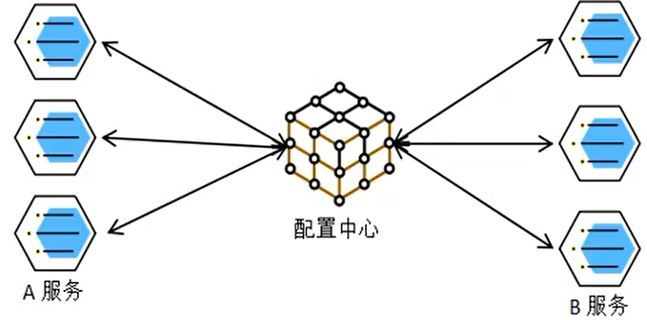
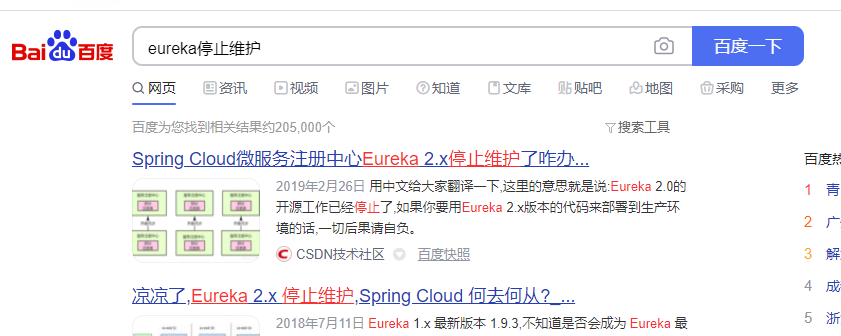

- [汉魂商城基础篇（上](#谷粒商城基础篇)
  - [一、项目简介](#一项目简介)
    - [1.1 项目背景](#11-项目背景)
    - [1.2 电商模式](#12-电商模式)
      - [1.2.1 B2B 模式](#121-b2b-模式)
      - [1.2.2 B2C 模式](#122-b2c-模式)
      - [1.2.3 C2B 模式](#123-c2b-模式)
      - [1.2.4 C2C 模式](#124-c2c-模式)
      - [1.2.5 O2O 模式](#125-o2o-模式)
    - [1.3 谷粒商城](#13-谷粒商城)
    - [1.4 项目架构图](#14-项目架构图)
    - [1.5 项目技术&特色](#15-项目技术特色)
    - [1.6 项目前置要求](#16-项目前置要求)
  - [二、分布式基础概念](#二分布式基础概念)
    - [2.1 微服务](#21-微服务)
    - [2.2 集群&分布式&节点](#22-集群分布式节点)
    - [2.3 远程调用](#23-远程调用)
    - [2.4 负载均衡](#24-负载均衡)
    - [2.5 服务注册/发现&注册中心](#25-服务注册发现注册中心)
    - [2.6 配置中心](#26-配置中心)
    - [2.7 服务熔断&服务降级](#27-服务熔断服务降级)
    - [2.8 API 网关](#28-api-网关)
  - [三、环境搭建](#三环境搭建)
    - [3.1 安装 linux虚拟机](#31-安装-linux虚拟机)
    - [3.2 安装 docker](#32-安装-docker)
      - [3.2.1 卸载系统之前安装的 docker](#321-卸载系统之前安装的-docker)
    - [3.3 docker 安装 mysql](#33-docker-安装-mysql)
      - [3.3.1 下载镜像文件](#331-下载镜像文件)
      - [3.3.2 创建实例并启动](#332-创建实例并启动)
      - [3.3.3 通过容器的 mysql 命令行工具连接](#333-通过容器的-mysql-命令行工具连接)
    - [3.4 docker 安装 redis](#34-docker-安装-redis)
      - [3.4.1 下载镜像文件](#341-下载镜像文件)
      - [3.4.2 创建实例并启动](#342-创建实例并启动)
      - [3.4.3 使用 redis 镜像执行 redis-cli 命令连接](#343-使用-redis-镜像执行-redis-cli-命令连接)
    - [3.5 开发环境统一](#35-开发环境统一)
      - [3.5.1 Maven](#351-maven)
      - [3.5.2 idea&VsCode](#352-ideavscode)
      - [3.5.3 安装配置 git](#353-安装配置-git)
      - [3.5.4 逆向工程使用](#354-逆向工程使用)
  - [四、MybatisPlus整合](#四mybatisplus整合)
    - [4.1 配置环境](#41-配置环境)
      - [4.1.1、导入依赖](#411导入依赖)
      - [4.2.2、配置数据源](#422配置数据源)
    - [4.2 分页配置](#42-分页配置)
    - [4.3 逻辑删除](#43-逻辑删除)
      - [步骤1：配置 application.yml](#步骤1配置-applicationyml)
      - [步骤2: 实体类字段上加上`@TableLogic`注解](#步骤2-实体类字段上加上tablelogic注解)
  - [五、SpringCloud Alibaba](#五springcloud-alibaba)
    - [5.1 SpringCloud Alibaba 简介](#51-springcloud-alibaba-简介)
      - [5.1.1、简介](#511简介)
      - [5.1.2、为什么要使用 ?](#512为什么要使用-)
    - [5.2 SpringCloud Alibaba - Nacos [作为注册中心]](#52-springcloud-alibaba---nacos-作为注册中心)
      - [5.2.1、下载 nacos-server](#521下载-nacos-server)
      - [5.2.2、启动 nacos-server](#522启动-nacos-server)
      - [5.2.3、注册进入 nacos 中](#523注册进入-nacos-中)
      - [Nacos 使用三步](#nacos-使用三步)
    - [5.3 SpringCloud Alibaba - Nacos [作为配置中心]](#53-springcloud-alibaba---nacos-作为配置中心)
      - [5.3.1、pom.xml 引入 Nacos Config Starter](#531pomxml-引入-nacos-config-starter)
      - [5.3.2、在应用的 resource 下 bootstrap.properties](#532在应用的-resource-下-bootstrapproperties)
      - [5.3.3、在 nacos 中添加配置](#533在-nacos-中添加配置)
      - [5.3.4、在应用中使用@Value 和 @RefreshScope](#534在应用中使用value-和-refreshscope)
      - [5.3.5、进阶](#535进阶)
    - [5.4 SpringCloud Alibaba-Sentinel](#54-springcloud-alibaba-sentinel)
      - [1、简介](#1简介)
        - [1、服务降级限流](#1服务降级限流)
        - [2、Sentinel 简介](#2sentinel-简介)
      - [2、Hystrix 与 Sentinel 比较](#2hystrix-与-sentinel-比较)
      - [3、整合 Feign 和 Sentinel 测试熔断降级](#3整合-feign-和-sentinel-测试熔断降级)
      - [4、整合 Sentinel 测试限流](#4整合-sentinel-测试限流)
      - [5、Sentinel网关限流](#5sentinel网关限流)
    - [5.5 SpringCloud Alibaba-Seata](#55-springcloud-alibaba-seata)
      - [1、简介](#1简介-1)
      - [2、核心概念](#2核心概念)
    - [5.6 SpringCloud Alibaba-OSS](#56-springcloud-alibaba-oss)
      - [5.6.1、简介](#561简介)
      - [5.6.2、使用步骤](#562使用步骤)
      - [5.6.3、 抽取成一个单独的第三方服务？OSS](#563-抽取成一个单独的第三方服务oss)
      - [5.6.4、Web端上传介绍](#564web端上传介绍)
  - [六、SpringCloud](#六springcloud)
    - [6.1 Feign 声明式远程调用](#61-feign-声明式远程调用)
      - [6.1.1、简介](#611简介)
      - [6.1.2、使用](#612使用)
    - [6.2 Gateway](#62-gateway)
      - [6.2.1、简介](#621简介)
    - [6.3 Sleuth+Zipkin 服务链路追踪](#63-sleuthzipkin-服务链路追踪)
      - [1、为什么用](#1为什么用)
      - [2、基本术语](#2基本术语)
      - [3、整合 Sleuth](#3整合-sleuth)
      - [4、整合 zipkin 可视化观察](#4整合-zipkin-可视化观察)
      - [5、Zipkin 数据持久化](#5zipkin-数据持久化)
  - [七、前端开发基础知识](#七前端开发基础知识)
    - [7.1 VSCode 使用](#71-vscode-使用)
    - [7.2 ES6](#72-es6)
    - [7.3 Node.js](#73-nodejs)
    - [7.4 Vue](#74-vue)
      - [7.4.5 整合 Element UI](#745-整合-element-ui)
    - [7.5 Babel](#75-babel)
    - [7.6 Webpack](#76-webpack)
  - [八、商品服务&三级分类](#八商品服务三级分类)
    - [8.1 基础概念](#81-基础概念)
      - [8.1.1、三级分类](#811三级分类)
      - [8.1.2、SPU 和 SKU](#812spu-和-sku)
      - [8.1.3、基本属性 【规格参数】与 销售属性](#813基本属性-规格参数与-销售属性)
      - [8.1.4、接口文档位置](#814接口文档位置)
      - [8.1.5、 Object 划分](#815-object-划分)
        - [1、PO (persistant object) 持久化对象](#1po-persistant-object-持久化对象)
        - [2、DO ( Domain Object) 领域对象](#2do--domain-object-领域对象)
        - [3、TO (Transfer Object) 数据传输对象](#3to-transfer-object-数据传输对象)
        - [4、DTO  (Data Transfer Object) 数据传输对象](#4dto--data-transfer-object-数据传输对象)
        - [5、VO(value object) 值对象](#5vovalue-object-值对象)
        - [6、BO(business object) 业务对象](#6bobusiness-object-业务对象)
        - [7、POJO ( plain ordinary java object) 简单无规则 java 对象](#7pojo--plain-ordinary-java-object-简单无规则-java-对象)
        - [8、DAO（data access object） 数据访问对象](#8daodata-access-object-数据访问对象)
    - [8.2 三级分类接口编写](#82-三级分类接口编写)
      - [8.2.1 树形展示三级分类数据](#821-树形展示三级分类数据)
      - [8.2.2 逻辑删除&删除效果细化](#822-逻辑删除删除效果细化)
      - [8.2.3 新增效果&基本修改](#823-新增效果基本修改)
      - [8.2.4 拖拽功能&数据收集&批量删除](#824-拖拽功能数据收集批量删除)
  - [九、商品服务&品牌管理](#九商品服务品牌管理)
    - [9.1、效果显示优化与快速显示开关](#91效果显示优化与快速显示开关)
    - [9.2、表单效验&自定义效验规则](#92表单效验自定义效验规则)
    - [9.3、JSR303 数据效验 & 统一异常处理](#93jsr303-数据效验--统一异常处理)
      - [9.3.1、给Bean添加效验注解  javax.validation.constraints包下 并定义自己的的message提示](#931给bean添加效验注解--javaxvalidationconstraints包下-并定义自己的的message提示)
      - [9.3.2、开启效验功能 @Valid](#932开启效验功能-valid)
      - [9.3.3、给效验的bean后紧跟一个BindingResult 就可以获取到效验的结果](#933给效验的bean后紧跟一个bindingresult-就可以获取到效验的结果)
      - [9.3.4、分组效验 (多场景复杂效验)](#934分组效验-多场景复杂效验)
      - [9.3.5、自定义效验](#935自定义效验)
      - [9.3.6、异常处理](#936异常处理)
  - [十、商品服务&属性分组](#十商品服务属性分组)
    - [10.1 、前端组件抽取 & 父子组件交互](#101-前端组件抽取--父子组件交互)
      - [10.1.1 属性分组 - 效果](#1011-属性分组---效果)
      - [10.1.2 Layout 布局](#1012-layout-布局)
      - [10.1.3 父子组件如何进行交互](#1013-父子组件如何进行交互)
    - [10.2 、获取属性分类分组](#102-获取属性分类分组)
    - [10.3 、分类新增 & 级联选择器](#103-分类新增--级联选择器)
    - [10.4 、分类修改 & 回显级联选择器](#104-分类修改--回显级联选择器)
    - [10.5、品牌分类关联与级联更新](#105品牌分类关联与级联更新)
      - [10.5.1、实现品牌管理搜索](#1051实现品牌管理搜索)
  - [十一、商品服务&平台属性](#十一商品服务平台属性)
    - [11.1 规格参数新增与VO](#111-规格参数新增与vo)
      - [11.1.1 获取分类规格参数](#1111-获取分类规格参数)
    - [11.2 规格参数列表&规格修改](#112-规格参数列表规格修改)
        - [11.2.1、获取分类规格参数](#1121获取分类规格参数)
        - [11.2.2、查询属性详情](#1122查询属性详情)
        - [11.3.3、销售属性](#1133销售属性)
    - [11.3 查询分类关联属性&删除关联&查询分组未关联属性](#113-查询分类关联属性删除关联查询分组未关联属性)
        - [11.3.1、获取属性分组的关联的所有属性](#1131获取属性分组的关联的所有属性)
        - [11.3.2、删除属性与分组的关联关系](#1132删除属性与分组的关联关系)
        - [11.3.3、查询分组未关联属性](#1133查询分组未关联属性)
        - [11.4.4、新增分组与属性关联](#1144新增分组与属性关联)
  - [十二、商品服务&新增商品](#十二商品服务新增商品)
    - [12.1 获取分类关联的品牌](#121-获取分类关联的品牌)
    - [12.2 获取分类下所有分组以及属性](#122-获取分类下所有分组以及属性)
    - [12.3 商品 VO 抽取&商品新增业务流程](#123-商品-vo-抽取商品新增业务流程)
      - [12.3.4 封装 Vo 中，更改对应得属性](#1234-封装-vo-中更改对应得属性)
      - [12.3.5 分析业务流程](#1235-分析业务流程)
      - [12.3.6 主要编码！](#1236-主要编码)
      - [**12.3.7 总结**](#1237-总结)
      - [12.3.8 商品保存后 Debug 调试](#1238-商品保存后-debug-调试)
      - [12.3.9 商品保存其他问题处理](#1239-商品保存其他问题处理)
        - [1、   `sku_images` 表中 img_url 字段为空](#1---sku_images-表中-img_url-字段为空)
        - [2、sku 满减以及打折信息 数据出现错误](#2sku-满减以及打折信息-数据出现错误)
        - [3、程序中其他的异常](#3程序中其他的异常)
  - [十三、 商品服务&商品管理](#十三-商品服务商品管理)
      - [13.1 商品管理 SPU 检索](#131-商品管理-spu-检索)
      - [13.1 商品管理 SkU 检索](#131-商品管理-sku-检索)
  - [十四、仓储服务&仓库管理](#十四仓储服务仓库管理)
    - [14.1 整合ware服务&获取仓库列表](#141-整合ware服务获取仓库列表)
      - [14.1.1整合 ware 服务](#1411整合-ware-服务)
      - [14.1.2 获取仓库列表](#1412-获取仓库列表)
    - [14.2 查询库存&创建采购需求](#142-查询库存创建采购需求)
      - [14.2.1 查询库存](#1421-查询库存)
      - [14.2.2 创建采购需求](#1422-创建采购需求)
    - [14.3 合并采购需求&领取采购单&完成采购&Spu规格维护](#143-合并采购需求领取采购单完成采购spu规格维护)
      - [14.3.1 合并采购需求](#1431-合并采购需求)
      - [14.3.2 领取采购单](#1432-领取采购单)
      - [14.3.3 完成采购](#1433-完成采购)
      - [14.3.4 Spu规格维护](#1434-spu规格维护)
      - [14.3.5 Spu更新操作](#1435-spu更新操作)
  - [分布式基础篇总结](#分布式基础篇总结)


---

typora-root-url: images
typora-copy-images-to: images

---


# 谷粒商城基础篇

## 一、项目简介

### 1.1 项目背景

### 1.2 电商模式

市面上有 5 种常见的电商模式 B2B、B2B、C2B、C2C、O2O

#### 1.2.1 B2B 模式

B2B(Business to Business)，是指商家和商家建立的商业关系，如 阿里巴巴，

### 1.2 电商模式

市面上有 5 种常见的电商模式 B2B、B2C、C2B、C2C、O2O

#### 1.2.1 B2B 模式

B2B(Business to Business)，是指商家和商家建立的商业关系，如 阿里巴巴，

#### 1.2.2 B2C 模式

B2C(Business to Consumer) 就是我们经常看到的供应商直接把商品卖给用户，即 “商对客” 模式，也就是我们说的商业零售，直接面向消费销售产品和服务，如苏宁易购，京东，天猫，小米商城

#### 1.2.3 C2B 模式

C2B (Customer to Business),即消费者对企业，先有消费者需求产生而后有企业生产，即先有消费者提出需求，后又生产企业按需求组织生产

#### 1.2.4 C2C 模式

C2C (Customer to Consumer) 客户之间把自己的东西放到网上去卖 如 淘宝 咸鱼

#### 1.2.5 O2O 模式

O2O 即 Online To Offline，也即将线下商务的机会与互联网结合在一起，让互联网成为线下交易前台，线上快速支付，线下优质服务，如：饿了吗，美团，淘票票，京东到家

### 1.3 谷粒商城

谷粒商城是一个 B2C 模式的电商平台，销售自营商品给客户

### 1.4 项目架构图

1、项目微服务架构图


2、微服务划分图


### 1.5 项目技术&特色

- 前后分离开发，并开发基于 vue 的 后台管理系统
- SpringCloud 全新的解决方案
- 应用监控、限流、网关、熔断降级、等分布式方案，全方位涉及
- 透彻讲解分布式事务，分布式锁等分布式系统的难点
- 压力测试与性能优化
- 各种集群技术的区别以及使用
- CI/CD 使用

### 1.6 项目前置要求

学习项目的前置知识

- 熟悉 SpringBoot 以及常见整合方案
- 了解 SpringCloud
- 熟悉 git maven
- 熟悉 linux、redis docker 基本操作
- 了解 html，css，js，vue
- 熟练使用 idea 开发项目


## 二、分布式基础概念

### 2.1 微服务

微服务架构风格，就像是把一个单独的应用程序开发成一套小服务，每个小服务运行在自己的进程中，并使用轻量级机制**通信**(通常是 HTTP API )，这些服务围绕业务能力来构建，	并通过完全自动化部署机制来独立部署，这些服务可以使用不同的编程语言书写，以及不同数据存储技术，并保持最低限度的集中式管理。

**简而言之，拒绝大型单体应用，基于业务边界进行服务拆分，每个服务独立部署运行。**


### 2.2 集群&分布式&节点

集群是个物理状态，分布式是个工作方式

只要是一堆机器，也可以叫做集群，他不是不是一起协作干活，这谁也不知道，

《分布式系统原理与范型》定义：

“分布式系统是若干独立计算机的集合，这些计算机对于用户来说像单个相关系统”

分布式系统 (distributed system) 是建立网络之上的软件系统

分布式是指讲不通的业务分布在不同的地方

集群实质是将几台服务器集中在一起，实现同一业务

例如：京东是一个分布式系统，众多业务运行在不同的机器上，所有业务构成一个大型的业务集群，每一个小的业务，比如用户系统，访问压力大的时候一台服务器是不够的，我们就应该将用户系统部署到多个服务器，也就是每个一业务系统也可以做集群化

分布式中的每一个节点，都可以做集群，而集群并不一定就是分布式的

节点：集群中的一个服务器

### 2.3 远程调用

在分布式系统中，各个服务可能处于不同主机，但是服务之间不可避免的需要互相调用，我们称之为远程调用

SpringCloud 中使用 HTTP+JSON 的方式来完成远程调用


### 2.4 负载均衡


分布式系统中，A  服务需要调用 B 服务，B 服务在多台机器中都存在， A 调用任意一个服务器均可完成功能

为了使每一个服务器都不要太或者太闲，我们可以负载均衡调用每一个服务器，提升网站的健壮性

常见的负载均衡算法：

> 轮询：为第一个请求选择键康齿中的每一个后端服务器，然后按顺序往后依次选择，直到最后一个，然后循环

> 最小连接：优先选择链接数最少，也就是压力最小的后端服务器，在会话较长的情况下可以考虑采取这种方式

### 2.5 服务注册/发现&注册中心

A 服务调用 B 服务， A 服务不知道 B 服务当前在哪几台服务器上有，那些正常的，哪些服务已经下线，解决这个问题可以引入注册中心


如果某些服务下线，我们其他人可以实时的感知到其他服务的状态，从而避免调用不可用的服务

### 2.6 配置中心



每一个服务最终都有大量配置，并且每个服务都可能部署在多个服务器上，我们经常需要变更配置，我们可以让每个服务在配置中心获取自己的位置。

配置中心用来集中管理微服务的配置信息

### 2.7 服务熔断&服务降级

在微服务架构中，微服务之间通过网络来进行通信，存在相互依赖，当其中一个服务不可用时，有可能会造成雪崩效应，要防止这种情况，必须要有容错机制来保护服务


1、服务熔断

- 设置服务的超时，当被调用的服务经常失败到达某个阈值，我们可以开启断路保护机制，后来的请求不再去调用这个服务，本地直接返回默认的数据

2、服务降级

- 在运维期间，当系统处于高峰期，系统资源紧张，我们可以让非核心业务降级运行，降级：某些服务不处理或限流，或者简单处理【抛异常，返回NULL，调用 Mock数据，调用 FallBack 处理逻辑】

 > 熔断是调用方发起的，当发现某个服务不稳定时，将其熔断，避免服务雪崩。
 >
 > 降级是某个服务或api主动“牺牲”自己，节省服务器资源给其他服务或api使用。

### 2.8 API 网关

在微服务架构中，API Gateway 作为整体架构的重要组件，他 抽象类服务中需要的公共功能，同时它提供了客户端**负载均衡**，**服务自动熔断**，**灰度发布**，**统一认证**，**限流监控**，**日志统计**等丰富功能，帮助我们解决很多 API 管理的难题


## 三、环境搭建

### 3.1 安装 linux虚拟机（Centos 7）

#### 3.1.1  要开启 CPU 虚拟化


CPU 查看


#### 3.1.2 下载&安装 VirtualBox https://www.virtualbox.org/
#### 3.1.3 下载& 安装 Vagrant 

https://app.vagrantup.com/boxes/search Vagrant 官方镜像仓库

https://www.vagrantup.com/downloads.html Vagrant下载

打开window cmd窗口，运行Vagrant init centos/7 ,即可初始化一个centos系统
```shell
$ vagrant init centos/7
A `Vagrantfile` has been placed in this directory. You are now
ready to `vagrant up` your first virtual environment! Please read
the comments in the Vagrantfile as well as documentation on
`vagrantup.com` for more information on using Vagrant.
```

执行完上面的命令后，会在用户的家目录下生成Vagrantfile文件。

```shell
$ vagrant up
Bringing machine 'default' up with 'virtualbox' provider...
==> default: Box 'centos/7' could not be found. Attempting to find and install...
    default: Box Provider: virtualbox
    default: Box Version: >= 0
==> default: Loading metadata for box 'centos/7'
    default: URL: https://vagrantcloud.com/centos/7
==> default: Adding box 'centos/7' (v1905.1) for provider: virtualbox
    default: Downloading: https://vagrantcloud.com/centos/boxes/7/versions/1905.1/providers/virtualbox.box
    default: Download redirected to host: cloud.centos.org
    default: Progress: 0% (Rate: 6717/s, Estimated time remaining: 7:33:42)
```

下载镜像过程比较漫长，也可以采用先用下载工具下载到本地后，然后使用“ vagrant box add ”添加，再“vagrant up”即可

```shell
#将下载的镜像添加到virtualBox中
$ vagrant box add centos/7 E:\迅雷下载\CentOS-7-x86_64-Vagrant-1905_01.VirtualBox.box
==> box: Box file was not detected as metadata. Adding it directly...
==> box: Adding box 'centos/7' (v0) for provider:
    box: Unpacking necessary files from: file:///E:/%D1%B8%C0%D7%CF%C2%D4%D8/CentOS-7-x86_64-Vagrant-1905_01.VirtualBox.box
    box:
==> box: Successfully added box 'centos/7' (v0) for 'virtualbox'!

#启动
$ vagrant up
Bringing machine 'default' up with 'virtualbox' provider...
==> default: Importing base box 'centos/7'...
==> default: Matching MAC address for NAT networking...
==> default: Setting the name of the VM: Administrator_default_1588497928070_24634
==> default: Clearing any previously set network interfaces...
==> default: Preparing network interfaces based on configuration...
    default: Adapter 1: nat
    default: Adapter 2: hostonly
==> default: Forwarding ports...
    default: 22 (guest) => 2222 (host) (adapter 1)
==> default: Booting VM...
==> default: Waiting for machine to boot. This may take a few minutes...
    default: SSH address: 127.0.0.1:2222
    default: SSH username: vagrant
    default: SSH auth method: private key
    default:
    default: Vagrant insecure key detected. Vagrant will automatically replace
    default: this with a newly generated keypair for better security.
    default:
    default: Inserting generated public key within guest...
    default: Removing insecure key from the guest if it's present...
    default: Key inserted! Disconnecting and reconnecting using new SSH key...
==> default: Machine booted and ready!
==> default: Checking for guest additions in VM...
    default: No guest additions were detected on the base box for this VM! Guest
    default: additions are required for forwarded ports, shared folders, host only
    default: networking, and more. If SSH fails on this machine, please install
    default: the guest additions and repackage the box to continue.
    default:
    default: This is not an error message; everything may continue to work properly,
    default: in which case you may ignore this message.
==> default: Configuring and enabling network interfaces...
==> default: Rsyncing folder: /cygdrive/c/Users/Administrator/ => /vagrant


```

#### 3.1.4 使用Vagrant ssh 登陆虚拟机

vagrant ssh 开启SSH，并登陆到centos7

```shell
$ vagrant ssh
[vagrant@localhost ~]$ ip addr
1: lo: <LOOPBACK,UP,LOWER_UP> mtu 65536 qdisc noqueue state UNKNOWN group default qlen 1000
    link/loopback 00:00:00:00:00:00 brd 00:00:00:00:00:00
    inet 127.0.0.1/8 scope host lo
       valid_lft forever preferred_lft forever
    inet6 ::1/128 scope host
       valid_lft forever preferred_lft forever
2: eth0: <BROADCAST,MULTICAST,UP,LOWER_UP> mtu 1500 qdisc pfifo_fast state UP group default qlen 1000
    link/ether 52:54:00:8a:fe:e6 brd ff:ff:ff:ff:ff:ff
    inet 10.0.2.15/24 brd 10.0.2.255 scope global noprefixroute dynamic eth0
       valid_lft 86091sec preferred_lft 86091sec
    inet6 fe80::5054:ff:fe8a:fee6/64 scope link
       valid_lft forever preferred_lft forever
3: eth1: <BROADCAST,MULTICAST,UP,LOWER_UP> mtu 1500 qdisc pfifo_fast state UP group default qlen 1000
    link/ether 08:00:27:d1:76:f6 brd ff:ff:ff:ff:ff:ff
    inet 192.168.56.102/24 brd 192.168.56.255 scope global noprefixroute dynamic eth1
       valid_lft 892sec preferred_lft 892sec
    inet6 fe80::8c94:1942:ba09:2458/64 scope link noprefixroute
       valid_lft forever preferred_lft forever
[vagrant@localhost ~]$
```


#### 3.1.5 虚拟机常见配置

1. 默认虚拟机的ip 地址不是固定ip 开发不方便

配置网络信息，打开"Vagrantfile"文件：

```
config.vm.network "private_network", ip: "192.168.56.10"
```
这里 ip 需要在 物理机下使用 ipconfig 命令找到

```shell
C:\Users\Administrator>ipconfig

Windows IP 配置

以太网适配器 VirtualBox Host-Only Network:

   连接特定的 DNS 后缀 . . . . . . . :
   本地链接 IPv6 地址. . . . . . . . : fe80::a00c:1ffa:a39a:c8c2%16
   IPv4 地址 . . . . . . . . . . . . : 192.168.56.1
   子网掩码  . . . . . . . . . . . . : 255.255.255.0
   默认网关. . . . . . . . . . . . . :
```


修改完成后，重启启动vagrant

```
vagrant reload
```

检查宿主机和virtualBox之间的通信是否正常

```
[vagrant@localhost ~]$ ping 192.168.43.43                                                                                                         PING 192.168.43.43 (192.168.43.43) 56(84) bytes of data.
64 bytes from 192.168.43.43: icmp_seq=1 ttl=127 time=0.533 ms
64 bytes from 192.168.43.43: icmp_seq=2 ttl=127 time=0.659 ms

--- 192.168.43.43 ping statistics ---
2 packets transmitted, 2 received, 0% packet loss, time 999ms
rtt min/avg/max/mdev = 0.533/0.596/0.659/0.063 ms
[vagrant@localhost ~]$
[vagrant@localhost ~]$
[vagrant@localhost ~]$ ping www.baidu.com
PING www.a.shifen.com (112.80.248.76) 56(84) bytes of data.
64 bytes from 112.80.248.76 (112.80.248.76): icmp_seq=1 ttl=53 time=56.1 ms
64 bytes from 112.80.248.76 (112.80.248.76): icmp_seq=2 ttl=53 time=58.5 ms
64 bytes from 112.80.248.76 (112.80.248.76): icmp_seq=3 ttl=53 time=53.4 ms

```

2.  开启远程登陆，修改“/etc/ssh/sshd_config”

```shell
PermitRootLogin yes 
PasswordAuthentication yes
```

然后重启SSHD

```shell
systemctl restart sshd
```

使用Xshell或SecureCRT进行远程连接。

3. 其他配置

运行vagrant up即可启动虚拟机。系统root用户的密码是vagrant

vagrant其他常用命令

vagrant ssh 自动使用 vagrant 用户连接虚拟机

vagrant upload source [destination] [name|id] 上传文件

https://www.vagrantup.com/docs/cli/init.html Vagrant 命令行


**Vagrant 和 VirtualBox 版本有对应问题  都安装最新版本 则安装成功**


### 3.2 安装 docker

Docker 安装文档参考官网

- 卸载系统之前安装的 docker

​      Uninstall old versions

一步一步往下执行就行

```bash
sudo yum remove docker \
                  docker-client \
                  docker-client-latest \
                  docker-common \
                  docker-latest \
                  docker-latest-logrotate \
                  docker-logrotate \
                  docker-engine
```

- SET UP THE REPOSITORY

​      Install the `yum-utils` package (which provides the `yum-config-manager` utility) and set up the **stable** repository.

```bash
sudo yum-config-manager \
    --add-repo \
    https://download.docker.com/linux/centos/docker-ce.repo
```

- INSTALL DOCKER ENGINE 

1. Install the *latest version* of Docker Engine and containerd, or go to the next step to install a specific version:

```bash
sudo yum install docker-ce docker-ce-cli containerd.io
```

- 启动docker及常见配置

```bash
sudo systemctl start docker
```

Verify that docker Engine is installed correctly by running the `hello-world` image.

```bash
sudo docker run hello-world
```

设置docker开机自启动

```bash
sudo systemctl enable docker 
```

设置 docker 镜像加速

登录 aliyun.com 在控制台找到容器镜像服务


### 3.3 docker 安装 mysql

-  下载镜像文件

```bash
docker pull mysql:5.7
```

查看镜像

```
[root@hadoop-104 module]# docker images
REPOSITORY  TAG    IMAGE ID     CREATED       SIZE
mysql       5.7    f5829c0eee9e 2 hours ago   455MB
[root@hadoop-104 module]# 
```

- 创建实例并启动

```bash
# --name指定容器名字 -v目录挂载 -p指定端口映射  -e设置mysql参数 -d后台运行
sudo docker run -p 3306:3306 --name mysql \
-v /mydata/mysql/log:/var/log/mysql \
-v /mydata/mysql/data:/var/lib/mysql \
-v /mydata/mysql/conf:/etc/mysql \
-e MYSQL_ROOT_PASSWORD=root \
-d mysql:5.7
####
-v 将对应文件挂载到主机
-e 初始化对应
-p 容器端口映射到主机的端口
```

- MySQL 配置

vi /mydata/mysql/conf/my.cnf 创建&修改该文件

```bash
[root@hadoop-104 conf]# pwd
/mydata/mysql/conf


[root@hadoop-104 conf]# cat my.cnf
[client]
default-character-set=utf8
[mysql]
default-character-set=utf8
[mysqld]
init_connect='SET collation_connection = utf8_unicode_ci'
init_connect='SET NAMES utf8'
character-set-server=utf8
collation-server=utf8_unicode_ci
skip-character-set-client-handshake
skip-name-resolve
[root@hadoop-104 conf]# 

[root@hadoop-104 conf]# docker restart mysql
mysql
[root@hadoop-104 conf]# 
```

进入容器查看配置：

```shell
[root@hadoop-104 conf]# docker exec -it mysql /bin/bash
root@b3a74e031bd7:/# whereis mysql
mysql: /usr/bin/mysql /usr/lib/mysql /etc/mysql /usr/share/mysql

root@b3a74e031bd7:/# ls /etc/mysql 
my.cnf
root@b3a74e031bd7:/# cat /etc/mysql/my.cnf 
[client]
default-character-set=utf8
[mysql]
default-character-set=utf8
[mysqld]
init_connect='SET collation_connection = utf8_unicode_ci'
init_connect='SET NAMES utf8'
character-set-server=utf8
collation-server=utf8_unicode_ci
skip-character-set-client-handshake
skip-name-resolve
root@b3a74e031bd7:/# 
```

- 设置启动docker时，即运行mysql

  ```
  [root@hadoop-104 ~]# docker update mysql --restart=always
  mysql
  [root@hadoop-104 ~]# 
  ```

- 通过容器的 mysql 命令行工具连接

### 3.4 docker 安装 redis

- **下载镜像文件**

```bash
docker pull redis
```


- **创建实例并启动**

```bash
 
mkdir -p /mydata/redis/conf
touch /mydata/redis/conf/redis.conf

# 启动 同时 映射到对应文件夹
# 后面 \ 代表换行
docker run -p 6379:6379 --name redis \
-v /mydata/redis/data:/data \
-v /mydata/redis/conf/redis.conf:/etc/redis/redis.conf \
-d redis redis-server /etc/redis/redis.conf
```

- **使用 redis 镜像执行 redis-cli 命令连接**

```
docker exec -it redis redis-cli
```

- **持久化 默认 appendonly on 没有开启**

```bash
vim /mydata/redis/conf/redis.conf
# 插入下面内容
appendonly yes
```

或者用

```
echo "appendonly yes"  >> /mydata/redis/conf/redis.conf
```

### 3.5 开发环境统一

#### 3.5.1 Maven

配置阿里云镜像

```xml
<mirrors>
		<mirror>
		<id>nexus-aliyun</id>
		<mirrorOf>central</mirrorOf>
		<name>Nexus aliyun</name>
		<url>http://maven.aliyun.com/nexus/content/groups/public</url>
		</mirror>
	</mirrors>
	
```

配置 jdk 1.8 编译项目

```xml
<profiles>
		<profile>
			<id>jdk-1.8</id>
			<activation>
				<activeByDefault>true</activeByDefault>
				<jdk>1.8</jdk>
			</activation>
			<properties>
				<maven.compiler.source>1.8</maven.compiler.source>
				<maven.compiler.target>1.8</maven.compiler.target>
				<maven.compiler.compilerVersion>1.8</maven.compiler.compilerVersion>
			</properties>
		</profile>
	</profiles>
```

#### 3.5.2 idea&VsCode

- **idea 安装 lombok、mybatisx 、Translation插件 等等..** 

- **Vscode 安装开发必备插件**  

>Vetur ——语法高亮，智能感知 包含格式化功能，Alt+Shift+F (格式化全文) ，Ctrl+K Ctrl+F (格式化选中代码，两个Ctrl需要同时按着)
> EsLint 一一 语法纠错
> Auto Close Tag 一一 自动闭合HTML/XML标签
> Auto Rename Tag 一一 自动完成另-侧标签的同步修改
> JavaScript(ES6) code snippets 一一 ES6 语法智能提示以及快速输入，除j外还支持.ts, .jsx， .tsx， .html, .vue;省去了配置其支持各种包含is代码文件的时间

VsCode开发vue 常用插件

https://blog.csdn.net/yujing1314/article/details/90340647

#### 3.5.3 安装配置 git

1、下载git

https://git-scm.com/

2、配置git 进入 git bash

```bash
# 配置用户名
git config --global user.name "user.name"
# 配置邮箱
git config --global user.email "username@email.com" # 注册账号使用的邮箱
```

3、配置 ssh 免密登录

https://github.com/settings/keys

```bash
git bash 使用 ssh-keygen -t rsa -C "XXX@xxx.com" 命令 连续三次回车
一般用户目录下都会有
id_rsa 文件
id_rsa.pub 文件
或者 cat ~/.ssh/id_rsa.pub
登录进 github/gitee 设置 SSH KEY
使用 ssh -T git@gitee.com 测试是否成功
具体过程参考百度
```


#### 3.5.4 逆向工程使用

1、导入项目逆向工程

2、下载人人开源后台管理系统脚手架工程

1. 导入工程，创建数据库
2. 修改工程shiro依赖为SpringSecurity
3. 删除部分暂时不需要的业务

3、下载人人开源后台管理系统vue端脚手架工程

1. vscode 导入前端项目
2. 前后端联调测试基本功能

<https://gitee.com/renrenio>


克隆到本地：

```shell
git clone https://gitee.com/renrenio/renren-fast-vue.git

git clone https://gitee.com/renrenio/renren-fast.git
```


将拷贝下来的“renren-fast”删除“.git”后，拷贝到“gulimall”工程根目录下，然后将它作为gulimall的一个module

创建“gulimall_admin”的数据库，然后执行“renren-fast/db/mysql.sql”中的SQl脚本

修改“application-dev.yml”文件，默认为dev环境，修改连接mysql的url和用户名密码

```yaml
spring:
    datasource:
        type: com.alibaba.druid.pool.DruidDataSource
        druid:
            driver-class-name: com.mysql.cj.jdbc.Driver
            url: jdbc:mysql://192.168.137.14:3306/gulimall_admin?useUnicode=true&characterEncoding=UTF-8&serverTimezone=Asia/Shanghai
            username: root
            password: root
```


启动“gulimall_admin”，然后访问“<http://localhost:8080/renren-fast/>”


安装node.js，并且安装仓库

```
npm config set registry http://registry.npm.taobao.org/
```


```shell
PS D:\tmp\renren-fast-vue> npm config set registry http://registry.npm.taobao.org/
PS D:\tmp\renren-fast-vue> npm install
npm WARN ajv-keywords@1.5.1 requires a peer of ajv@>=4.10.0 but none is installed. You must install peer dependencies yourself.
npm WARN sass-loader@6.0.6 requires a peer of node-sass@^4.0.0 but none is installed. You must install peer dependencies yourself.
npm WARN optional SKIPPING OPTIONAL DEPENDENCY: fsevents@1.2.9 (node_modules\fsevents):
npm WARN notsup SKIPPING OPTIONAL DEPENDENCY: Unsupported platform for fsevents@1.2.9: wanted {"os":"darwin","arch":"any"} (current: {"os":"win32","arch":"x64"})

up to date in 17.227s
PS D:\tmp\renren-fast-vue> 
```


```shell
PS D:\tmp\renren-fast-vue> npm run dev

> renren-fast-vue@1.2.2 dev D:\tmp\renren-fast-vue
> webpack-dev-server --inline --progress --config build/webpack.dev.conf.js

 10% building modules 5/10 modules 5 active ...-0!D:\tmp\renren-fast-vue\src\main.js(node:19864) Warning: Accessing non-existent property 'cat' of module exports inside circular dependency
(Use `node --trace-warnings ...` to show where the warning was created)
(node:19864) Warning: Accessing non-existent property 'cd' of module exports inside circular dependency
(node:19864) Warning: Accessing non-existent property 'chmod' of module exports inside circular dependency
(node:19864) Warning: Accessing non-existent property 'cp' of module exports inside circular dependency
(node:19864) Warning: Accessing non-existent property 'dirs' of module exports inside circular dependency
(node:19864) Warning: Accessing non-existent property 'pushd' of module exports inside circular dependency
(node:19864) Warning: Accessing non-existent property 'popd' of module exports inside circular dependency
(node:19864) Warning: Accessing non-existent property 'echo' of module exports inside circular dependency
(node:19864) Warning: Accessing non-existent property 'tempdir' of module exports inside circular dependency
(node:19864) Warning: Accessing non-existent property 'pwd' of module exports inside circular dependency
```


常见问题1：“Module build failed: Error: Cannot find module 'node-sass”

运行过程中，出现“Module build failed: Error: Cannot find module 'node-sass'报错问题”，解决方法

>
>
>用npm install -g cnpm --registry=https://registry.npm.taobao.org ，从淘宝镜像那下载，然后cnpm下载成功。
>
>最后输入cnpm install node-sass --save。npm run dev终于能跑起来了！！！
>————————————————
>版权声明：本文为CSDN博主「夕阳下美了剪影」的原创文章，遵循CC 4.0 BY-SA版权协议，转载请附上原文出处链接及本声明。
>原文链接：https://blog.csdn.net/qq_38401285/article/details/86483278


常见问题2：cnpm - 解决 " cnpm : 无法加载文件 C:\Users\93457\AppData\Roaming\npm\cnpm.ps1，因为在此系统上禁止运行脚本。有关详细信息 。。。 "

<https://www.cnblogs.com/500m/p/11634969.html>


所有问题的根源都在“node_modules”，npm install之前，应该将这个文件夹删除，然后再进行安装和运行。

再次运行npm run dev恢复正常：


#### 3.5.5

**clone**

https://gitee.com/renrenio/renren-generator.git

然后将该项目放置到“gulimall”的跟路径下，然后添加该Module，并且提交到github上

**修改配置**

renren-generator/src/main/resources/generator.properties

```properties
#代码生成器，配置信息

mainPath=cn.walon
#包名
package=cn.walon.hanhunmall
moduleName=product
#作者
author=walon
#Email
email=lowols@163.com
#表前缀(类名不会包含表前缀)
tablePrefix=pms_
```

**运行“renren-generator”**

访问：<http://localhost:80/


点击“renren-fast”，能够看到它将“renren-fast”的所有表都列举了出来：


选择所有的表，然后点击“生成代码”，将下载的“renren.zip”，解压后取出main文件夹，放置到“gulimall-product”项目的main目录中。

下面的几个module，也采用同样的方式来操作。

但是针对于“undo_log”，存在一个问题


它的数据类型是“longblob”类型，逆向工程后，对应的数据类型未知：


这个问题该要怎么解决？


## 四、MybatisPlus整合


### 4.1 配置环境

#### 4.1.1、导入依赖

```xml
<dependency>
            <groupId>com.baomidou</groupId>
            <artifactId>mybatis-plus-boot-starter</artifactId>
            <version>3.2.0</version>
        </dependency>
```

#### 4.2.2、配置数据源

配置数据源

1. ##### 导入数据库驱动

   https://mvnrepository.com/artifact/mysql/mysql-connector-java

   ```xml
    <!--导入mysql驱动-->
           <dependency>
               <groupId>mysql</groupId>
               <artifactId>mysql-connector-java</artifactId>
               <version>8.0.17</version>
           </dependency>
   ```

2. ##### 在application.yml配置数据源相关信息

   ```yml
   spring:
     datasource:
       username: root
       password: root
       url: jdbc:mysql://192.168.56.10:3306/gulimall_pms
       driver-class-name: com.mysql.jdbc.Driver
   mybatis-plus:
   	# mapper文件扫描
     mapper-locations: classpath*:/mapper/**/*.xml
     global-config:
       db-config:
         id-type: auto # 数据库主键自增
   ```

配置MyBatis-Plus包扫描：

1. 使用@MapperScanner

2. 告诉MyBatis-Plus,Sql映射文件位置

   ```java
   @MapperScan("cn.walon.hanhunmall.product.dao")
   @SpringBootApplication
   public class GulimallProductApplication {
       public static void main(String[] args) {
           SpringApplication.run(GulimallProductApplication.class, args);
       }
   }
   ```

   

具体过程参考官网： https://baomidou.com/guide/install.html#release

### 4.2 分页配置

```java
@Configuration // 声明配置类
@EnableTransactionManagement // 开启注解
@MapperScan("com.atguigu.gulimall.product.dao") // 指定扫描包
public class MyBatisConfig {


    /**
     * 引入分页插件 拦截器
     * @return
     */
    @Bean
    public PaginationInterceptor paginationInterceptor() {
        PaginationInterceptor paginationInterceptor = new PaginationInterceptor();
        // 设置请求的页面大于最大页后操作， true调回到首页，false 继续请求  默认false
         paginationInterceptor.setOverflow(true);
        // 设置最大单页限制数量，默认 500 条，-1 不受限制
         paginationInterceptor.setLimit(1000);
        // 开启 count 的 join 优化,只针对部分 left join
        paginationInterceptor.setCountSqlParser(new JsqlParserCountOptimize(true));
        return paginationInterceptor;
    }
}
```

### 4.3 逻辑删除

说明:

只对自动注入的sql起效:

- 插入: 不作限制
- 查找: 追加where条件过滤掉已删除数据,且使用 wrapper.entity 生成的where条件会忽略该字段
- 更新: 追加where条件防止更新到已删除数据,且使用 wrapper.entity 生成的where条件会忽略该字段
- 删除: 转变为 更新

例如:

- 删除: `update user set deleted=1 where id = 1 and deleted=0`
- 查找: `select id,name,deleted from user where deleted=0`

#### 步骤1：配置 application.yml

```yaml
mybatis-plus:
  mapper-locations: classpath*:/mapper/**/*.xml
  global-config:
    db-config:
      id-type: auto # 数据库主键自增
      logic-delete-value: 1 # 逻辑已删除值(默认为 1)
      logic-not-delete-value: 0 # 逻辑未删除值(默认为 0)
```

#### 步骤2: 实体类字段上加上`@TableLogic`注解

```java
/**
 * 是否显示[0-不显示，1显示]
 */
@TableLogic(value = "1",delval = "0")
private Integer showStatus;
```

## 五、SpringCloud Alibaba

### 5.1 SpringCloud Alibaba 简介

#### 5.1.1、简介

Spring Cloud Alibaba 致力于提供微服务开发的一站式解决方案。此项目包含开发分布式应用微服务的必需组件，方便开发者通过 Spring Cloud 编程模型轻松使用这些组件来开发分布式应用服务。

依托 Spring Cloud Alibaba，您只需要添加一些注解和少量配置，就可以将 Spring Cloud 应用接入阿里微服务解决方案，通过阿里中间件来迅速搭建分布式应用系统。


#### 5.1.2、为什么要使用 ?




**SpringClouid的几大痛点：**

SpringCloud部分组件停止维护和更新，给开发带来不便;

SpringCloud部分环境搭建复杂，没有完善的可视化界面，我们需要大量的二次开发和定制

SpringCloud配置复杂，难以上手，部分配置差别难以区分和合理应用


**SpringCloud Alibaba的优势：**

阿里使用过的组件经历了考验，性能强悍，设计合理，现在开源出来大家用

成套的产品搭配完善的可视化界面给开发运维带来极大的便利

搭建简单，学习曲线低。


**结合SpringCloud Alibaba我们最终的技术搭配方案：**

SpringCloud Alibaba - Nacos : 注册中心 (服务发现/注册)

SpringCloud Alibaba- Nacos: 配置中心 (动态配置管理)

SpringCloud - Ribbon: 负载均衡

SpringCloud - Feign: 声明式HTTP客户端(调用远程服务)

SpringCloud Alibaba - Sentinel: 服务容错(限流、降级、熔断)

SpringCloud - Gateway:  API 网关 (webflux 编程模式)

SpringCloud - Sleuth:调用链监控

SpringCloud Alibaba - Seata: 原Fescar, 即分布式事务解决方案


### 5.2 SpringCloud Alibaba - Nacos [作为注册中心]

Nacos 是阿里巴巴开源的一个更易于构建云原生应用的动态服务发现，配置管理和服务管理平台，他是使用 java 编写的，需要依赖 java 环境

Nacos 文档地址： https://nacos.io/zh-cn/docs/quick-start.html

#### 5.2.1、下载 nacos-server

https://github.com/alibaba/nacos/releases

#### 5.2.2、启动 nacos-server

- cmd 运行startup.cmd 文件
- 访问localhost:8848/nacos/
- 使用默认的 nacos/nacos 登录


#### 5.2.3、注册进入 nacos 中

1. 首先，修改 pom.xml 文件，引入  Nacos Discovery Starter

```xml
 <dependency>
     <groupId>com.alibaba.cloud</groupId>
     <artifactId>spring-cloud-starter-alibaba-nacos-discovery</artifactId>
 </dependency>
```

2. 在应用的 /resource /application.properties 中配置 Nacos Server地址

```PROPER
spring.cloud.nacos.discovery.server-addr=127.0.0.1:8848
```

3. 使用@EnableDiscoveryClient 开启服务注册发现功能

```java
 @SpringBootApplication
 @EnableDiscoveryClient
 public class ProviderApplication {

 	public static void main(String[] args) {
 		SpringApplication.run(ProviderApplication.class, args);
 	}
 }
```

4. 启动应用、观察 nacos 服务列表是否已经注册上服务

注意每一个应用都应该有名字，这样才能往册上去。修改pplicaion.propertes文件

```properties
spring.application.name= service provider
server.port=8000
```

5. 注册更多的服务上去，测试使用 feign 远程

**Nacos 使用三步**

> 1、导包
>
> 2、写配置，指定 nacos 地址，指定应用的名字
>
> 3、加注解@EnableDiscoveryClient  开启服务注册发现功能 

**Feign 使用三步**

> 1、导包 openfeign
>
> 2、加注解@EnableFeignClients  开启已注册服务的调用功能
>
> 3、编写接口，进行远程调用


### 5.3 SpringCloud Alibaba - Nacos [作为配置中心]

#### 5.3.1、pom.xml 引入 Nacos Config Starter

```xml
  <!--配置中心来做配置管理-->
<dependency>
   <groupId>com.alibaba.cloud</groupId>
   <artifactId>spring-cloud-starter-alibaba-nacos-config</artifactId>
</dependency>
```

#### 5.3.2、在应用的 resource 下 bootstrap.properties

```properties
spring.application.name=gulimall-coupon
spring.cloud.nacos.config.server-addr=127.0.0.1:8848
```

#### **5.3.3 传统方式**

为了详细说明config的使用方法，先来看原始的方式

创建“application.properties”配置文件，添加如下配置内容：

```properties
coupon.user.name="zhangsan"
coupon.user.age=30
```

修改“io.niceseason.gulimall.coupon.controller.CouponController”文件，添加如下内容：

```java
    @Value("${coupon.user.name}")
    private String name;
    @Value("${coupon.user.age}")
    private Integer age;

    @RequestMapping("/test")
    public R getConfigInfo(){
       return R.ok().put("name",name).put("age",age);
    }
```


启动“gulimall-coupon”服务：


访问：http://localhost:7000/coupon/coupon/test>


这样做存在的一个问题，如果频繁的修改application.properties，在需要频繁重新打包部署。下面我们将采用Nacos的配置中心来解决这个问题。

#### 5.3.3、在 nacos 中添加配置

选择右上角添加配置


Data ID 改成 gulimall-coupon.properties 

文件的默认规则为：${spring.application.name}-${spring.profiles.active}.${spring.cloud.nacos.config.file-extension}

${spring.application.name}：为微服务名

${spring.profiles.active}：指明是哪种环境下的配置，如dev、test或info

${spring.cloud.nacos.config.file-extension}：配置文件的扩展名，可以为properties、yml等


#### 5.3.4、在应用中使用@Value 和 @RefreshScope

修改“cn.walon.hanhunmall.coupon.controller.CouponController”类，添加“@RefreshScope”注解


```java
@RefreshScope // 刷新对应controller
@RestController
@RequestMapping("coupon/coupon")
public class CouponController {
    @Autowired
    private CouponService couponService;

    @Value("${coupon.user.name}")
    private String name;

    @Value("${coupon.user.age}")
    private Integer age;
    @RequestMapping("/test")
    public R test() {
        return R.ok().put("name",name).put("age",age);
    }

```

这样都会动态的从配置中心读取配置.

4、访问：<http://localhost:7000/coupon/coupon/test>


能够看到读取到了nacos 中的最新的配置信息，并且在指明了相同的配置信息时，配置中心中设置的值优先于本地配置。

### 4）Nacos按照环境加载相应配置的三种方案


Nacos支持“Namespace+group+data ID”的配置解决方案。

详情见：<https://github.com/alibaba/spring-cloud-alibaba/blob/master/spring-cloud-alibaba-docs/src/main/asciidoc-zh/nacos-config.adoc>

剧透一下，习惯上，我们用一个Namespace对应一个服务，Namespace下面的group对应环境（dev,test,prd...)。

在拉取配置前，指定当前服务配置所在的namespace，group。精准拉取。

```yaml
spring.application.name=hanhunmall-coupon
spring.cloud.nacos.config.server-addr=127.0.0.1:8848
spring.cloud.nacos.config.namespace=114f1931-c4ad-45b5-9c57-9281ee1de371
#spring.cloud.nacos.config.group=dev

spring.cloud.nacos.config.extension-configs[0].data-id=datasource.yml
spring.cloud.nacos.config.extension-configs[0].group=dev

spring.cloud.nacos.config.extension-configs[1].data-id=mybatis.yml
spring.cloud.nacos.config.extension-configs[1].group=dev

spring.cloud.nacos.config.extension-configs[2].data-id=other.yml
spring.cloud.nacos.config.extension-configs[2].group=dev
```


##### Namespace方案

通过命名空间实现环境区分

下面是配置实例：

1、创建命名空间：

“命名空间”—>“创建命名空间”：


 创建三个命名空间，分别为dev，test和prop

2、回到配置列表中，能够看到所创建的三个命名空间


下面我们需要在dev命名空间下，创建“gulimall-coupon.properties”配置规则：


3、访问：<http://localhost:7000/coupon/coupon/test>


并没有使用我们在dev命名空间下所配置的规则，而是使用的是public命名空间下所配置的规则，这是怎么回事呢？

查看“gulimall-coupon”服务的启动日志：

```verilog
2020-04-24 16:37:24.158  WARN 32792 --- [           main] c.a.c.n.c.NacosPropertySourceBuilder     : Ignore the empty nacos configuration and get it based on dataId[gulimall-coupon] & group[DEFAULT_GROUP]
2020-04-24 16:37:24.163  INFO 32792 --- [           main] c.a.nacos.client.config.utils.JVMUtil    : isMultiInstance:false
2020-04-24 16:37:24.169  INFO 32792 --- [           main] b.c.PropertySourceBootstrapConfiguration : Located property source: [BootstrapPropertySource {name='bootstrapProperties-gulimall-coupon.properties,DEFAULT_GROUP'}, BootstrapPropertySource {name='bootstrapProperties-gulimall-coupon,DEFAULT_GROUP'}]

```

**"gulimall-coupon.properties"**，默认就是public命名空间中的内容中所配置的规则。

4、指定命名空间

如果想要使得我们自定义的命名空间生效，需要在“bootstrap.properties”文件中，指定使用哪个命名空间：

```properties
spring.cloud.nacos.config.namespace=a2c83f0b-e0a8-40fb-9b26-1e9d61be7d6d
```

这个命名空间ID来源于我们在第一步所创建的命名空间


5、重启“gulimall-coupon”，再次访问：http://localhost:7000/coupon/coupon/test


但是这种命名空间的粒度还是不够细化，对此我们可以为项目的每个微服务module创建一个命名空间。

6、为所有微服务创建命名空间


7、回到配置列表选项卡，克隆pulic的配置规则到coupon命名空间下


切换到coupon命名空间下，查看所克隆的规则：


8、修改“gulimall-coupon”下的bootstrap.properties文件，添加如下配置信息

```properties
spring.cloud.nacos.config.namespace=7905c915-64ad-4066-8ea9-ef63918e5f79
```

这里指明的是，读取时使用coupon命名空间下的配置。

9、重启“gulimall-coupon”，访问：<http://localhost:7000/coupon/coupon/test>


##### DataID方案

通过指定spring.profile.active和配置文件的DataID，来使不同环境下读取不同的配置，读取配置时，使用的是默认命名空间public，默认分组（default_group）下的DataID。

默认情况，Namespace=public，Group=DEFAULT GROUP，默认Cluster是DEFAULT

通过制定`spring.profiles.active=dev`可以制定`xxx-dev.properties`的配置文件


##### Group方案

通过Group实现环境区分

实例：通过使用不同的组，来读取不同的配置，还是以上面的gulimall-coupon微服务为例

1、新建“gulimall-coupon.properties”，将它置于“tmp”组下


2、修改“bootstrap.properties”配置，添加如下的配置

```properties
spring.cloud.nacos.config.group=tmp
```

3、重启“gulimall-coupon”，访问：<http://localhost:7000/coupon/coupon/test>


### 5）同时加载多个配置集

当微服务数量很庞大时，将所有配置都书写到一个配置文件中，显然不是太合适。对此我们可以将配置按照功能的不同，拆分为不同的配置文件。

如下面的配置文件：

```yaml
server:
  port: 7000

spring:
  datasource:
    #MySQL配置
    driverClassName: com.mysql.cj.jdbc.Driver
    url: jdbc:mysql://192.168.137.14:3306/gulimall_sms?useUnicode=true&characterEncoding=UTF-8&useSSL=false
    username: root
    password: root

  application:
    name: gulimall-coupon
  cloud:
    nacos:
      discovery:
        server-addr: 192.168.137.14:8848


mybatis-plus:
  global-config:
    db-config:
      id-type: auto
  mapper-locations: classpath:/mapper/**/*.xml


```


我们可以将，

数据源有关的配置写到一个配置文件中：

```yaml
spring:
  datasource:
    #MySQL配置
    driverClassName: com.mysql.cj.jdbc.Driver
    url: jdbc:mysql://192.168.137.14:3306/gulimall_sms?useUnicode=true&characterEncoding=UTF-8&useSSL=false
    username: root
    password: root
```

和框架有关的写到另外一个配置文件中：

```yaml
mybatis-plus:
  global-config:
    db-config:
      id-type: auto
  mapper-locations: classpath:/mapper/**/*.xml
```


也可以将上面的这些配置交给nacos来进行管理。

实例：将“gulimall-coupon”的“application.yml”文件拆分为多个配置，并放置到nacos配置中心

1、创建“datasource.yml”，用于存储和数据源有关的配置

```yml
spring:
  datasource:
    #MySQL配置
    driverClassName: com.mysql.cj.jdbc.Driver
    url: jdbc:mysql://192.168.137.14:3306/gulimall_sms?useUnicode=true&characterEncoding=UTF-8&useSSL=false
    username: root
    password: root
```

在coupon命名空间中，创建“datasource.yml”配置


2、将和mybatis相关的配置，放置到“mybatis.yml”中

```yaml
mybatis-plus:
  global-config:
    db-config:
      id-type: auto
  mapper-locations: classpath:/mapper/**/*.xml
```


3、创建“other.yml”配置，保存其他的配置信息

```yaml
server:
  port: 7000

spring:
  application:
    name: gulimall-coupon
  cloud:
    nacos:
      discovery:
        server-addr: 192.168.137.14:8848
```


现在“mybatis.yml”、“datasource.yml”和“other.yml”共同构成了微服务的配置。

4、修改“gulimall-coupon”的“bootstrap.properties”文件，加载“mybatis.yml”、“datasource.yml”和“other.yml”配置

```properties
spring.cloud.nacos.config.extension-configs[0].data-id=mybatis.yml
spring.cloud.nacos.config.extension-configs[0].group=dev
spring.cloud.nacos.config.extension-configs[0].refresh=true

spring.cloud.nacos.config.extension-configs[1].data-id=datasource.yml
spring.cloud.nacos.config.extension-configs[1].group=dev
spring.cloud.nacos.config.extension-configs[1].refresh=true


spring.cloud.nacos.config.extension-configs[2].data-id=other.yml
spring.cloud.nacos.config.extension-configs[2].group=dev
spring.cloud.nacos.config.extension-configs[2].refresh=true
```

"spring.cloud.nacos.config.ext-config"已经被废弃，建议使用“spring.cloud.nacos.config.extension-configs”，根据自己的版本选择配置。

5、注释“application.yml”文件中的所有配置

6、重启“gulimall-coupon”服务，然后访问：<http://localhost:7000/coupon/coupon/test>

 

7、访问：<http://localhost:7000/coupon/coupon/list>，查看是否能够正常的访问数据库


小结：

1)、微服务任何配置信息，任何配置文件都可以放在配置中心；

2)、只需要在bootstrap.properties中，说明加载配置中心的哪些配置文件即可；

3)、@Value, @ConfigurationProperties。都可以用来获取配置中心中所配置的信息；

4)、配置中心有的优先使用配置中心中的，没有则使用本地的配置。


### 5.4 SpringCloud Alibaba-Sentinel

#### 1、简介

##### 1、服务降级限流

**什么是熔断：**

​	A 服务调用 B 服务的某个功能，由于网络不稳定问题，或者 B 服务卡机，导致功能时间超长，如果这样子的次数太多，我们可以直接将 B 断路了，（A 不在请求  B 接口）凡是调用 B 服务的直接返回降级数据，不必等待 B 的 超时执行，这样 B 的故障问题，就不会级联影响到 A。

**什么是降级：**

​	整个网站处于流量高峰期服务器压力剧增，根据当前自身业务情况以及流量，对一些服务和页面进行有策略的降级/停止服务，所有的调用直接返回降级数据以此缓解服务器资源的压力，以保证核心业务的正常运行，同时也保持了客户和大部分客户等到正确的响应

异同：

​	相同点

​		1、为了保证集群大部分服务的可用性和可靠性，防止崩溃，牺牲小我	

​		2、用户最终都是体验到某个功能不可用

​	不同点：

​		1、熔断是被调用方的故障，触发系统的主动规则

​		2、降级是基于全局的考虑停止一些正常服务，释放资源

什么是限流

​	对打入的服务的请求流量进行控制，使服务能够承担不超过自己能力的流量压力

##### 2、Sentinel 简介

官方文档：https://github.com/alibaba/Sentinel/wiki/%E4%BB%8B%E7%BB%8D

项目文档：https://github.com/alibaba/Sentinel

随着微服务的流行，服务和服务之间的稳定性变得越来越重要。Sentinel 以流量为切入点，从流量控制、熔断降级、系统负载保护等多个维度保护服务的稳定性。

**Sentinel 具有以下特征:**

- **丰富的应用场景**：Sentinel 承接了阿里巴巴近 10 年的双十一大促流量的核心场景，例如秒杀（即突发流量控制在系统容量可以承受的范围）、消息削峰填谷、集群流量控制、实时熔断下游不可用应用等。
- **完备的实时监控**：Sentinel 同时提供实时的监控功能。您可以在控制台中看到接入应用的单台机器秒级数据，甚至 500 台以下规模的集群的汇总运行情况。
- **广泛的开源生态**：Sentinel 提供开箱即用的与其它开源框架/库的整合模块，例如与 Spring Cloud、Dubbo、gRPC 的整合。您只需要引入相应的依赖并进行简单的配置即可快速地接入 Sentinel。
- **完善的 SPI 扩展点**：Sentinel 提供简单易用、完善的 SPI 扩展接口。您可以通过实现扩展接口来快速地定制逻辑。例如定制规则管理、适配动态数据源等。

Sentinel 的主要特性：


**Sentinel 分为两个部分:**

- 核心库（Java 客户端）不依赖任何框架/库，能够运行于所有 Java 运行时环境，同时对 Dubbo / Spring Cloud 等框架也有较好的支持。
- 控制台（Dashboard）基于 Spring Boot 开发，打包后可以直接运行，不需要额外的 Tomcat 等应用容器。

**Sentinel 基本概念:**

- 资源
  - 资源是 Sentinel 的关键概念。它可以是 Java 应用程序中的任何内容，例如，由应用程序提供的服务，或由应用程序调用的其它应用提供的服务，甚至可以是一段代码。在接下来的文档中，我们都会用资源来描述代码块。
  - **只要通过 Sentinel API 定义的代码，就是资源，能够被 Sentinel 保护起来**。大部分情况下，可以使用方法签名，URL，甚至服务名称作为资源名来标示资源。
- 规则
  - 围绕资源的实时状态设定的规则，可以包括**流量控制规则、熔断降级规则以及系统保护规则。所有规则可以动态实时调整。**


#### 2、Hystrix 与 Sentinel 比较


#### 3、整合 Feign 和 Sentinel 测试熔断降级

熔断降级官网解释：https://github.com/alibaba/Sentinel/wiki/%E7%86%94%E6%96%AD%E9%99%8D%E7%BA%A7

Spring-  Cloud整合Sentinel和Feign：https://github.com/alibaba/spring-cloud-alibaba/wiki/Sentinel

pom.xml

```xml
<!-- 导入sentinel依赖 -->
<dependency>
    <groupId>com.alibaba.cloud</groupId>
    <artifactId>spring-cloud-starter-alibaba-sentinel</artifactId>
</dependency>
<!--导入openFeign -->
<dependency>
    <groupId>org.springframework.cloud</groupId>
    <artifactId>spring-cloud-starter-openfeign</artifactId>
</dependency>
```

application.properties 

```properties
## sentinel与项目间的通信端口
spring.cloud.sentinel.transport.port=8719
## sentinel端口设置
spring.cloud.sentinel.transport.dashboard=localhost:8333
## 暴露信息
management.endpoints.web.exposure.exclude=*
## 配置文件打开 Sentinel 对 Feign 的支持
feign.sentinel.enabled=true
```

开启后，在微服务中调用远程服务，Sentinel 就会记录微服务之间的调用，从而对远程调用进行设置熔断降级等。

请求设置


设置流控规则


Feign设置


结果


#### 4、整合 Sentinel 测试限流

官网Spring-Cloud 整合：https://github.com/alibaba/spring-cloud-alibaba/wiki/Sentinel

Pom.xml

> 参考 3、整合 Feign 和 Sentinel 测试熔断降级

控制台：


超过单继阈值，返回自定义请求结果

实现方式：

```java
/**
  		1、代码
 *      	try (Entry entry = SphU.entry("resourceName")) {
 *      	}(BlockedException e){}
 *      2、基于注解
 *       	@SentinelResource(value = "getCurrentSeckillSkusSource",blockHandler = "BlockHandler")
 *       	无论1/2方式一定要配置限流以后的默认返回
 *       	url可以设置统一返回

**/
```

具体实现方式参考官网给出文档：https://github.com/alibaba/Sentinel/wiki/%E5%A6%82%E4%BD%95%E4%BD%BF%E7%94%A8


#### 5、Sentinel网关限流

官网文档：https://github.com/alibaba/Sentinel/wiki/%E7%BD%91%E5%85%B3%E9%99%90%E6%B5%81

pom.xml

```xml
<dependency>
          <groupId>com.alibaba.cloud</groupId>
          <artifactId>spring-cloud-alibaba-sentinel-gateway</artifactId>
          <version>2.1.0.RELEASE</version>
</dependency>
```

启动Sentinle1.7.1 后比原先的1.6.1多个一个功能


您可以在 `GatewayCallbackManager` 注册回调进行定制：

- `setBlockHandler`：注册函数用于实现自定义的逻辑处理被限流的请求，对应接口为 `BlockRequestHandler`。默认实现为 `DefaultBlockRequestHandler`，当被限流时会返回类似于下面的错误信息：`Blocked by Sentinel: FlowException`。

```java
@Configuration
public class SentinelGatewayConfig {

    public SentinelGatewayConfig() {
        GatewayCallbackManager.setBlockHandler(new BlockRequestHandler() {
            // 网关限流了 就会回调
            @Override
            public Mono<ServerResponse> handleRequest(ServerWebExchange serverWebExchange, Throwable throwable) {
                R error = R.error(BizCodeEnume.TO_MANY_REQUEST.getCode(), BizCodeEnume.TO_MANY_REQUEST.getMsg());
                String errorJson = JSON.toJSONString(error);
                Mono<ServerResponse> body = ServerResponse.ok().body(Mono.just(errorJson), String.class);
                return body;
            }
        });
    }
}
```


### 5.5 SpringCloud Alibaba-Seata

#### 1、简介

Seata 是一款开源的分布式事务解决方案，致力于提供高性能和简单易用的分布式事务服务。Seata 将为用户提供了 AT、TCC、SAGA 和 XA 事务模式，为用户打造一站式的分布式解决方案。


https://seata.io/zh-cn/index.html


#### 2、核心概念

**TC (Transaction Coordinator) - 事务协调者**

维护全局和分支事务的状态，驱动全局事务提交或回滚。

**TM (Transaction Manager) - 事务管理器**

定义全局事务的范围：开始全局事务、提交或回滚全局事务。

**RM (Resource Manager) - 资源管理器**

管理分支事务处理的资源，与TC交谈以注册分支事务和报告分支事务的状态，并驱动分支事务提交或回滚。


### 5.6 SpringCloud Alibaba-OSS

#### 5.6.1、简介

对象存储服务 阿里云对象存储服务（Object Storage Service，简称 OSS），是阿里云提供的海量、安全、低成本、高可靠的云存储服务。您可以在任何应用、任何时间、任何地点存储和访问任意类型的数据。


#### 5.6.2、使用步骤

使用 Java 上传文件

https://help.aliyun.com/document_detail/32011.html?spm=a2c4g.11186623.6.915.56196d39rr96Ll

来自官网实例 - 上传文件流

```java
  @Test
    public void testUpload() throws FileNotFoundException {
        // Endpoint以杭州为例，其它Region请按实际情况填写。
        String endpoint = "http://oss-cn-hangzhou.aliyuncs.com";
            // 云账号AccessKey有所有API访问权限，建议遵循阿里云安全最佳实践，创建并使用RAM子账号进行API访问或日常运维，请登录 //https://ram.console.aliyun.com 创建。
        String accessKeyId = "<yourAccessKeyId>";
        String accessKeySecret = "<yourAccessKeySecret>";

        // 创建OSSClient实例。
        OSS ossClient = new OSSClientBuilder().build(endpoint, accessKeyId, accessKeySecret);

        // 上传文件流。
        InputStream inputStream = new FileInputStream("<yourlocalFile>");
        ossClient.putObject("<yourBucketName>", "<yourObjectName>", inputStream);

        // 关闭OSSClient。
        ossClient.shutdown();
        System.out.println("上传成功");
    }
```

需要填写 AccesskeyId 以及 Secret 同时也要指定文件位置 以及文件名字

最终上传结果


#### 5.6.3、 抽取成一个单独的第三方服务？OSS

官网文档

https://github.com/alibaba/aliyun-spring-boot/blob/master/aliyun-spring-boot-samples/aliyun-oss-spring-boot-sample/README-zh.md

新建项目 gulimall-third-party

pom 配置

```xml
 <dependency>
            <groupId>com.alibaba.cloud</groupId>
            <artifactId>spring-cloud-starter-alicloud-oss</artifactId>
 </dependency>

 <dependencyManagement>
        <dependencies>
            <dependency>
                <groupId>org.springframework.cloud</groupId>
                <artifactId>spring-cloud-dependencies</artifactId>
                <version>${spring-cloud.version}</version>
                <type>pom</type>
                <scope>import</scope>
            </dependency>
           <!-- springCloudAlibaba -->
            <dependency>
                <groupId>com.alibaba.cloud</groupId>
                <artifactId>spring-cloud-alibaba-dependencies</artifactId>
                <version>2.1.0.RELEASE</version>
                <type>pom</type>
                <scope>import</scope>
            </dependency>
        </dependencies>
    </dependencyManagement>
```

application.yml 配置 **accessKey、secretKey、endpoint** 

```yaml
spring:
  cloud:
    nacos:
      discovery:
        server-addr: 127.0.0.1:8848
    alicloud:
      access-key: LTAI4GE22ckocpNBfd36zkxJ 
      secret-key: qDFrQ6cxZqc4DwxoWx5K2aosXXj0Go
      oss:
        endpoint: oss-cn-shenzhen.aliyuncs.com  ## 地域节点
        bucket: gulimall-oss01 # 桶列表

  application:
    name: gulimall-third-party

server:
  port: 30000
```


#### 5.6.4、用安全的数据直传替代Web端上传

> 阿里云对象存储-普通上传方式：


用户提交文件到服务器，服务器将文件提交到 OSS 对象存储

和数据直传到OSS相比，以上方法有三个缺点：

- 上传慢：用户数据需先上传到应用服务器，之后再上传到OSS。网络传输时间比直传到OSS多一倍。如果用户数据不通过应用服务器中转，而是直传到OSS，速度将大大提升。而且OSS采用BGP带宽，能保证各地各运营商之间的传输速度。
- 扩展性差：如果后续用户多了，应用服务器会成为瓶颈。
- 费用高：需要准备多台应用服务器。由于OSS上传流量是免费的，如果数据直传到OSS，不通过应用服务器，那么将能省下几台应用服务器。


> 阿里云对象存储-服务端签名后直传：


流程介绍


**背景-不安全的数据直传**

采用JavaScript客户端直接签名（参见[JavaScript客户端签名直传](https://help.aliyun.com/document_detail/31925.html?spm=a2c4g.11186623.2.11.26386e28XWAM19#concept-frd-4gy-5db)）时，AccessKey ID和AcessKey Secret会暴露在前端页面，因此存在严重的安全隐患。因此，OSS提供了服务端签名后直传的方案。

Web端向服务端请求签名，然后直接上传，不会对服务端产生压力，而且安全可靠。服务端签后直传


## 六、SpringCloud

### 6.1 Feign 声明式远程调用

#### 6.1.1、简介

Feign 是一个声明式的 HTTP 客户端，他的目的就是让远程调用更加简单，Feign提供了 HTTP请求的模板，**通过编写简单的接口和插入注解**，就可以定义好的 HTTP 请求参数、格式、地址等信息

Feign 整合了 **Ribbon（负载均衡**）和 **Hystrix（服务熔断**），可以让我们不再需要显示地使用这两个组件

SpringCloud - Feign，在 NetflixFeign 的基础上扩展了对 SpringMVC 注解的支持，在其实现下，我们只需创建一个接口并用注解的方式来配置它，即可完成对服务提供方的接口绑定。简化了 SpringCloud - Ribbon 自行封装服务调用客户端的开发量。


#### 6.1.2、使用

1、引入依赖

```xml
<dependency>
            <groupId>org.springframework.cloud</groupId>
            <artifactId>spring-cloud-starter-openfeign</artifactId>
</dependency>
```

2、开启 feign 功能

```java
@EnableFeignClients(basePackages = "com.atguigu.gulimall.pms.feign") // 指定feign包位置
```

3、声明远程接口

```java
@FeignClient("gulimall-ware")
public interface WareFeignService {
    
    @PostMapping("/ware/waresku/skus")
    public Resp<List<SkuStockVO>> skuWareInfos(@RequestBody List<Long> skuIds)
}
```

总结

```java
/**
 * 1、想要远程调用别的服务
 *  1.1 引入open-feing
 *  1.2 编写一个接口，告诉SpringCloud这个接口需要调用的远程服务
 *      1.2.1 生命接口的每一个方法都是调用远程服务的那个请求
 *  1.3 开启远程调用功能
 */
```


### 6.2 Gateway

#### 6.2.1、简介

网关作为流量入口，常用功能包括路由转发，权限效验，限流控制等，而 SpringCloud GateWay作为 SpringCloud 官方推出的第二代网关框架，取代了 Zull 网关

网上测试 三种网关对应请求数


网关提供 API 全托管服务，丰富的 API 管理功能，辅助企业管理大规模的 API，以降低管理成本和安全风险、包括协议适配、协议转发、安全策略、防刷、流量、监控日志等功能

Spring Cloud GateWay 旨在提供一种简单有效的方式来对 API 进行路由，并为他们提供切面，列如、安全性、监控/指标 和弹性等

官网文档地址


### 6.3 Sleuth+Zipkin 服务链路追踪

#### 1、为什么用

微服务架构是一个分布式架构，它按业务划分服务单元，一个分布式系统往往有很多个服务单元。由于服务单元数量众多，业务的复杂性，如果出现了错误和异常，很难去定位。主要体现在，一个请求可能需要调用很多个服务，而内部服务的调用复杂性，决定了问题难以定位。所以微服务架构中，必须实现分布式链路追踪，去跟进一个请 求到底有哪些服务参与，参与的顺序又是怎样的，从而达到每个请求的步骤清晰可见，出了问题，很快定位。

链路追踪组件有Google 的Dapper, Twitter 的Zipkin,以及阿里的Eagleeye(鹰眼)等，它们都是非常优秀的链路追踪开源组件。

#### 2、基本术语

- Span (跨度) :基本工作单元，发送一个远程调度任务就会产生一个Span, Span 是一个64位ID唯一标识的，Trace 是用另一个64ID唯一标识的，Span 还有其他数据信息，比如摘要、时间戳事件、Span的ID、 以及进度ID。
- Trace (跟踪) :一系列Span组成的一个树状结构。请求一个微服务系统的API接口，这个API接口，需要调用多个微服务，调每个微服务都会产生一个新的Span,所有由这个请求产生的Span组成了这个Trace
- Annotation (标注) :用来及时记录一个事件的，一些核心注解用来定义一个请求的开始和结束。这些注解包括以下:
  - cs- Client Sent客户端发送一 个请求，这个注解描述了这个Span的开始
  - sr- Server Received -服务端获得请求并准备开始处理它，如果将其sr诚去cs时间戳便可得到网络传输的时间。
  - ss- Server Sent(服务端 发送响应) -该注解表明请求处理的完成(当请求返回客户端)，如果ss的时间戳诚去sr时间戳，就可以得到服务器请求的时间。
  - cr- Client Received (客 户端接收响应)此时Span的结束，如果cr的时间戳诚去cs时间戳便可以得到整个请求所消耗的时间。

官方文档：

https://docs.spring.io/spring-cloud-sleuth/docs/2.2.5.RELEASE/reference/html/

如果调用顺序是这样的

#### 3、整合 Sleuth

1、服务提供者与消费者导入依赖

```xml
  <dependency>
        <groupId>org.springframework.cloud</groupId>
        <artifactId>spring-cloud-starter-sleuth</artifactId>
    </dependency>
```

2、打开 debug 日志

```

```

3、发起一次远程调用，观察控制台

```

```


#### 4、整合 zipkin 可视化观察

通过 Sleuth 产生的调用链监控信息，可以得知微服务之间的调用链路，但监控信息只输出到控制台不方便查看，我们需要一个图形化的工具 -Zipkin ，Zipkin 是 Twitter 开源的分布式跟踪系统，主要用来收集系统的时序数据，从而追踪链路的调用问题，zipkin 官网地址如下：

https://zipkin.io/


1、docker 安装 zipkin服务器

```
docker run -d -p 9411:9411 openzipkin/zipkin
```

2、pom.xml

```xml
<dependency> 
    <groupId>org.springframework.cloud</groupId>
    <artifactId>spring-cloud-starter-zipkin</artifactId>
</dependency>
```

3、application.yml

```properties
# zipkin查询服务器实例的URL
spring.zipkin.base-url=http://192.168.56.10:9411/
# 不查询自己
spring.zipkin.discovery-client-enabled=false
# 发送类型
spring.zipkin.sender.type=web
# 应用采样的请求概率
spring.sleuth.sampler.probability=1
```


#### 5、Zipkin 数据持久化

Zipkin默认是将监控数据存储在内存的，如果Zipkin挂掉或重启的话，那么监控数据就会丢失。所以如果想要搭建生产可用的Zipkin,就需要实现监控数据的持久化。而想要实现数据持久化，自然就是得将数据存储至数据库。好在Zipkin 支持将数据存储至:

内存（默认）

MySQL

Elasticsearch

Cassandra

Zipkin 数据持久化相关官方文档地址如下

