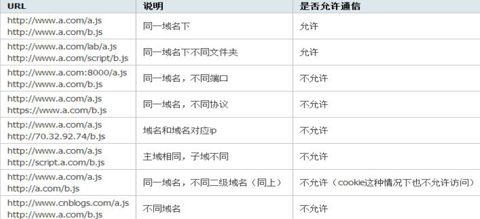
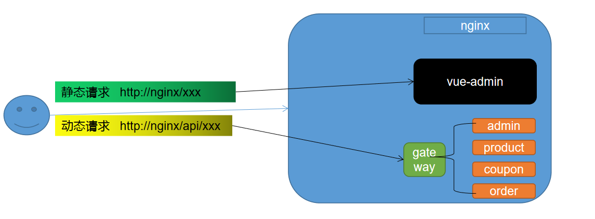
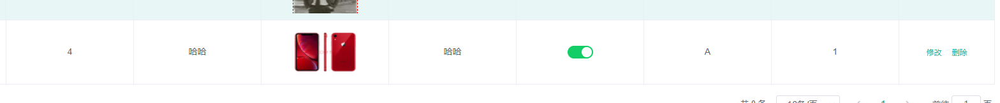
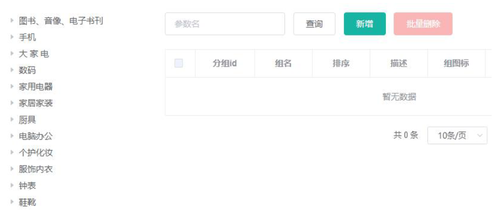
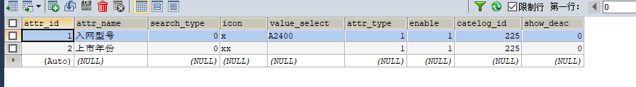
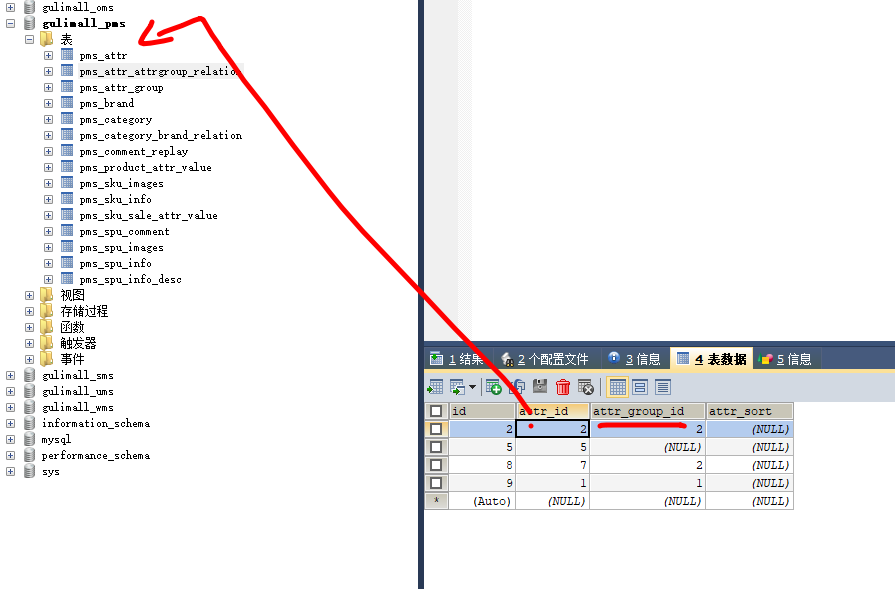
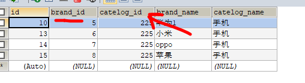
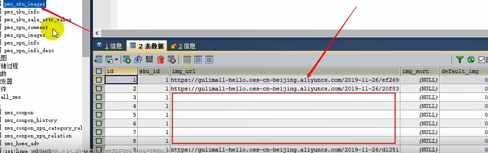
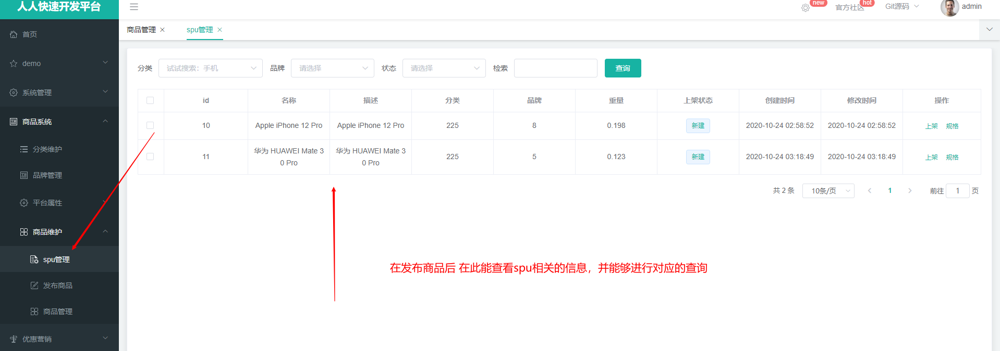
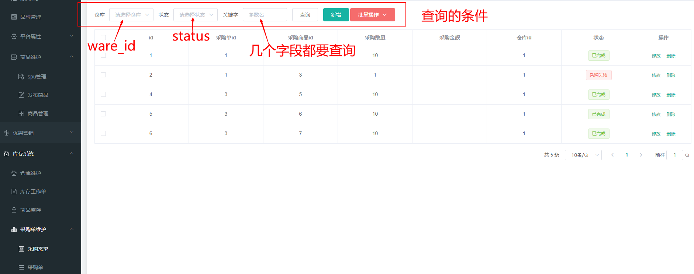

- [汉魂商城基础篇（下](#汉魂商城基础篇)
  - [七、前端开发基础知识](#七前端开发基础知识)
    - [7.1 VSCode 使用](#71-vscode-使用)
    - [7.2 ES6](#72-es6)
    - [7.3 Node.js](#73-nodejs)
    - [7.4 Vue](#74-vue)
      - [7.4.5 整合 Element UI](#745-整合-element-ui)
    - [7.5 Babel](#75-babel)
    - [7.6 Webpack](#76-webpack)
  - [八、商品服务&三级分类](#八商品服务三级分类)
    - [8.1 基础概念](#81-基础概念)
      - [8.1.1、三级分类](#811三级分类)
      - [8.1.2、SPU 和 SKU](#812spu-和-sku)
      - [8.1.3、基本属性 【规格参数】与 销售属性](#813基本属性-规格参数与-销售属性)
      - [8.1.4、接口文档位置](#814接口文档位置)
      - [8.1.5、 Object 划分](#815-object-划分)
        - [1、PO (persistant object) 持久化对象](#1po-persistant-object-持久化对象)
        - [2、DO ( Domain Object) 领域对象](#2do--domain-object-领域对象)
        - [3、TO (Transfer Object) 数据传输对象](#3to-transfer-object-数据传输对象)
        - [4、DTO  (Data Transfer Object) 数据传输对象](#4dto--data-transfer-object-数据传输对象)
        - [5、VO(value object) 值对象](#5vovalue-object-值对象)
        - [6、BO(business object) 业务对象](#6bobusiness-object-业务对象)
        - [7、POJO ( plain ordinary java object) 简单无规则 java 对象](#7pojo--plain-ordinary-java-object-简单无规则-java-对象)
        - [8、DAO（data access object） 数据访问对象](#8daodata-access-object-数据访问对象)
    - [8.2 三级分类接口编写](#82-三级分类接口编写)
      - [8.2.1 树形展示三级分类数据](#821-树形展示三级分类数据)
      - [8.2.2 逻辑删除&删除效果细化](#822-逻辑删除删除效果细化)
      - [8.2.3 新增效果&基本修改](#823-新增效果基本修改)
      - [8.2.4 拖拽功能&数据收集&批量删除](#824-拖拽功能数据收集批量删除)
  - [九、商品服务&品牌管理](#九商品服务品牌管理)
    - [9.1、效果显示优化与快速显示开关](#91效果显示优化与快速显示开关)
    - [9.2、表单效验&自定义效验规则](#92表单效验自定义效验规则)
    - [9.3、JSR303 数据效验 & 统一异常处理](#93jsr303-数据效验--统一异常处理)
      - [9.3.1、给Bean添加效验注解  javax.validation.constraints包下 并定义自己的的message提示](#931给bean添加效验注解--javaxvalidationconstraints包下-并定义自己的的message提示)
      - [9.3.2、开启效验功能 @Valid](#932开启效验功能-valid)
      - [9.3.3、给效验的bean后紧跟一个BindingResult 就可以获取到效验的结果](#933给效验的bean后紧跟一个bindingresult-就可以获取到效验的结果)
      - [9.3.4、分组效验 (多场景复杂效验)](#934分组效验-多场景复杂效验)
      - [9.3.5、自定义效验](#935自定义效验)
      - [9.3.6、异常处理](#936异常处理)
  - [十、商品服务&属性分组](#十商品服务属性分组)
    - [10.1 、前端组件抽取 & 父子组件交互](#101-前端组件抽取--父子组件交互)
      - [10.1.1 属性分组 - 效果](#1011-属性分组---效果)
      - [10.1.2 Layout 布局](#1012-layout-布局)
      - [10.1.3 父子组件如何进行交互](#1013-父子组件如何进行交互)
    - [10.2 、获取属性分类分组](#102-获取属性分类分组)
    - [10.3 、分类新增 & 级联选择器](#103-分类新增--级联选择器)
    - [10.4 、分类修改 & 回显级联选择器](#104-分类修改--回显级联选择器)
    - [10.5、品牌分类关联与级联更新](#105品牌分类关联与级联更新)
      - [10.5.1、实现品牌管理搜索](#1051实现品牌管理搜索)
  - [十一、商品服务&平台属性](#十一商品服务平台属性)
    - [11.1 规格参数新增与VO](#111-规格参数新增与vo)
      - [11.1.1 获取分类规格参数](#1111-获取分类规格参数)
    - [11.2 规格参数列表&规格修改](#112-规格参数列表规格修改)
        - [11.2.1、获取分类规格参数](#1121获取分类规格参数)
        - [11.2.2、查询属性详情](#1122查询属性详情)
        - [11.3.3、销售属性](#1133销售属性)
    - [11.3 查询分类关联属性&删除关联&查询分组未关联属性](#113-查询分类关联属性删除关联查询分组未关联属性)
        - [11.3.1、获取属性分组的关联的所有属性](#1131获取属性分组的关联的所有属性)
        - [11.3.2、删除属性与分组的关联关系](#1132删除属性与分组的关联关系)
        - [11.3.3、查询分组未关联属性](#1133查询分组未关联属性)
        - [11.4.4、新增分组与属性关联](#1144新增分组与属性关联)
  - [十二、商品服务&新增商品](#十二商品服务新增商品)
    - [12.1 获取分类关联的品牌](#121-获取分类关联的品牌)
    - [12.2 获取分类下所有分组以及属性](#122-获取分类下所有分组以及属性)
    - [12.3 商品 VO 抽取&商品新增业务流程](#123-商品-vo-抽取商品新增业务流程)
      - [12.3.4 封装 Vo 中，更改对应得属性](#1234-封装-vo-中更改对应得属性)
      - [12.3.5 分析业务流程](#1235-分析业务流程)
      - [12.3.6 主要编码！](#1236-主要编码)
      - [**12.3.7 总结**](#1237-总结)
      - [12.3.8 商品保存后 Debug 调试](#1238-商品保存后-debug-调试)
      - [12.3.9 商品保存其他问题处理](#1239-商品保存其他问题处理)
        - [1、   `sku_images` 表中 img_url 字段为空](#1---sku_images-表中-img_url-字段为空)
        - [2、sku 满减以及打折信息 数据出现错误](#2sku-满减以及打折信息-数据出现错误)
        - [3、程序中其他的异常](#3程序中其他的异常)
  - [十三、 商品服务&商品管理](#十三-商品服务商品管理)
      - [13.1 商品管理 SPU 检索](#131-商品管理-spu-检索)
      - [13.1 商品管理 SkU 检索](#131-商品管理-sku-检索)
  - [十四、仓储服务&仓库管理](#十四仓储服务仓库管理)
    - [14.1 整合ware服务&获取仓库列表](#141-整合ware服务获取仓库列表)
      - [14.1.1整合 ware 服务](#1411整合-ware-服务)
      - [14.1.2 获取仓库列表](#1412-获取仓库列表)
    - [14.2 查询库存&创建采购需求](#142-查询库存创建采购需求)
      - [14.2.1 查询库存](#1421-查询库存)
      - [14.2.2 创建采购需求](#1422-创建采购需求)
    - [14.3 合并采购需求&领取采购单&完成采购&Spu规格维护](#143-合并采购需求领取采购单完成采购spu规格维护)
      - [14.3.1 合并采购需求](#1431-合并采购需求)
      - [14.3.2 领取采购单](#1432-领取采购单)
      - [14.3.3 完成采购](#1433-完成采购)
      - [14.3.4 Spu规格维护](#1434-spu规格维护)
      - [14.3.5 Spu更新操作](#1435-spu更新操作)
  - [分布式基础篇总结](#分布式基础篇总结)


---

typora-root-url: images
typora-copy-images-to: images

---


# 汉魂商城基础篇（下


## 七、前端开发基础知识

这个等以后深入学习在进行记录~~~~

安装vue

```
# 最新稳定版
$ npm install vue
```

###   1、vue声明式渲染

```javascript
        let vm = new Vue({
            el: "#app",//绑定元素
            data: {  //封装数据
                name: "张三",
                num: 1
            },
            methods:{  //封装方法
                cancle(){
                    this.num -- ;
                },
                hello(){
                    return "1"
                }
            }
        });

```


### 2、双向绑定,模型变化，视图变化。反之亦然

双向绑定使用v-model

```html
 <input type="text" v-model="num">
```


```javascript
<h1> {{name}} ,非常帅，有{{num}}个人为他点赞{{hello()}}</h1>
```


> 看上去vue像一个数据缓存字典。
>
> 上面在vue里创建了一个num变量。text控件负责生产num值，其他地方通过{{}}符号引用这个变量。
>
> text控件输入的值被引用监听着。num值一变，所有引用的地方跟着变。
>
> 思考：vue可能通过事件机制实现上面的响应式效果。vue监听text控件的变化事件，在vue自己的事件触发代码里将新的变化通知引用vue的元素。
>
> 用户通过用vue绑定html元素，让html元素变得更智能。和以前接触的jsp页面，Razor页面，mybatis的*mapper.xml道理类似。都是这些第三方框架背后默默为我们生成了新的代码。本质来说，都是语法糖。

### 3、事件处理

v-xx：指令
1、创建vue实例，关联页面的模板，将自己的数据（data）渲染到关联的模板，响应式的
2、指令来简化对dom的一些操作。
3、声明方法来做更复杂的操作。methods里面可以封装方法。


v-on是按钮的单击事件：

```
 <button v-on:click="num++">点赞</button>
```


在VUE中el,data和vue的作用:

- el：用来绑定数据；
- data:用来封装数据；
- methods：用来封装方法，并且能够封装多个方法，如何上面封装了cancell和hello方法。

> vue原理好像java里利用aop，通过注解来增强代码的框架。通过对一个html元素使用vue“注解”，html元素便有了生命，有了各种事件，成为了一个响应式元素。
>

安装“Vue 2 Snippets”，用来做代码提示


为了方便的在浏览器上调试VUE程序，需要安装“[vue-devtools](https://github.com/vuejs/vue-devtools)”，编译后安装到chrome中即可。

详细的使用方法见：[Vue调试神器vue-devtools安装](https://www.jianshu.com/p/63f09651724c)


“v-html”不会对于HTML标签进行转义，而是直接在浏览器上显示data所设置的内容;而“ v-text”会对html标签进行转义

```javascript
     <div id="app">
        {{msg}}  {{1+1}}  {{hello()}}<br/>
        <span v-html="msg"></span>
        <br/>
        <span v-text="msg"></span>
    </div>
   
    <script src="../node_modules/vue/dist/vue.js"></script>

    <script>
        new Vue({
            el:"#app",
            data:{
                msg:"<h1>Hello</h1>",
                link:"http://www.baidu.com"
            },
            methods:{
                hello(){
                    return "World"
                }
            }
        })
    </script>
```

运行结果：


  {{msg}}  :称为差值表达式，它必须要写在Html表达式，可以完成数学运算和方法调用


### 4、v-bind :单向绑定

HTML元素从vue对象中读取值。

给html标签的属性绑定

```javascript
 <!-- 给html标签的属性绑定 -->
    <div id="app"> 

        <a v-bind:href="link">gogogo</a>

        <!-- class,style  {class名：加上？}-->
        <span v-bind:class="{active:isActive,'text-danger':hasError}"
          :style="{color: color1,fontSize: size}">你好</span>

    </div>

    <script src="../node_modules/vue/dist/vue.js"></script>

    <script>
        let vm = new Vue({
            el:"#app",
            data:{
                link: "http://www.baidu.com",
                isActive:true,
                hasError:true,
                color1:'red',
                size:'36px'
            }
        })
    </script>
```

上面所完成的任务就是给a标签绑定一个超链接。并且当“isActive”和“hasError”都是true的时候，将属性动态的绑定到，则绑定该“active”和 "text-danger"class。这样可以动态的调整属性的存在。

而且如果想要实现修改vm的"color1"和“size”， span元素的style也能够随之变化，则可以写作v-bind:style，也可以省略v-bind。

### 5、v-model双向绑定

html元素从vue对象中读取值，写入值。

```html
<!DOCTYPE html>
<html lang="en">
<head>
    <meta charset="UTF-8">
    <meta name="viewport" content="width=device-width, initial-scale=1.0">
    <meta http-equiv="X-UA-Compatible" content="ie=edge">
    <title>Document</title>
</head>
<body>


    <!-- 表单项，自定义组件 -->
    <div id="app">

        精通的语言：
            <input type="checkbox" v-model="language" value="Java"> java<br/>
            <input type="checkbox" v-model="language" value="PHP"> PHP<br/>
            <input type="checkbox" v-model="language" value="Python"> Python<br/>
        选中了 {{language.join(",")}}
    </div>
    
    <script src="../node_modules/vue/dist/vue.js"></script>

    <script>
        let vm = new Vue({
            el:"#app",
            data:{
                language: []
            }
        })
    </script>

</body>
</html>
```

上面完成的功能就是通过“v-model”为输入框绑定多个值，能够实现选中的值，在data的language也在不断的发生着变化，


如果在控制台上指定vm.language=["Java","PHP"]，则data值也会跟着变化。


通过“v-model”实现了页面发生了变化，则数据也发生变化，数据发生变化，则页面也发生变化，这样就实现了双向绑定。


数组的连接操作： 选中了 {{language.join(",")}}

### 6、v-on为按钮绑定事件

```javascript
        <!--事件中直接写js片段-->
        <button v-on:click="num++">点赞</button>
        <!--事件指定一个回调函数，必须是Vue实例中定义的函数-->
        <button @click="cancle">取消</button>
```

上面是为两个按钮绑定了单击事件，其中一个对于num进行自增，另外一个自减。

v-on:click也可以写作@click

事件的冒泡：

```html
        <!-- 事件修饰符 -->
        <div style="border: 1px solid red;padding: 20px;" v-on:click="hello">
            大div
            <div style="border: 1px solid blue;padding: 20px;" @click="hello">
                小div <br />
                <a href="http://www.baidu.com" @click.prevent="hello">去百度</a>
            </div>
        </div>
```

上面的这两个嵌套div中，如果点击了内层的div，则外层的div也会被触发；这种问题可以事件修饰符来完成：

```html
        <!-- 事件修饰符 -->
        <div style="border: 1px solid red;padding: 20px;" v-on:click.once="hello">
            大div
            <div style="border: 1px solid blue;padding: 20px;" @click.stop="hello">
                小div <br />
                <a href="http://www.baidu.com" @click.prevent.stop="hello">去百度</a>
                <!--这里禁止了超链接的点击跳转操作，并且只会触发当前对象的操作-->
            </div>
        </div>
```

关于事件修饰符：


按键修饰符：


### 7、v-for遍历循环

```html
<!DOCTYPE html>
<html lang="en">

<head>
    <meta charset="UTF-8">
    <meta name="viewport" content="width=device-width, initial-scale=1.0">
    <meta http-equiv="X-UA-Compatible" content="ie=edge">
    <title>Document</title>
</head>

<body>

    <div id="app">
        <ul>
            <li v-for="(user,index) in users" :key="user.name" v-if="user.gender == '女'">
                <!-- 1、显示user信息：v-for="item in items" -->
               当前索引：{{index}} ==> {{user.name}}  ==>   {{user.gender}} ==>{{user.age}} <br>
                <!-- 2、获取数组下标：v-for="(item,index) in items" -->
                <!-- 3、遍历对象：
                        v-for="value in object"
                        v-for="(value,key) in object"
                        v-for="(value,key,index) in object" 
                -->
                对象信息：
                <span v-for="(v,k,i) in user">{{k}}=={{v}}=={{i}}；</span>
                <!-- 4、遍历的时候都加上:key来区分不同数据，提高vue渲染效率 -->
            </li>

            
        </ul>

        <ul>
            <li v-for="(num,index) in nums" :key="index"></li>
        </ul>
    </div>
    <script src="../node_modules/vue/dist/vue.js"></script>
    <script>         
        let app = new Vue({
            el: "#app",
            data: {
                users: [{ name: '柳岩', gender: '女', age: 21 },
                { name: '张三', gender: '男', age: 18 },
                { name: '范冰冰', gender: '女', age: 24 },
                { name: '刘亦菲', gender: '女', age: 18 },
                { name: '古力娜扎', gender: '女', age: 25 }],
                nums: [1,2,3,4,4]
            },
        })
    </script>
</body>

</html>
```

4、遍历的时候都加上:key来区分不同数据，提高vue渲染效率


### 过滤器

```html
<!DOCTYPE html>
<html lang="en">

<head>
    <meta charset="UTF-8">
    <meta name="viewport" content="width=device-width, initial-scale=1.0">
    <meta http-equiv="X-UA-Compatible" content="ie=edge">
    <title>Document</title>
</head>

<body>
    <!-- 过滤器常用来处理文本格式化的操作。过滤器可以用在两个地方：双花括号插值和 v-bind 表达式 -->
    <div id="app">
        <ul>
            <li v-for="user in userList">
                {{user.id}} ==> {{user.name}} ==> {{user.gender == 1?"男":"女"}} ==>
                {{user.gender | genderFilter}} ==> {{user.gender | gFilter}}
                <!-- 这里的"|"表示的管道，将user.gender的值交给genderFilter -->
            </li>
        </ul>
    </div>
    <script src="../node_modules/vue/dist/vue.js"></script>

    <script>
        // 全局过滤器 
        Vue.filter("gFilter", function (val) {
            if (val == 1) {
                return "男~~~";
            } else {
                return "女~~~";
            }
        })

        let vm = new Vue({
            el: "#app",
            data: {
                userList: [
                    { id: 1, name: 'jacky', gender: 1 },
                    { id: 2, name: 'peter', gender: 0 }
                ]
            },
            filters: {
                //// filters 定义局部过滤器，只可以在当前vue实例中使用
                genderFilter(val) {
                    if (val == 1) {
                        return "男";
                    } else {
                        return "女";
                    }
                }
            }
        })
    </script>
</body>

</html>
```


### 组件化

```html
<!DOCTYPE html>
<html lang="en">

<head>
    <meta charset="UTF-8">
    <meta name="viewport" content="width=device-width, initial-scale=1.0">
    <meta http-equiv="X-UA-Compatible" content="ie=edge">
    <title>Document</title>
</head>

<body>

    <div id="app">
        <button v-on:click="count++">我被点击了 {{count}} 次</button>

        <counter></counter>
        <counter></counter>
        <counter></counter>
        <counter></counter>
        <counter></counter>
        <!-- 使用所定义的组件button-counter -->
        <button-counter></button-counter>
    </div>
    <script src="../node_modules/vue/dist/vue.js"></script>


    <script>
        //1、全局声明注册一个组件
        Vue.component("counter", {
            template: `<button v-on:click="count++">我被点击了 {{count}} 次</button>`,
            data() {
                return {
                    count: 1
                }
            }
        });

        //2、局部声明一个组件
        const buttonCounter = {
            template: `<button v-on:click="count++">我被点击了 {{count}} 次~~~</button>`,
            data() {
                return {
                    count: 1
                }
            }
        };

        new Vue({
            el: "#app",
            data: {
                count: 1
            },
            components: {
                //声明所定义的局部组件
                'button-counter': buttonCounter
            }
        })
    </script>
</body>

</html>
```


### 生命周期钩子函数

```html
<!DOCTYPE html>
<html lang="en">

<head>
    <meta charset="UTF-8">
    <meta name="viewport" content="width=device-width, initial-scale=1.0">
    <meta http-equiv="X-UA-Compatible" content="ie=edge">
    <title>Document</title>
</head>

<body>
    <div id="app">
        <span id="num">{{num}}</span>
        <button @click="num++">赞！</button>
        <h2>{{name}}，有{{num}}个人点赞</h2>
    </div>

    <script src="../node_modules/vue/dist/vue.js"></script>
    
    <script>
        let app = new Vue({
            el: "#app",
            data: {
                name: "张三",
                num: 100
            },
            methods: {
                show() {
                    return this.name;
                },
                add() {
                    this.num++;
                }
            },
            beforeCreate() {
                console.log("=========beforeCreate=============");
                console.log("数据模型未加载：" + this.name, this.num);
                console.log("方法未加载：" + this.show());
                console.log("html模板未加载：" + document.getElementById("num"));
            },
            created: function () {
                console.log("=========created=============");
                console.log("数据模型已加载：" + this.name, this.num);
                console.log("方法已加载：" + this.show());
                console.log("html模板已加载：" + document.getElementById("num"));
                console.log("html模板未渲染：" + document.getElementById("num").innerText);
            },
            beforeMount() {
                console.log("=========beforeMount=============");
                console.log("html模板未渲染：" + document.getElementById("num").innerText);
            },
            mounted() {
                console.log("=========mounted=============");
                console.log("html模板已渲染：" + document.getElementById("num").innerText);
            },
            beforeUpdate() {
                console.log("=========beforeUpdate=============");
                console.log("数据模型已更新：" + this.num);
                console.log("html模板未更新：" + document.getElementById("num").innerText);
            },
            updated() {
                console.log("=========updated=============");
                console.log("数据模型已更新：" + this.num);
                console.log("html模板已更新：" + document.getElementById("num").innerText);
            }
        });
    </script>
</body>

</html>
```


## 13. element ui

官网： https://element.eleme.cn/#/zh-CN/component/installation 

安装

```shell
npm i element-ui -S
```

###   

 在 main.js 中写入以下内容： 

```
import ElementUI  from 'element-ui'
import 'element-ui/lib/theme-chalk/index.css';

Vue.use(ElementUI);
```


## 14. 递归树形结构获取数据

在注册中心中“product”命名空间中，创建“gulimall-product.yml”配置文件：


将“application.yml”内容拷贝到该配置文件中

```yaml
server:
  port: 10000

spring:
  datasource:
    #MySQL配置
    driverClassName: com.mysql.cj.jdbc.Driver
    url: jdbc:mysql://192.168.137.14:3306/gulimall_pms?useUnicode=true&characterEncoding=UTF-8&useSSL=false
    username: root
    password: root
  application:
    name: gulimall-product
  cloud:
    nacos:
      discovery:
        server-addr: 192.168.137.14:8848


mybatis-plus:
  global-config:
    db-config:
      id-type: auto
  mapper-locations: classpath:/mapper/**/*.xml


```

在本地创建“bootstrap.properties”文件，指明配置中心的位置和使用到的配置文件：

```properties
spring.application.name=gulimall-product
spring.cloud.nacos.config.server-addr=192.168.137.14:8848
spring.cloud.nacos.config.namespace=3c50ffaa-010b-4b59-9372-902e35059232
spring.cloud.nacos.config.extension-configs[0].data-id=gulimall-product.yml
spring.cloud.nacos.config.extension-configs[0].group=DEFAULT_GROUP
spring.cloud.nacos.config.extension-configs[0].refresh=true
```

然后启动gulimall-product，查看到该服务已经出现在了nacos的注册中心中了

修改“io.niceseason.gulimall.product.service.CategoryService”类，添加如下代码：

```java
    /**
     * 列表
     */
    @RequestMapping("/list/tree")
    public List<CategoryEntity> list(){
        List<CategoryEntity> categoryEntities = categoryService.listWithTree();

        return categoryEntities;
    }
```

测试：http://localhost:10000/product/category/list/tree


如何区别是哪种分类级别？

答：可以通过分类的parent_cid来进行判断，如果是一级分类，其值为0.

```java
     /**
     * 列表
     */
    @RequestMapping("/list/tree")
    public List<CategoryEntity> list(){
        List<CategoryEntity> categoryEntities = categoryService.listWithTree();
        //找到所有的一级分类
        List<CategoryEntity> level1Menus = categoryEntities.stream()
                .filter(item -> item.getParentCid() == 0)
                .map(menu->{
                    menu.setChildCategoryEntity(getChildrens(menu,categoryEntities));
                    return menu;
                })
                .sorted((menu1, menu2) -> {

                  return (menu1.getSort() ==null ? 0:menu1.getSort())- (menu2.getSort()==null?0:menu2.getSort());

                })
                .collect(Collectors.toList());


        return level1Menus;
    }

    public List<CategoryEntity> getChildrens(CategoryEntity root,List<CategoryEntity> all){

        List<CategoryEntity> childrens = all.stream().filter(item -> {
            return item.getParentCid() == root.getCatId();
        }).map(item -> {
            item.setChildCategoryEntity(getChildrens(item, all));
            return item;
        }).sorted((menu1, menu2) -> {
            return (menu1.getSort() ==null ? 0:menu1.getSort())- (menu2.getSort()==null?0:menu2.getSort());
        }).collect(Collectors.toList());

        return childrens;
    }

```


下面是得到的部分JSON数据

```json
[
  {
    "catId": 1,
    "name": "图书、音像、电子书刊",
    "parentCid": 0,
    "catLevel": 1,
    "showStatus": 1,
    "sort": 0,
    "icon": null,
    "productUnit": null,
    "productCount": 0,
    "childCategoryEntity": [
      {
        "catId": 22,
        "name": "电子书刊",
        "parentCid": 1,
        "catLevel": 2,
        "showStatus": 1,
        "sort": 0,
        "icon": null,
        "productUnit": null,
        "productCount": 0,
        "childCategoryEntity": [
          {
            "catId": 165,
            "name": "电子书",
            "parentCid": 22,
            "catLevel": 3,
            "showStatus": 1,
            "sort": 0,
            "icon": null,
            "productUnit": null,
            "productCount": 0,
            "childCategoryEntity": []
          },
          {
            "catId": 166,
            "name": "网络原创",
            "parentCid": 22,
            "catLevel": 3,
            "showStatus": 1,
            "sort": 0,
            "icon": null,
            "productUnit": null,
            "productCount": 0,
            "childCategoryEntity": []
          },
          {
            "catId": 167,
            "name": "数字杂志",
            "parentCid": 22,
            "catLevel": 3,
            "showStatus": 1,
            "sort": 0,
            "icon": null,
            "productUnit": null,
            "productCount": 0,
            "childCategoryEntity": []
          },
          {
            "catId": 168,
            "name": "多媒体图书",
            "parentCid": 22,
            "catLevel": 3,
            "showStatus": 1,
            "sort": 0,
            "icon": null,
            "productUnit": null,
            "productCount": 0,
            "childCategoryEntity": []
          }
        ]
      },
      {
        "catId": 23,
        "name": "音像",
        "parentCid": 1,
        "catLevel": 2,
        "showStatus": 1,
        "sort": 0,
        "icon": null,
        "productUnit": null,
        "productCount": 0,
        "childCategoryEntity": [
          {
            "catId": 169,
            "name": "音乐",
            "parentCid": 23,
            "catLevel": 3,
            "showStatus": 1,
            "sort": 0,
            "icon": null,
            "productUnit": null,
            "productCount": 0,
            "childCategoryEntity": []
          },
          {
            "catId": 170,
            "name": "影视",
            "parentCid": 23,
            "catLevel": 3,
            "showStatus": 1,
            "sort": 0,
            "icon": null,
            "productUnit": null,
            "productCount": 0,
            "childCategoryEntity": []
          },
          {
            "catId": 171,
            "name": "教育音像",
            "parentCid": 23,
            "catLevel": 3,
            "showStatus": 1,
            "sort": 0,
            "icon": null,
            "productUnit": null,
            "productCount": 0,
            "childCategoryEntity": []
          }
        ]
      },
      {
```


启动后端项目renren-fast

启动前端项目renren-fast-vue：

```
npm run dev
```


访问： http://localhost:8001/#/login 

创建一级菜单：


创建完成后，在后台的管理系统中会创建一条记录：


然后创建子菜单：


创建renren-fast-vue\src\views\modules\product目录，子所以是这样来创建，是因为product/category，对应于product-category

在该目录下，新建“category.vue”文件：

```html
<!--  -->
<template>
  <el-tree :data="menus" :props="defaultProps" @node-click="handleNodeClick"></el-tree>
</template>

<script>
//这里可以导入其他文件（比如：组件，工具js，第三方插件js，json文件，图片文件等等）
//例如：import 《组件名称》 from '《组件路径》';

export default {
  //import引入的组件需要注入到对象中才能使用
  components: {},

  //监听属性 类似于data概念
  computed: {},
  //监控data中的数据变化
  watch: {},
  data() {
    return {
      menus: [],
       defaultProps: {
        children: "childrens",
        label: "name"
      },
    }
  },
    
  methods: {
    handleNodeClick(data) {
      console.log(data);
    },

    getMenus() {
      this.dataListLoading = true;
      this.$http({
        url: this.$http.adornUrl("/product/category/list/tree"),
        method: "get"
      }).then(({ data }) => {
        console.log("获取到数据", data);
        this.menus=data;
      });
    }
  },


  //生命周期 - 创建完成（可以访问当前this实例）
  created() {
    this.getMenus();
  },
  //生命周期 - 挂载完成（可以访问DOM元素）
  mounted() {},
  beforeCreate() {}, //生命周期 - 创建之前
  beforeMount() {}, //生命周期 - 挂载之前
  beforeUpdate() {}, //生命周期 - 更新之前
  updated() {}, //生命周期 - 更新之后
  beforeDestroy() {}, //生命周期 - 销毁之前
  destroyed() {}, //生命周期 - 销毁完成
  activated() {} //如果页面有keep-alive缓存功能，这个函数会触发
};
</script>
<style scoped>
```

刷新页面出现404异常，查看请求发现，请求的是“http://localhost:8080/renren-fast/product/category/list/tree”


这个请求是不正确的，正确的请求是：http://localhost:10000/product/category/list/tree，

修正这个问题：

替换“static\config\index.js”文件中的“window.SITE_CONFIG['baseUrl']”

替换前：

```
window.SITE_CONFIG['baseUrl'] = 'http://localhost:8080/renren-fast';
```

替换后：

```
 window.SITE_CONFIG['baseUrl'] = 'http://localhost:88/api';
```

http://localhost:88，这个地址是我们网关微服务的接口。


这里我们需要通过网关来完成路径的映射，因此将renren-fast注册到nacos注册中心中，并添加配置中心

```yaml
application:
    name: renren-fast
  cloud:
    nacos:
      discovery:
        server-addr: 192.168.137.14:8848

      config:
        name: renren-fast
        server-addr: 192.168.137.8848
        namespace: ee409c3f-3206-4a3b-ba65-7376922a886d
```


配置网关路由，前台的所有请求都是经由“http://localhost:88/api”来转发的，在“gulimall-gateway”中添加路由规则：

```yaml
        - id: admin_route
          uri: lb://renren-fast
          predicates:
            - Path=/api/**
```


但是这样做也引入了另外的一个问题，再次访问：http://localhost:8001/#/login，发现验证码不再显示：

分析原因：

1. 现在的验证码请求路径为，http://localhost:88/api/captcha.jpg?uuid=69c79f02-d15b-478a-8465-a07fd09001e6
2. 原始的验证码请求路径：http://localhost:8001/renren-fast/captcha.jpg?uuid=69c79f02-d15b-478a-8465-a07fd09001e6

在admin_route的路由规则下，在访问路径中包含了“api”，因此它会将它转发到renren-fast，网关在转发的时候，会使用网关的前缀信息，为了能够正常的取得验证码，我们需要对请求路径进行重写


关于请求路径重写：

[6.16. The `RewritePath` `GatewayFilter` Factory](https://cloud.spring.io/spring-cloud-static/spring-cloud-gateway/2.2.2.RELEASE/reference/html/#the-rewritepath-gatewayfilter-factory)

The `RewritePath` `GatewayFilter` factory takes a path `regexp` parameter and a `replacement` parameter. This uses Java regular expressions for a flexible way to rewrite the request path. The following listing configures a `RewritePath` `GatewayFilter`:

Example 41. application.yml

```yaml
spring:
  cloud:
    gateway:
      routes:
      - id: rewritepath_route
        uri: https://example.org
        predicates:
        - Path=/foo/**
        filters:
        - RewritePath=/red(?<segment>/?.*), $\{segment}
```

For a request path of `/red/blue`, this sets the path to `/blue` before making the downstream request. Note that the `$` should be replaced with `$\` because of the YAML specification.


修改“admin_route”路由规则：

```yaml
        - id: admin_route
          uri: lb://renren-fast
          predicates:
            - Path=/api/**
          filters:
            - RewritePath=/api/(?<segment>/?.*), /renren-fast/$\{segment}
```


再次访问：http://localhost:8001/#/login，验证码能够正常的加载了。

但是很不幸新的问题又产生了，访问被拒绝了


 问题描述：已拦截跨源请求：同源策略禁止读取位于 http://localhost:88/api/sys/login 的远程资源。（原因：CORS 头缺少 'Access-Control-Allow-Origin'）。 

问题分析：这是一种跨域问题。访问的域名和端口和原来的请求不同，请求就会被限制


跨域流程：


解决方法：在网关中定义“GulimallCorsConfiguration”类，该类用来做过滤，允许所有的请求跨域。

```java
@Configuration
public class GulimallCorsConfiguration {

    @Bean
    public CorsWebFilter corsWebFilter(){
        UrlBasedCorsConfigurationSource source=new UrlBasedCorsConfigurationSource();
        CorsConfiguration corsConfiguration = new CorsConfiguration();
        corsConfiguration.addAllowedHeader("*");
        corsConfiguration.addAllowedMethod("*");
        corsConfiguration.addAllowedOrigin("*");
        corsConfiguration.setAllowCredentials(true);
        
        source.registerCorsConfiguration("/**",corsConfiguration);
        return new CorsWebFilter(source);
    }
}
```


再次访问：http://localhost:8001/#/login


http://localhost:8001/renre已拦截跨源请求：同源策略禁止读取位于 http://localhost:88/api/sys/login 的远程资源。（原因：不允许有多个 'Access-Control-Allow-Origin' CORS 头）n-fast/captcha.jpg?uuid=69c79f02-d15b-478a-8465-a07fd09001e6

出现了多个请求，并且也存在多个跨源请求。

为了解决这个问题，需要修改renren-fast项目，注释掉“io.renren.config.CorsConfig”类。然后再次进行访问。


在显示分类信息的时候，出现了404异常，请求的http://localhost:88/api/product/category/list/tree不存在


这是因为网关上所做的路径映射不正确，映射后的路径为http://localhost:8001/renren-fast/product/category/list/tree

但是只有通过http://localhost:10000/product/category/list/tree路径才能够正常访问，所以会报404异常。

解决方法就是定义一个product路由规则，进行路径重写：

```yaml
        - id: product_route
          uri: lb://gulimall-product
          predicates:
            - Path=/api/product/**
          filters:
            - RewritePath=/api/(?<segment>/?.*),/$\{segment}
```

在路由规则的顺序上，将精确的路由规则放置到模糊的路由规则的前面，否则的话，精确的路由规则将不会被匹配到，类似于异常体系中try catch子句中异常的处理顺序。


## 15. 删除/添加数据

添加delete和append标识，并且增加复选框

```vue
 <el-tree
    :data="menus"
    show-checkbox  //显示复选框
    :props="defaultProps"  
    :expand-on-click-node="false" //设置节点点击时不展开
    node-key="catId"   
  >
    <span class="custom-tree-node" slot-scope="{ node, data }">
      <span>{{ node.label }}</span>
      <span>
        <el-button v-if="node.level <= 2" type="text" size="mini" @click="() => append(data)">Append</el-button>
        <el-button
          v-if="node.childNodes.length == 0"
          type="text"
          size="mini"
          @click="() => remove(node, data)"
        >Delete</el-button>
      </span>
    </span>
  </el-tree>
```


测试删除数据，打开postman输入“ http://localhost:88/api/product/category/delete ”，请求方式设置为POST，为了比对效果，可以在删除之前查询数据库的pms_category表：


由于delete请求接收的是一个数组，所以这里使用JSON方式，传入了一个数组：


再次查询数据库能够看到cat_id为1000的数据已经被删除了。


修改“io.niceseason.gulimall.product.controller.CategoryController”类，添加如下代码：

```java
 @RequestMapping("/delete")
    public R delete(@RequestBody Long[] catIds){
        //删除之前需要判断待删除的菜单那是否被别的地方所引用。
//		categoryService.removeByIds(Arrays.asList(catIds));

        categoryService.removeMenuByIds(Arrays.asList(catIds));
        return R.ok();
    }
```


io.niceseason.gulimall.product.service.impl.CategoryServiceImpl

```java
    @Override
    public   void removeMenuByIds(List<Long> asList) {
        //TODO 检查当前的菜单是否被别的地方所引用
        categoryDao.deleteBatchIds(asList);
    }
```


然而多数时候，我们并不希望删除数据，而是标记它被删除了，这就是逻辑删除；

可以设置show_status为0，标记它已经被删除。


mybatis-plus的逻辑删除：


配置全局的逻辑删除规则，在“src/main/resources/application.yml”文件中添加如下内容：

```yaml
mybatis-plus:
  global-config:
    db-config:
      id-type: auto
      logic-delete-value: 1
      logic-not-delete-value: 0
```

修改“io.niceseason.gulimall.product.entity.CategoryEntity”类，添加上@TableLogic，表明使用逻辑删除：

```java
	/**
	 * 是否显示[0-不显示，1显示]
	 */
	@TableLogic(value = "1",delval = "0")
	private Integer showStatus;
```

然后在POSTMan中测试一下是否能够满足需要。另外在“src/main/resources/application.yml”文件中，设置日志级别，打印出SQL语句：

```yaml
logging:
  level:
    io.niceseason.gulimall.product: debug
```

打印的日志：

```verilog
 ==>  Preparing: UPDATE pms_category SET show_status=0 WHERE cat_id IN ( ? ) AND show_status=1 
 ==> Parameters: 1431(Long)
 <==    Updates: 1
 get changedGroupKeys:[]
```

删除细节优化

```javascript
  remove(node, data) {
      //讲删除id传入数组
      var ids = [data.catId];
      //删除前弹出确认框
      this.$confirm(`是否删除【${data.name}】菜单?`, "提示", {
        confirmButtonText: "确定",
        cancelButtonText: "取消",
        type: "warning",
      })
        .then(() => {
          this.$http({
            url: this.$http.adornUrl("/product/category/delete"),
            method: "post",
            data: this.$http.adornData(ids, false),
          }).then(({ data }) => {
            //成功删除后弹出提示
            this.$message({
              message: "菜单删除成功",
              type: "success",
            });
            //刷新出新的菜单
            this.getMenus();
            //设置需要默认展开的菜单，使得删除后当前目录处于展开的状态
            this.expandedKey = [node.parent.data.catId];
          });
        })
        .catch(() => {});

      console.log("remove", node, data);
    },
```


**添加数据**

在模板上添加分类对话框

```html
 <el-dialog title="添加分类" :visible.sync="dialogFormVisible">
  <el-form :model="category">
    <el-form-item label="分类名称">
      <el-input v-model="category.name" autocomplete="off"></el-input>
    </el-form-item>
  </el-form>
  <div slot="footer" class="dialog-footer">
    <el-button @click="dialogFormVisible = false">取 消</el-button>
    <el-button type="primary" @click="addCategory">确 定</el-button>
  </div>
</el-dialog>
```

在data属性中增加对话框显示属性`dialogFormVisible`和提交数据`category`

```javascript
data() {
    return {
      menus: [],
      defaultProps: {
        children: "childrens",
        label: "name",
      },
      //展开菜单的id
      expandedKey: [],
      //添加分类对话框默认关闭
      dialogFormVisible: false,
      //提交分类的数据
      category: {
        name:"",
        parentCid: 0,
        catLevel: 0,
        showStatus: 1,
        sort: 0,
        productUnit: "",
        icon: "",
        catId: null,
      },
    };
  },
```

分别添加`添加`和`确定`对应函数

```javascript
//点击添加调用此函数
append(data) {
      console.log("添加数据", data);
    //显示对话框
      this.dialogFormVisible=true;
    //父id为当前点击数据id
      this.category.parentCid = data.catId;
    //显示层级为当前点击数据下一级
      this.category.catLevel = data.catLevel * 1 + 1;
      this.category.catId = null;
      this.category.name = "";
      this.category.icon = "";
      this.category.productUnit = "";
      this.category.sort = 0;
      this.category.showStatus = 1;
    },

    addCategory(){
      this.$http({
      url: this.$http.adornUrl('/product/category/save'),
      method: 'post',
      data: this.$http.adornData(this.category, false)
       }).then(({ data }) => {
        this.$message({
          message: "菜单保存成功",
          type: "success",
        });
        //关闭对话框
        this.dialogFormVisible = false;
        //刷新出新的菜单
        this.getMenus();
        //设置需要默认展开的菜单
        this.expandedKey = [this.category.parentCid];
      });
    },
  },
```

## 16. 修改数据

添加修改按钮

```html
<el-button type="text" size="mini" @click="() => edit(data)">Edit</el-button>
```

使对话框回显数据并显示标题`修改分类`，由于与 `增加分类`公用统一对话框，所以需要添加属性`title`并定制函数`submitData()`

```html
<el-dialog :title="title" :visible.sync="dialogFormVisible">
    <el-form :model="category">
        <el-form-item label="分类名称">
            <el-input v-model="category.name" autocomplete="off"></el-input>
        </el-form-item>
        <el-form-item label="图标">
            <el-input v-model="category.icon" autocomplete="off"></el-input>
        </el-form-item>
        <el-form-item label="计量单位">
            <el-input v-model="category.productUnit" autocomplete="off"></el-input>
        </el-form-item>
    </el-form>
    <div slot="footer" class="dialog-footer">
        <el-button @click="dialogFormVisible = false">取 消</el-button>
        <el-button type="primary" @click="submitData">确 定</el-button>
    </div>
</el-dialog>
```

```javascript
 data() {
    return {
      menus: [],
      defaultProps: {
        children: "childrens",
        label: "name",
      },
      //展开菜单的id
      expandedKey: [],
      dialogFormVisible: false,
      category: {
        catId: null,
        name: "",
        parentCid: 0,
        catLevel: 0,
        showStatus: 1,
        sort: 0,
        productUnit: "",
        icon: "",
        catId: null,
      },
      //对话框显示标题：添加分类/修改分类
      title: "",
      dialogType: "" // add/edit
    };
  },
      
      //点击修改按钮调用函数
       edit(data) {
      this.title = "修改分类",
      this.dialogFormVisible = true,
      this.dialogType="edit",
        console.log("修改数据", data);
      this.$http({
        url: this.$http.adornUrl(`/product/category/info/${data.catId}`),
        method: "get",
      }).then(({ data }) => {
        console.log("回显数据", data.category);
        this.category = data.category;
      });
    },

    //点击确定按钮调用函数
    editCategory(){
      var {catId,name,icon,productUnit}=this.category;
      this.$http({
        url: this.$http.adornUrl("/product/category/update"),
        method: "post",
        data: this.$http.adornData({catId,name,icon,productUnit}, false),
      }).then(({ data }) => {
        this.$message({
          message: "菜单修改成功",
          type: "success",
        });
        //关闭对话框
        this.dialogFormVisible = false;
        //刷新出新的菜单
        this.getMenus();
        //设置需要默认展开的菜单
        this.expandedKey = [this.category.parentCid];
      });
    },

    //根据提交类型是add/edit选择调用不同的方法
    submitData(){
      this.dialogType=="add"?this.addCategory():this.editCategory();
    },
  },

```


## 17. 菜单拖动

**开启拖拽功能**

在`<el-tree>`添加属性`draggable`开启拖拽功能

```html
<el-tree
      :data="menus"
      :props="defaultProps"
      :expand-on-click-node="false"
      show-checkbox
      node-key="catId"
      :default-expanded-keys="expandedKey"
      :draggable="draggable"
      :allow-drop="allowDrop"  //绑定允许拖拽的函数
      @node-drop="handleDrop" 
      ref="menuTree"
    >
```

**限制可拖拽范围**

由于我们的菜单是三级分类，所以未防止超出三级的情况，有部分情况不允许被拖入：比如被拖拽的节点本身包含两级菜单，将其拖进第二层级的节点，那么最深层级就达到了四级，为防止这种情况的出现，我们需要编写在`<el-tree>`中绑定`allow-drop`属性并编写`allowDrop()`函数

`allowDrop()`的思路为将被拖拽节点的子节点通过递归遍历找出最深节点的`level`，然后将被拖拽节点的相对深度与目标节点的相对深度相加，看是否超出最大深度3

```javascript
   //拖拽时判定目标节点能否被放置。type 参数有三种情况：'prev'、'inner' 和 'next'，
    //分别表示放置在目标节点前、插入至目标节点和放置在目标节点后
    allowDrop(draggingNode, dropNode, type){
      console.log("拖拽节点",draggingNode,dropNode,type);
      this.maxLevel=draggingNode.level;
      this.countNodeLevel(draggingNode);
      //当前拖拽节点距离最深节点的深度
      let deep=(this.maxLevel-draggingNode.level)+1;
      console.log("deep:",deep,"maxlevel:",this.maxLevel,"dragging:",draggingNode.level);
      if(type=="inner"){
        return deep+dropNode.level<=3;
      }else{
        return deep+dropNode.parent.level<=3;
      }
    },

    //判断当前拖动菜单的最深层级
    countNodeLevel(node){
      if(node.childNodes!=null&&node.childNodes.length!=0){
        for(let i=0;i<node.childNodes.length;i++){
        if(node.childNodes[i].level>this.maxLevel){
          this.maxLevel=node.childNodes[i].level;
        }
        this.countNodeLevel(node.childNodes[i]);
      }
      }
    },
```

**拖拽完成**

拖拽完成后我们需要更新三个状态：

1. 当前节点最新的父节点id，

2. 当前拖拽节点的最新顺序

   > 遍历姊妹节点的顺序即为新顺序

3. 当前拖拽节点的最新层级

   >  当前拖拽层级变化需要更新拖拽节点及其子节点


拖拽完成后需要更新变化的节点，根据被拖拽节点的防止位置的不同，变化的部分也有所不同

* inner

  父节点为`dropNode`节点

  姊妹节点为`dropNode`的孩子节点

* before/after

  父节点为`dropNode`的父节点

  姊妹节点为`dropNode`的父节点的孩子节点

```javascript
   //拖拽成功完成时触发的事件
    //共四个参数，依次为：
    //被拖拽节点对应的 Node、结束拖拽时最后进入的节点、被拖拽节点的放置位置（before、after、inner）、event
    handleDrop(draggingNode, dropNode, dropType, ev) {
      //1、当前节点最新的父节点id
      let pCid=0;
      let siblings=null;
      if(dropType=="inner"){
        pCid=dropNode.data.catId;
        siblings=dropNode.childNodes;
      }else{
        pCid=dropNode.parent.data.catId==undefined?0:dropNode.parent.data.catId;
        siblings=dropNode.parent.childNodes;
      }
      //2、当前拖拽节点的最新顺序，
      //3、当前拖拽节点的最新层级
      this.pCid.push(pCid);
      for(let i=0;i<siblings.length;i++){
        if(siblings[i].data.catId==draggingNode.data.catId){
           let catLevel=draggingNode.catLevel;
           //被拖拽节点的层级发生变化
           //其子节点的层级也需要变化
           if(catLevel!=draggingNode.level){
                this.updateChildNodeLevel(siblings[i]);
                catLevel=draggingNode.level;
           }
           this.updateNodes.push({
             catId:siblings[i].data.catId,
             catLevel,
             sort:i,
             parentCid:pCid,
           });
        }else{
          this.updateNodes.push({
            catId:siblings[i].data.catId,
            sort:i,
          });
        }
      }
      console.log(this.updateNodes);
    },

    //更新子节点的层级
    updateChildNodeLevel(node){
        if(node.childNodes.length>0){
          for(let i=0;i<node.childNodes.length;i++){
            this.updateNodes.push({
              catId:node.childNodes[i].data.catId,
              catLevel:node.childNodes[i].level,
            });
            this.updateChildNodeLevel(node.childNodes[i]);
          }
        }
    },
```

**设置菜单拖动开关**

```vue
<el-switch v-model="draggable" active-text="开启拖拽" inactive-text="关闭拖拽"></el-switch>
<el-button v-if="draggable" @click="batchSave">批量保存</el-button>
```

> 现在存在的一个问题是每次拖拽的时候，都会发送请求，更新数据库这样频繁的与数据库交互，现在想要实现一个拖拽过程中不更新数据库，拖拽完成后，通过`批量保存`统一提交拖拽后的数据。

```javascript
 	//批量保存拖动分类
    batchSave(){
      this.$http({
      url: this.$http.adornUrl('/product/category/updateNodes'),
      method: 'post',
      data: this.$http.adornData(this.updateNodes, false)
      }).then(({ data }) => { 
          this.$message({
          message: "菜单顺序等修改成功",
          type: "success"
        });
        //刷新出新的菜单
        this.getMenus();
        //设置需要默认展开的菜单
        this.expandedKey = this.pCid;
        //将更新节点置空
        this.updateNodes = [];
        this.maxLevel = 0;
      });
    }
```

现在还存在一个问题，如果是将一个菜单连续的拖拽，最终还放到了原来的位置，但是updateNode中却出现了很多节点更新信息，这样显然也是一个问题。

### 批量删除

添加删除按钮

```vue
  <el-button type="danger" plain size="small" @click="batchDelete">批量删除</el-button>
```

在`<el-tree>`中添加`  ref="tree"`属性以获得选中节点

```javascript
	 //批量删除
    batchDelete(){
        // this.$refs表示当前el-tree的所有引用
       let checkNodes = this.$refs.tree.getCheckedNodes();
       let ids=[];
       let names=[];
       for(let i=0;i<checkNodes.length;i++){
         ids.push(checkNodes[i].catId);
         names.push(checkNodes[i].name);
       }
       this.$confirm(`是否删除【${names}】菜单?`, "提示", {
        confirmButtonText: "确定",
        cancelButtonText: "取消",
        type: "warning",
      }).then(()=>{
          //获取选中节点
      //$refs表示所有属性，由于在之前定义了ref="tree"
      
        this.$http({
        url: this.$http.adornUrl('/product/category/delete'),
        method: 'post',
        data: this.$http.adornData(ids, false)
        }).then(() => { 
          this.$message({
          message: "批量删除成功",
          type: "success"
        });
        this.getMenus();
        });
      }
      ).catch();
    },

```


## 17. 品牌管理菜单


（2）将“”逆向工程得到的resources\src\views\modules\product文件拷贝到gulimall/renren-fast-vue/src/views/modules/product目录下，也就是下面的两个文件

brand.vue  brand-add-or-update.vue

但是显示的页面没有新增和删除功能，这是因为权限控制的原因，


```vue
<el-button v-if="isAuth('product:brand:save')" type="primary" @click="addOrUpdateHandle()">新增</el-button>
<el-button v-if="isAuth('product:brand:delete')" type="danger" @click="deleteHandle()" :disabled="dataListSelections.length <= 0">批量删除</el-button>
      
```

查看“isAuth”的定义位置：


它是在“index.js”中定义，现在将它设置为返回值为true，即可显示添加和删除功能。

再次刷新页面能够看到，按钮已经出现了：


### 添加“显示状态按钮”

brand.vue

```vue
<template slot-scope="scope">
  <el-switch
    v-model="scope.row.showStatus"
    active-color="#13ce66"
    inactive-color="#ff4949"
    @change="updateBrandStatus(scope.row)"
    :active-value = "1"
    :inactive-value	= "0"
  ></el-switch>
</template>
```

brand-add-or-update.vue

```vue
 <el-form-item label="显示状态" prop="showStatus">
    <el-switch v-model="dataForm.showStatus" active-color="#13ce66" inactive-color="#ff4949"></el-switch>
 </el-form-item>
```

```javascript
//更新开关的状态
    updateBrandStatus(data) {
      console.log("最新状态", data);
      let {brandId,showStatus} = data;
      this.$http({
        url: this.$http.adornUrl("/product/brand/update"),
        method: "post",
        data: this.$http.adornData({brandId,showStatus}, false)
      }).then(({ data }) => {

        this.$message({
          message: "状态更新成功",
          type: "success"
        });

      });
    },
```


### 添加上传

和传统的单体应用不同，这里我们选择将数据上传到分布式文件服务器上。

这里我们选择将图片放置到阿里云上，使用对象存储。

阿里云上使使用对象存储方式：


创建Bucket


 

上传文件：


上传成功后，取得图片的URL


这种方式是手动上传图片，实际上我们可以在程序中设置自动上传图片到阿里云对象存储。

上传模型：


查看阿里云关于文件上传的帮助： https://help.aliyun.com/document_detail/32009.html?spm=a2c4g.11186623.6.768.549d59aaWuZMGJ 

#### 1）添加依赖包

在Maven项目中加入依赖项（推荐方式）

在 Maven 工程中使用 OSS Java SDK，只需在 pom.xml 中加入相应依赖即可。以 3.8.0 版本为例，在 <dependencies> 内加入如下内容：

```xml
<dependency>
    <groupId>com.aliyun.oss</groupId>
    <artifactId>aliyun-sdk-oss</artifactId>
    <version>3.8.0</version>
</dependency>
```

#### 2）上传文件流

以下代码用于上传文件流：

```java
// Endpoint以杭州为例，其它Region请按实际情况填写。
String endpoint = "http://oss-cn-hangzhou.aliyuncs.com";
// 云账号AccessKey有所有API访问权限，建议遵循阿里云安全最佳实践，创建并使用RAM子账号进行API访问或日常运维，请登录 https://ram.console.aliyun.com 创建。
String accessKeyId = "<yourAccessKeyId>";
String accessKeySecret = "<yourAccessKeySecret>";

// 创建OSSClient实例。
OSS ossClient = new OSSClientBuilder().build(endpoint, accessKeyId, accessKeySecret);

// 上传文件流。
InputStream inputStream = new FileInputStream("<yourlocalFile>");
ossClient.putObject("<yourBucketName>", "<yourObjectName>", inputStream);

// 关闭OSSClient。
ossClient.shutdown();
```

endpoint的取值：


accessKeyId和accessKeySecret需要创建一个RAM账号：


创建用户完毕后，会得到一个“AccessKey ID”和“AccessKeySecret”，然后复制这两个值到代码的“AccessKey ID”和“AccessKeySecret”。

另外还需要添加访问控制权限：


```java
@Test
    public void testUpload() throws FileNotFoundException {
        // Endpoint以杭州为例，其它Region请按实际情况填写。
        String endpoint = "oss-cn-shanghai.aliyuncs.com";
        // 云账号AccessKey有所有API访问权限，建议遵循阿里云安全最佳实践，创建并使用RAM子账号进行API访问或日常运维，请登录 https://ram.console.aliyun.com 创建。
        String accessKeyId = "LTAI4G4W1RA4JXz2QhoDwHhi";
        String accessKeySecret = "R99lmDOJumF2x43ZBKT259Qpe70Oxw";

        // 创建OSSClient实例。
        OSS ossClient = new OSSClientBuilder().build(endpoint, accessKeyId, accessKeySecret);

        // 上传文件流。
        InputStream inputStream = new FileInputStream("C:\\Users\\Administrator\\Pictures\\timg.jpg");
        ossClient.putObject("gulimall-images", "time.jpg", inputStream);

        // 关闭OSSClient。
        ossClient.shutdown();
        System.out.println("上传成功.");
    }
```


更为简单的使用方式，是使用SpringCloud Alibaba


详细使用方法，见： https://help.aliyun.com/knowledge_detail/108650.html  

（1）添加依赖

```xml
        <dependency>
            <groupId>com.alibaba.cloud</groupId>
            <artifactId>spring-cloud-starter-alicloud-oss</artifactId>
            <version>2.2.0.RELEASE</version>
        </dependency>
```

（2）创建“AccessKey ID”和“AccessKeySecret”


（3）配置key，secret和endpoint相关信息

```yaml
      access-key: LTAI4G4W1RA4JXz2QhoDwHhi
      secret-key: R99lmDOJumF2x43ZBKT259Qpe70Oxw
      oss:
        endpoint: oss-cn-shanghai.aliyuncs.com
```


（4）注入OSSClient并进行文件上传下载等操作


但是这样来做还是比较麻烦，如果以后的上传任务都交给gulimall-product来完成，显然耦合度高。最好单独新建一个Module来完成文件上传任务。

### 其他方式


#### 1）新建gulimall-third-party

#### 2）添加依赖，将原来gulimall-common中的“spring-cloud-starter-alicloud-oss”依赖移动到该项目中

```xml
        <dependency>
            <groupId>com.alibaba.cloud</groupId>
            <artifactId>spring-cloud-starter-alicloud-oss</artifactId>
            <version>2.2.0.RELEASE</version>
        </dependency>

        <dependency>
            <groupId>com.bigdata.gulimall</groupId>
            <artifactId>gulimall-common</artifactId>
            <version>1.0-SNAPSHOT</version>
            <exclusions>
                <exclusion>
                    <groupId>com.baomidou</groupId>
                    <artifactId>mybatis-plus-boot-starter</artifactId>
                </exclusion>
            </exclusions>
        </dependency>
```

 另外也需要在“pom.xml”文件中，添加如下的依赖管理

```xml
<dependencyManagement>

        <dependencies>
            <dependency>
                <groupId>org.springframework.cloud</groupId>
                <artifactId>spring-cloud-dependencies</artifactId>
                <version>${spring-cloud.version}</version>
                <type>pom</type>
                <scope>import</scope>
            </dependency>
            <dependency>
                <groupId>com.alibaba.cloud</groupId>
                <artifactId>spring-cloud-alibaba-dependencies</artifactId>
                <version>2.2.1.RELEASE</version>
                <type>pom</type>
                <scope>import</scope>
            </dependency>
        </dependencies>
    </dependencyManagement>
```

#### 3）在主启动类中开启服务的注册和发现

```java
@EnableDiscoveryClient
```


#### 4）在nacos中注册

（1）创建命名空间“ gulimall-third-party ”


（2）在“ gulimall-third-party”命名空间中，创建“ gulimall-third-party.yml”文件

```yaml
spring:
  cloud:
    alicloud:
      access-key: LTAI4G4W1RA4JXz2QhoDwHhi
      secret-key: R99lmDOJumF2x43ZBKT259Qpe70Oxw
      oss:
        endpoint: oss-cn-shanghai.aliyuncs.com
```


#### 5）编写配置文件

application.yml

```yaml
server:
  port: 30000

spring:
  application:
    name: gulimall-third-party
  cloud:
    nacos:
      discovery:
        server-addr: 192.168.137.14:8848

logging:
  level:
    io.niceseason.gulimall.product: debug

```


bootstrap.properties

```properties
spring.cloud.nacos.config.name=gulimall-third-party
spring.cloud.nacos.config.server-addr=192.168.137.14:8848
spring.cloud.nacos.config.namespace=f995d8ee-c53a-4d29-8316-a1ef54775e00
spring.cloud.nacos.config.extension-configs[0].data-id=gulimall-third-party.yml
spring.cloud.nacos.config.extension-configs[0].group=DEFAULT_GROUP
spring.cloud.nacos.config.extension-configs[0].refresh=true
```


#### 6） 编写测试类

```java
package io.niceseason.gulimall.thirdparty;

import com.aliyun.oss.OSS;
import com.aliyun.oss.OSSClient;
import com.aliyun.oss.OSSClientBuilder;
import org.junit.jupiter.api.Test;
import org.springframework.beans.factory.annotation.Autowired;
import org.springframework.boot.test.context.SpringBootTest;

import java.io.FileInputStream;
import java.io.FileNotFoundException;
import java.io.InputStream;

@SpringBootTest
class GulimallThirdPartyApplicationTests {


    @Autowired
    OSSClient ossClient;

    @Test
    public void testUpload() throws FileNotFoundException {
        // Endpoint以杭州为例，其它Region请按实际情况填写。
        String endpoint = "oss-cn-shanghai.aliyuncs.com";
        // 云账号AccessKey有所有API访问权限，建议遵循阿里云安全最佳实践，创建并使用RAM子账号进行API访问或日常运维，请登录 https://ram.console.aliyun.com 创建。
        String accessKeyId = "LTAI4G4W1RA4JXz2QhoDwHhi";
        String accessKeySecret = "R99lmDOJumF2x43ZBKT259Qpe70Oxw";

        // 创建OSSClient实例。
        OSS ossClient = new OSSClientBuilder().build(endpoint, accessKeyId, accessKeySecret);

         //上传文件流。
        InputStream inputStream = new FileInputStream("C:\\Users\\Administrator\\Pictures\\timg.jpg");
        ossClient.putObject("gulimall-images", "time3.jpg", inputStream);

        // 关闭OSSClient。
        ossClient.shutdown();
        System.out.println("上传成功.");
    }

}

```


 https://help.aliyun.com/document_detail/31926.html?spm=a2c4g.11186623.6.1527.228d74b8V6IZuT 

**背景**

采用JavaScript客户端直接签名（参见[JavaScript客户端签名直传](https://help.aliyun.com/document_detail/31925.html#concept-frd-4gy-5db)）时，AccessKeyID和AcessKeySecret会暴露在前端页面，因此存在严重的安全隐患。因此，OSS提供了服务端签名后直传的方案。

**原理介绍**

[](http://static-aliyun-doc.oss-cn-hangzhou.aliyuncs.com/assets/img/6875011751/p1472.png)

服务端签名后直传的原理如下：

1. 用户发送上传Policy请求到应用服务器。
2. 应用服务器返回上传Policy和签名给用户。
3. 用户直接上传数据到OSS。

编写“io.niceseason.gulimall.thirdparty.controller.OssController”类：

```java
package io.niceseason.gulimall.thirdparty.controller;

import com.aliyun.oss.OSS;
import com.aliyun.oss.common.utils.BinaryUtil;
import com.aliyun.oss.model.MatchMode;
import com.aliyun.oss.model.PolicyConditions;
import org.springframework.beans.factory.annotation.Autowired;
import org.springframework.beans.factory.annotation.Value;
import org.springframework.web.bind.annotation.RequestMapping;
import org.springframework.web.bind.annotation.RestController;

import java.text.SimpleDateFormat;
import java.util.Date;
import java.util.LinkedHashMap;
import java.util.Map;

@RestController
public class OssController {

    @Autowired
    OSS ossClient;
    @Value ("${spring.cloud.alicloud.oss.endpoint}")
    String endpoint ;

    @Value("${spring.cloud.alicloud.oss.bucket}")
    String bucket ;

    @Value("${spring.cloud.alicloud.access-key}")
    String accessId ;
    @Value("${spring.cloud.alicloud.secret-key}")
    String accessKey ;
    @RequestMapping("/oss/policy")
    public Map<String, String> policy(){

        String host = "https://" + bucket + "." + endpoint; // host的格式为 bucketname.endpoint

        String format = new SimpleDateFormat("yyyy-MM-dd").format(new Date());
        String dir = format; // 用户上传文件时指定的前缀。

        Map<String, String> respMap=null;
        try {
            long expireTime = 30;
            long expireEndTime = System.currentTimeMillis() + expireTime * 1000;
            Date expiration = new Date(expireEndTime);
            PolicyConditions policyConds = new PolicyConditions();
            policyConds.addConditionItem(PolicyConditions.COND_CONTENT_LENGTH_RANGE, 0, 1048576000);
            policyConds.addConditionItem(MatchMode.StartWith, PolicyConditions.COND_KEY, dir);

            String postPolicy = ossClient.generatePostPolicy(expiration, policyConds);
            byte[] binaryData = postPolicy.getBytes("utf-8");
            String encodedPolicy = BinaryUtil.toBase64String(binaryData);
            String postSignature = ossClient.calculatePostSignature(postPolicy);

            respMap= new LinkedHashMap<String, String>();
            respMap.put("accessid", accessId);
            respMap.put("policy", encodedPolicy);
            respMap.put("signature", postSignature);
            respMap.put("dir", dir);
            respMap.put("host", host);
            respMap.put("expire", String.valueOf(expireEndTime / 1000));

        } catch (Exception e) {
            // Assert.fail(e.getMessage());
            System.out.println(e.getMessage());
        } finally {
            ossClient.shutdown();
        }
        return respMap;
    }
}
```


测试： http://localhost:30000/oss/policy 

```
{"accessid":"LTAI4G4W1RA4JXz2QhoDwHhi","policy":"eyJleHBpcmF0aW9uIjoiMjAyMC0wNC0yOVQwMjo1ODowNy41NzhaIiwiY29uZGl0aW9ucyI6W1siY29udGVudC1sZW5ndGgtcmFuZ2UiLDAsMTA0ODU3NjAwMF0sWyJzdGFydHMtd2l0aCIsIiRrZXkiLCIyMDIwLTA0LTI5LyJdXX0=","signature":"s42iRxtxGFmHyG40StM3d9vOfFk=","dir":"2020-04-29/","host":"https://gulimall-images.oss-cn-shanghai.aliyuncs.com","expire":"1588129087"}
```


以后在上传文件时的访问路径为“ http://localhost:88/api/thirdparty/oss/policy”，

在“gulimall-gateway”中配置路由规则：

```yaml
        - id: third_party_route
          uri: lb://gulimall-third-party
          predicates:
            - Path=/api/thirdparty/**
          filters:
            - RewritePath=/api/thirdparty/(?<segment>/?.*),/$\{segment}
```


测试是否能够正常跳转： http://localhost:88/api/thirdparty/oss/policy 


### 上传组件

放置项目提供的upload文件夹到components目录下，一个是单文件上传，另外一个是多文件上传

```shell
PS D:\Project\gulimall\renren-fast-vue\src\components\upload> ls


    目录: D:\Project\gulimall\renren-fast-vue\src\components\upload


Mode                LastWriteTime         Length Name
----                -------------         ------ ----
-a----  2020/4/29 星期三     12:0           3122 multiUpload.vue
                                2
-a----  2019/11/11 星期一     21:            343 policy.js
                               20
-a----  2020/4/29 星期三     12:0           3053 singleUpload.vue
                                1


PS D:\Project\gulimall\renren-fast-vue\src\components\upload>
```


修改这两个文件的配置后

开始执行上传，但是在上传过程中，出现了如下的问题：


```
Access to XMLHttpRequest at 'http://gulimall-images.oss-cn-shanghai.aliyuncs.com/' from origin 'http://localhost:8001' has been blocked by CORS policy: Response to preflight request doesn't pass access control check: No 'Access-Control-Allow-Origin' header is present on the requested resource.
```

这又是一个跨域的问题，解决方法就是在阿里云上开启跨域访问：


再次执行文件上传。

### 7.1 VSCode 使用

#### 7.1.1代码片段的配置

为了方便，把常用代码配置成代码片段，可以快速插入常用代码。

Get

```vue
	"http-get请求": {
		"prefix": "httpget",
		"body": [
		"this.\\$http({",
		"url: this.\\$http.adornUrl(''),",
		"method: 'get',",
		"params: this.\\$http.adornParams({})",
		"}).then(({ data }) => {",
		"})"],
		"description": "httpGET请求"
	},
```

POST 

```vue
	"http-post请求": {
		"prefix": "httppost",
		"body": [
		"this.\\$http({",
		"url: this.\\$http.adornUrl(''),",
		"method: 'post',",
		"data: this.\\$http.adornData(data, false)",
		"}).then(({ data }) => { });" ],
		"description": "httpPOST请求"
	}
```


### 7.5 Babel

### 7.6 Webpack


## 八、商品服务&三级分类


### 8.1 基础概念

#### 8.1.1、三级分类


一级分类查出二级分类数据，二级分类中查询出三级分类数据

**数据库设计**


#### 8.1.2、SPU 和 SKU

**SPU：Standard Product Unit （标准化产品单元）**

是商品信息聚合的最小单位，是一组可复用，易检索的标准化信息的组合，该集合描述了一个产品的特性


IPhoneX 是 SPU,MI8 是 SPU

IPhoneX 64G 黑曜石 是 SKU

MIX8 + 64G 是 SKU

**SKU: Stock KeepingUnit (库存量单位)**


#### 8.1.3、基本属性 【规格参数】与 销售属性

每个spu下的商品共享规格参数、与销售属性，只是有些商品不一定更用这个分类下全部的属性：


属性是以三级分类组织起来的

规格参数中有些是可以提供检索的

规格参数也是基本属性，他们具有自己的分组

属性的分组也是以三级分类组织起来的

属性名确定的，但是值是每一个商品不同来决定的

> 类比一下，spu相当于编程语言中的类，属性就相当于类里面的字段，sku相当于创建的该类的对象。
>
> 创建一个sku，就相当于new了一个对象出来。对应一个具体的产品。
>
> 规格参数与销售属性相比，多了一个所属分组。分组可看成对属性的补充描述。好比java的注解。

> 【属性分组-规格参数-销售属性-三级分类】关联关系


SPU-SKU-属性表


#### 8.1.4、接口文档位置

https://easydoc.xyz/s/78237135/ZUqEdvA4/hKJTcbfd

#### 8.1.5、属性VO的使用

规格参数新增时，请求的URL：Request URL: 

http://localhost:88/api/product/attr/base/list/0?t=1588731762158&page=1&limit=10&key=

当有新增字段时，我们往往会在entity实体类中新建一个字段，并标注数据库中不存在该字段，然而这种方式并不规范


比较规范的做法是，新建一个vo文件夹，存放接受和返回页面数据的类放在这里。

Request URL: http://localhost:88/api/product/attr/save，现在的情况是，它在保存的时候，只是保存了attr，并没有保存attrgroup，为了解决这个问题，我们新建了一个vo/AttrVo，在原AttrEntity基础上增加了attrGroupId字段，使得保存新增数据的时候，也保存了它们之间的关系。

```java
@Data
public class AttrVo extends AttrEntity {
    private Long attrGroupId;
}
```

并且由于查询时显示了所属分类名和所属分组名，并且在修改时要回显其三级分类，所以我们要为返回时的属性定制vo


```java
@Data
public class AttrRespVo extends AttrVo {
    /**
     * 			"catelogName": "手机/数码/手机", //所属分类名字
     * 			"groupName": "主体", //所属分组名字
     */
    private String catelogName;
    private String groupName;

    private Long[] catelogPath;
}
```

通过" BeanUtils.copyProperties(attr,attrEntity);"能够实现在两个Bean之间拷贝数据，但是两个Bean的字段要相同

```java 
   @Override
    public void saveAttr(AttrVo attr) {
        AttrEntity attrEntity = new AttrEntity();
        BeanUtils.copyProperties(attr,attrEntity);
        this.save(attrEntity);
    }
```

问题：现在有两个查询，一个是查询部分，另外一个是查询全部，但是又必须这样来做吗？还是有必要的，但是可以在后台进行设计，两种查询是根据catId是否为零进行区分的。


#### 8.1.6、 （扩展）根据使用目的对Object类型的划分

##### 1、PO (persistant object) 持久化对象

po 就是对应数据库中某一个表的一条记录，多个记录可以用 PO 的集合，PO 中应该不包含任何对数据库到操作

##### 2、DO ( Domain Object) 领域对象

就是从现实世界抽象出来的有形或无形的业务实体

##### 3、TO (Transfer Object) 数据传输对象

不同的应用程序之间传输的对象

##### 4、DTO  (Data Transfer Object) 数据传输对象

这个概念来源于 J2EE 的设计模式，原来的目的是为了 EJB的分布式应用提供粗粒度的数据实体，以减少分布式调用的次数，从而提高分数调用的性能和降低网络负载，但在这里，泛指用于展示层与服务层之间的数据传输对象

##### 5、VO(value object) 值对象

通常用于业务层之间的数据传递，和 PO 一样也是仅仅包含数据而已，但应是抽象出的业务对象，可以和表对应，也可以不，这根据业务的需要，用 new 关键字创建，由 GC 回收

view Object 试图对象

接受页面传递来的数据，封装对象，封装页面需要用的数据

##### 6、BO(business object) 业务对象

从业务模型的角度看，见 UML 原件领域模型中的领域对象，封装业务逻辑的， java 对象，通过调用 DAO 方法，结合 PO VO,进行业务操作，business object 业务对象，主要作用是把业务逻辑封装成一个对象，这个对象包括一个或多个对象，比如一个简历，有教育经历，工作经历，社会关系等等，我们可以把教育经历对应一个 PO 、工作经验对应一个 PO、 社会关系对应一个 PO, 建立一个对应简历的的 BO 对象处理简历，每 个 BO 包含这些 PO ,这样处理业务逻辑时，我们就可以针对 BO 去处理

##### 7、POJO ( plain ordinary java object) 简单无规则 java 对象

传统意义的 java 对象，就是说一些 Object/Relation Mapping 工具中，能够做到维护数据库表记录的 persisent object 完全是一个符合  Java Bean 规范的 纯 java 对象，没有增加别的属性和方法，我们的理解就是最基本的 Java bean 只有属性字段 setter 和 getter 方法

POJO 时是 DO/DTO/BO/VO 的统称

##### 8、DAO（data access object） 数据访问对象

是一个 sun 的一个标准 j2ee 设计模式，这个模式有个接口就是 DAO ，他负持久层的操作，为业务层提供接口，此对象用于访问数据库，通常和 PO 结合使用，DAO 中包含了各种数据库的操作方法，通过它的方法，结合 PO 对数据库进行相关操作，夹在业务逻辑与数据库资源中间，配合VO 提供数据库的 CRUD 功能


### 8.2 三级分类接口编写

```java
// 返回查询所有分类以及子子分类，以树形结构组装起来    
List<CategoryEntity> listWithTree();
```

实现类：

```java
  @Override
    public List<CategoryEntity> listWithTree() {
        // 1、查出所有分类 设置为null查询全部
        List<CategoryEntity> entities = baseMapper.selectList(null);

        // 2、组装成父子的树形结构
        List<CategoryEntity> levelList = entities.stream().filter(categoryEntity -> {
            // parentCid ==0 为父目录默认0
            return categoryEntity.getParentCid() == 0;
        }).map(menu -> {
            // 设置二三级分类 递归
            menu.setChildren(getChildrens(menu,entities));
            return menu;
        }).sorted((menu1, menu2) -> {
            //  排序 Sort字段排序
            return (menu1.getSort() == null ? 0 : menu1.getSort()) - (menu2.getSort() == null ? 0 : menu2.getSort());
        }).collect(Collectors.toList());

        return levelList;
    }

  /**
     *  递归查询子分类
     * @param root 当前category对象
     * @param all  全部分类数据
     * @return
     */
    private List<CategoryEntity> getChildrens(CategoryEntity root, List<CategoryEntity> all) {

        List<CategoryEntity> collect = all.stream().filter(categoryEntity -> {
            // 遍历所有的category对象的父类id = 等于root的分类id 说明是他的子类
            return categoryEntity.getParentCid() == root.getCatId();
        }).map(menu -> {
            // 1、递归遍历菜单
            menu.setChildren(getChildrens(menu, all));
            return menu;
        }).sorted((menu1, menu2) -> {
            // 2、菜单排序
            return (menu1.getSort() == null ? 0 : menu1.getSort()) - (menu2.getSort() == null ? 0 : menu2.getSort());
        }).collect(Collectors.toList());

        return collect;
    }
```

> 跨域

跨域：指的是浏览器不能执行其他网站的脚本。它是由浏览器的同源策略造成的，是浏览器对javascript施加的安全限制。

同源策略：是指协议，域名，端口都要相同，其中有一个不同都会产生跨域；

下图详细说明了 URL  的改变导致是否允许通信




> 跨域流程


浏览器发请求都要实现发送一个请求询问是否可以进行通信 ，我直接给你返回可以通信不就可以了吗？


相关资料参考：https://developer.mozilla.org/zh-CN/docs/Web/HTTP/Access_control_CORS

> 解决跨越（ 一 ） 使用nginx部署为同一域

开发过于麻烦，上线在使用



> 解决跨域 （ 二 ）配置当次请求允许跨域

1、添加响应头

- Access-Control-Allow-Origin: 支持哪些来源的请求跨域

- Access-Control-Allow-Methods: 支持哪些方法跨域

- Access-Control-Allow-Credentials: 跨域请求默认不包含cookie,设置为true可以包含cookie

- Access-Control-Expose-Headers: 跨域请求暴露的字段

  ​	CORS请求时, XML .HttpRequest对象的getResponseHeader()方法只能拿到6个基本字段: CacheControl、Content-L anguage、Content Type、Expires、 

  Last-Modified、 Pragma。 如果想拿到其他字段，就必须在Access-Control-Expose-Headers里面指定。

- Access-Control-Max- Age: 表明该响应的有效时间为多少秒。在有效时间内，浏览器无须为同一-请求再次发起预检请求。请注意，浏览器自身维护了一个最大有效时间，如果该首部字段的值超过了最大有效时间，将不会生效。


网关配置文件

```yaml
        - id: product_route
          uri: lb://gulimall-product
          predicates:
            - Path=/api/product/**
          filters:
            - RewritePath=/api/(?<segment>/?.*),/$\{segment}

        - id: admin_route
          uri: lb://renren-fast  # lb负载均衡
          predicates:
            - Path=/api/**  # path指定对应路径
          filters: # 重写路径
            - RewritePath=/api/(?<segment>/?.*), /renren-fast/$\{segment}
```

跨越设置

请求先发送到网关，网关在转发给其他服务  事先都要注册到**注册中心**

```java
@Configuration
public class GulimallCorsConfiguration {

    @Bean
    public CorsWebFilter corsWebFilter() {
        UrlBasedCorsConfigurationSource source = new UrlBasedCorsConfigurationSource();

        CorsConfiguration corsConfiguration = new CorsConfiguration();

        // 配置跨越
        corsConfiguration.addAllowedHeader("*"); // 允许那些头
        corsConfiguration.addAllowedMethod("*"); // 允许那些请求方式
        corsConfiguration.addAllowedOrigin("*"); //  允许请求来源
        corsConfiguration.setAllowCredentials(true); // 是否允许携带cookie跨越
        // 注册跨越配置
        source.registerCorsConfiguration("/**",corsConfiguration);

        return new CorsWebFilter(source);
    }

}
```


#### 8.2.1 树形展示三级分类数据

> 1、用到的前端组件  Tree 树形控件


```vue
<el-tree :data="data" :props="defaultProps" @node-click="handleNodeClick"></el-tree>
<!--
data	展示数据
props 配置选项
	children 指定子树为节点对象的某个属性值
	label 指定节点标签为节点对象的某个属性值
    disabled 节点选择框是否禁用为节点对象的某个属性值
@node-click 节点被点击时的回调
-->
```

配置静态数据就能显示出对应的效果

> 2、编写方法获取全部菜单数据

```javascript
getMenus() {
      this.$http({
          // 请求接口见上面
        url: this.$http.adornUrl("/product/category/list/tree"),
        method: "get"
      }).then(({ data }) => {
        console.log("返回的菜单数据" + data.data);
        this.menus = data.data;
      });
    }
```

> 3、最终展示结果  ( append ,edit 会在后面介绍)


#### 8.2.2 逻辑删除&删除效果细化

效果图


> 1、节点的内容支持自定义，可以在节点区添加按钮或图标等内容

```vue
 <el-button
            v-if="node.childNodes.length == 0"
            type="text"
            size="mini"
            @click="() => remove(node, data)"
          > Delete</el-button>
 <!-- 
	v-if="node.childNodes.length == 0"  没有子节点可以删除
	type 对应类型
	size 大小
	@click 点击后出发的方法 此处使用了 箭头函数
-->
```

> 2、前端remove方法进行删除

```javascript
remove(node, data) {
      this.$confirm(`是否删除【${data.name}】菜单 ? `, "提示", {
        confirmButtonText: "确定",
        cancelButtonText: "取消",
        type: "warning"
      })
        .then(() => {
          // 拿到当前节点的catId
          var ids = [data.catId];
          this.$http({
            url: this.$http.adornUrl("/product/category/delete"),
            method: "post",
            data: this.$http.adornData(ids, false)
          }).then(({ data }) => {
            this.$message({
              message: "菜单删除成功",
              type: "success"
            });
            // 刷新菜单
            this.getMenus();
            // 设置默认需要展开的菜单
            /**
            default-expanded-keys  默认展开节点的 key 数组 
            */
            this.expandedKey = [node.parent.data.catId];
            console.log(node.parent.data.catId);
          });
        })
        .catch(() => {});

      console.log("remove", node, data);
    }
```

> 3、后端接口 -- 逻辑删除配置

3.1 第一种方式 mybatisplus 逻辑删除参考官网：https://baomidou.com/guide/logic-delete.html

在appliction.yml 中配置 myabtisplus 逻辑删除

```yaml
mybatis-plus:
  mapper-locations: classpath*:/mapper/**/*.xml
  global-config:
    db-config:
      id-type: auto # 数据库主键自增
      logic-delete-value: 1 # 逻辑已删除值(默认为 1)
      logic-not-delete-value: 0 # 逻辑未删除值(默认为 0)
```

3.2 第二种方式 在 Entity中 使用注解 

```java
/**
	是否为数据库表字段
	默认 true 存在，false 不存在
	标记为false 说明 该字段不在数据库 
**/
@TableField(exist = false)
private List<CategoryEntity> children;
```

> 4、Controller 实现  使用了代码生成器

```java
 /**
     * 删除
     * @RequestBody:获取请求体，必须发送post请求才有 get请求没有
     * SpringMvc 自动将请求体的数据 ( json ) 转为对应的对象
     */
    @RequestMapping("/delete")
    public R delete(@RequestBody Long[] catIds){
        // 1、检查当前删除的菜单，是否被别的地方应用
        categoryService.removeMenuByIds(Arrays.asList(catIds));
        return R.ok();
    }
//Service 实现
   @Override
    public void removeMenuByIds(List<Long> asList) {
        // 1、逻辑删除
        baseMapper.deleteBatchIds(asList);

    }

```


#### 8.2.3 新增效果&基本修改


> 1、前端组件 button 组件  Dialog 对话框

```vue
  <!-- 层级小于2 才能新增 -->
          <el-button
            v-if="node.level <= 2"
            type="text"
            size="mini"
            @click="() => append(data)"
            >Append
          </el-button>
 <el-button type="text" size="mini" @click="() => edit(data)"
            >edit
          </el-button>

<!-- 上面组件在tree中-->
<el-dialog
      :title="title"
      :visible.sync="dialogVisible"
      width="30%"
      :before-close="handleClose"
      :close-on-click-modal="false"
    >
      <el-form :model="category">
        <el-form-item label="分类名称">
          <el-input v-model="category.name" autocomplete="off"></el-input>
        </el-form-item>
        <el-form-item label="图标">
          <el-input v-model="category.icon" autocomplete="off"></el-input>
        </el-form-item>
        <el-form-item label="计量单位">
          <el-input
            v-model="category.productUnit"
            autocomplete="off"
          ></el-input>
        </el-form-item>
      </el-form>
      <span slot="footer" class="dialog-footer">
        <el-button @click="dialogVisible = false">取 消</el-button>
        <el-button type="primary" @click="submitData">确 定</el-button>
      </span>
    </el-dialog>
```

> 2、新增&修改

```javascript
  append(data) {
      this.dialogVisible = true;
      console.log("append", data);
      this.category.name = "";
      this.dialogType = "add";
      this.title = "添加分类";
      this.category.parentCid = data.catId;
      this.category.catLevel = data.catLevel * 1 + 1;
      this.category.name = "";
      this.category.catId = null;
      this.category.icon = "";
      this.category.productUnit = "";
    }, // 要修改的数据
    edit(data) {
      console.log("要修改的数据", data);
      this.dialogType = "edit";
      this.title = "修改分类";
      this.dialogVisible = true;

      // 发送请求获取最新的数据
      this.$http({
        url: this.$http.adornUrl(`/product/category/info/${data.catId}`),
        method: "get"
      }).then(({ data }) => {
        // 请求成功
        console.log("要回显的数据", data);
        this.category.name = data.data.name;
        this.category.catId = data.data.catId;
        this.category.icon = data.data.icon;
        this.category.productUnit = data.data.productUnit;
        this.category.parentCid = data.data.parentCid;
      });
    },


submitData() {
      if (this.dialogType == "add") {
        // 进行新增
        this.addCategory();
      }
      if (this.dialogType == "edit") {
        // 进行修改
        this.editCategory();
      }
    },
        // 添加三级分类
    addCategory() {
      console.log("添加三级分类的数据", this.category);
      this.$http({
        url: this.$http.adornUrl("/product/category/save"),
        method: "post",
        data: this.$http.adornData(this.category, false)
      }).then(({ data }) => {
        this.$message({
          message: "菜单保存成功",
          type: "success"
        });
        // 关闭对话框
        this.dialogVisible = false;
        // 重新刷新数据
        this.getMenus();
        // 默认展开的菜单
        this.expandedKey = [this.category.parentCid];
      });
    }, // 修改三级分类数据
    editCategory() {
      // 解构出单独的几个对象 用来提交
      var { catId, name, icon, productUnit } = this.category;
      this.$http({
        url: this.$http.adornUrl("/product/category/update"),
        method: "post",
        data: this.$http.adornData({ catId, name, icon, productUnit }, false)
      }).then(({ data }) => {
        this.$message({
          message: "菜单修改成功",
          type: "success"
        });
        // 关闭对话框
        this.dialogVisible = false;
        // 重新刷新数据
        this.getMenus();
        // 默认展开的菜单
        this.expandedKey = [this.category.parentCid];
      });
    },
```

> 3、要考虑到的点 以及细节

- 添加完成后要把表单的数据进行清除，否则第二次打开任然会有上次表单提交剩下的数据      this.category.name = "";
- 修改和新增用的是同一个表单，因此在方法对话框中 动态的绑定了  :title="title" 标题 用于显示是新增还是修改
- 一个表单都是一个提交方法 因此在提交方法的时候进行了判断，根据变量赋值决定调用那个方法  this.dialogType = "add";  this.dialogType = "edit";


#### 8.2.4 拖拽功能&数据收集&批量删除

效果演示


> 1、前端用的组件  Tree 树形控件 可拖拽节点 

通过 draggable 属性可让节点变为可拖拽。

```vue
 <el-tree
      :expand-on-click-node="false" 
      :data="menus"
      :props="defaultProps"
      show-checkbox
      node-key="catId"
      :default-expanded-keys="expandedKey"
      :draggable="draggable"
      :allow-drop="allowDrop"
      @node-drop="handleDrop"
      ref="menuTree"
    >
<!-- 
:expand-on-click-node 是否在点击节点的时候展开或者收缩节点 默认 true 则只有点箭头图标的时候才会展开或者收缩节点。
show-checkbox	节点是否可被选择
node-key 每个树节点用来做唯一标识的属性 
default-expanded-keys  默认展开节点的节点
draggable 表示是否可以被拖拽 true&false
allow-drop 拖拽时判定目标节点能否被放置
node-drop 拖拽成功完成出发的事件
ref 该组件tree的引用
详细解释参考官网 https://element.eleme.cn/#/zh-CN/component/tree
-->
```

> 2、主要业务逻辑  TODO：暂时不懂 回头再来看

**allowDrop**：

拖拽时判定目标节点能否被放置。`type` 参数有三种情况：'prev'、'inner' 和 'next'，分别表示放置在目标节点前、插入至目标节点和放置在目标节点后

**@node-drop**

拽成功完成时触发的事件

共四个参数，依次为：被拖拽节点对应的 Node、结束拖拽时最后进入的节点、被拖拽节点的放置位置（before、after、inner）、event

```javascript
 allowDrop(draggingNode, dropNode, type) {
      // 1、被拖动的当前节点以及所在的父节点总层次不能大于3

      // 1) 被拖动节点的总层数
      console.log("allowDrop", draggingNode, dropNode, type);

      this.countNodeLevel(draggingNode.data);

      // 当前正在拖动的节点 + 父节点所在的深度不大于3即可
      let deep = Math.abs(this.maxLevel - draggingNode.level) + 1;
      console.log("深度", deep);

      if (type == "inner") {
        return deep + dropNode.level <= 3;
      } else {
        return deep + dropNode.parent.level <= 3;
      }
 },
    countNodeLevel(node) {
      // 找到所有子节点，求出最大深度
      if (node.children != null && node.children.length > 0) {
        for (let i = 0; i < node.children.length; i++) {
          if (node.children[i].catLevel > this.maxLevel) {
            this.maxLevel = node.children[i].catLevel;
          }
          // 递归查找
          this.countNodeLevel(node.children[i]);
        }
      }
    },  handleDrop(draggingNode, dropNode, dropType, ev) {
      console.log("handleDrop: ", draggingNode, dropNode, dropType);

      // 1、当前节点最新的父节点
      let pCid = 0;
      let siblings = null;
      if (dropType == "before" || dropType == "after") {
        pCid =
          dropNode.parent.data.catId == undefined
            ? 0
            : dropNode.parent.data.catId;
        siblings = dropNode.parent.childNodes;
      } else {
        pCid = dropNode.data.catId;
        siblings = dropNode.childNodes;
      }
      // this.PCid = pCid
      this.pCid.push(pCid);

      // 2、当前拖拽节点的最新顺序
      for (let i = 0; i < siblings.length; i++) {
        if (siblings[i].data.catId == draggingNode.data.catId) {
          // 如果遍历的是当前正在拖拽的节点
          let catLevel = draggingNode.level;
          if (siblings[i].level != draggingNode.level) {
            // 当前结点的层级发生变化
            catLevel = siblings[i].level;
            // 修改它子节点的层级
            this.updateChildNodeLevel(siblings[i]);
          }
          // 如果遍历当前正在拖拽的节点
          this.updateNodes.push({
            catId: siblings[i].data.catId,
            sort: i,
            parentCid: pCid
          });
        } else {
          this.updateNodes.push({ catId: siblings[i].data.catId, sort: i });
        }
      }

      // 3、当前拖拽节点的最新层级
      console.log("updateNodes", this.updateNodes);
    },
    updateChildNodeLevel() {
      if (node.childNodes.length > 0) {
        for (let i = 0; i < node.childNodes.length; i++) {
          var cNode = node.childNodes[i].data;
          this.updateNodes.push({
            catId: cNode.catId,
            catLevel: node.childNodes[i].level
          });
          this.updateChildNodeLevel(node.childNodes[i]);
        }
      }
    },
```


> 3、批量删除

```vue
 <el-button type="danger" @click="batchDelete">批量删除</el-button>
```

batchDelete方法 

```javascript
  batchDelete() {
      let catIds = [];
      let names = [];
      // 返回目前被选中的节点所组成的数组
      let checkedNodes = this.$refs.menuTree.getCheckedNodes();
      console.log("被选中的元素", checkedNodes);
      for (let i = 0; i < checkedNodes.length; i++) {
          // 遍历节点数组 拿到需要的值
        catIds.push(checkedNodes[i].catId);
        names.push(checkedNodes[i].name);
      }
      this.$confirm(`是否批量删除【${names}】菜单 ? `, "提示", {
        confirmButtonText: "确定",
        cancelButtonText: "取消",
        type: "warning"
      }).then(() => {
        this.$http({
          url: this.$http.adornUrl("/product/category/delete"),
          method: "post",
          data: this.$http.adornData(catIds, false)
        }).then(({ data }) => {
          this.$message({
            message: "删除成功",
            type: "success"
          });
        // 刷新菜单
        this.getMenus();
        });
      });
    },
```

后端接口也是逻辑批量删除

```java
void removeMenuByIds(List<Long> asList); //接收的是一个id数组
```

**总结：**

前端用到的组件

 Dialog 对话框、可拖拽节点、Switch 开关、Button 按钮、Tree组件（属性较多）

细节点：

没开启拖拽


开启拖拽：

通过 draggable 属性可让节点变为可拖拽。


## 九、商品服务&品牌管理

### 9.1、效果显示优化与快速显示开关



vue代码

```vue
 <el-switch
            v-model="scope.row.showStatus"
            active-color="#13ce66"
            inactive-color="#ff4949"
            :active-value="1"
            :inactive-value="0"
            @change="updateBrandStatus(scope.row)"
          >
     <!-- 
scope.row 拿到整行的数据
active-color	switch 打开时的背景色
inactive-color	switch 关闭时的背景色
active-value	switch 打开时的值
inactive-value	switch 关闭时的值
-->
```

组件地址：https://element.eleme.cn/#/zh-CN/component/switch

用户点击 switch 开关就会调用后台的接口更改对应数据库的字段 ( 决定是否显示)，定义了 @change 事件 只要修后就会触发对应方法

```javascript
 updateBrandStatus(data) {
      console.log("整行数据",data);
     // 单独就封装两个字段
      let {brandId,showStatus} = data
      this.$http({
        url: this.$http.adornUrl('/product/brand/update'),
        method: 'post',
        data: this.$http.adornData({brandId,showStatus}, false)
      }).then(({ data }) => {
        this.$message({
          type:"success",
          message:"状态更新成功"
        })
       });
    },
```


### 9.2、表单效验&自定义效验规则

Form 组件提供了表单验证的功能，只需要通过 `rules` 属性传入约定的验证规则，并将 Form-Item 的 `prop` 属性设置为需校验的字段名即可


```vue
<el-form
      :model="dataForm"
      :rules="dataRule"
      ref="dataForm"
      @keyup.enter.native="dataFormSubmit()"
      label-width="140px"
    >
```

data中

 自定义的规则 ，用来对数据进行判断

```javascript
dataRule: {
        name: [{ required: true, message: "品牌名不能为空", trigger: "blur" }],
        // 自定义的规则  
        firstLetter: [
          { validator: (rule, value, callback) => {
            if(value == '') {
              callback(new Error("首字母必须填写"))
            } else if(! /^[a-zA-Z]$/.test(value)) {
              callback(new Error("首字母必须a-z或者A-Z之间"))
            } else {
              callback()
            }
          },trigger:'blur'}
        ],
        sort: [{ validator: (rule, value, callback) => {
            if(value == '') {
              callback(new Error("排序字段必须填写"));
            } else if(!Number.isInteger(value) || value < 0) {
              callback(new Error("排序必须是一个大于等于0的整数"));
            } else {
              callback();
            }
          }, trigger: "blur" }]
      }
```

### 9.3、JSR303 数据效验 & 统一异常处理

前端数据效验成功了，就会把json数据传递到后端，但是有人利用接口 比如 postman 乱发送请求 那会怎么办，于是后端也会利用 JSR303进行数据效验

#### 9.3.1、给Bean添加效验注解  javax.validation.constraints包下 并定义自己的的message提示


```java
@NotEmpty(messsage = "logo不能为空")
@URL(message = "logo必须是一个合法的url地址")
private String logo;
```

#### 9.3.2、开启效验功能 @Valid

* 效果：效验错误以后有默认的响应

  Controller代码：

  ```java
  @RequestMapping("/save")
  public R save(@Valid@RequestBody BrandEntity brand){
      brandService.save(brand);
      return R.ok();
  }
  ```

  

#### 9.3.3、给效验的bean后紧跟一个BindingResult 就可以获取到效验的结果

```java
 public R save(@Valid @RequestBody BrandEntity brand,BindingResult result){
  if(result.hasErrors()){
            Map<String,String> map = new HashMap<>();
            //1、获取校验的错误结果
            result.getFieldErrors().forEach((item)->{
                //FieldError 获取到错误提示
                String message = item.getDefaultMessage();
                //获取错误的属性的名字
                String field = item.getField();
                map.put(field,message);
            });

            return R.error(400,"提交的数据不合法").put("data",map);
        }else {

        }
```

#### 9.3.4、分组效验 (多场景复杂效验)

添加一个组 & 修改一个组

1、@NotBlank(message = "品牌名必须提交",groups = {AddGroup.class,UpdateGroup.class})

- **给效验注解标注什么情况需要进行效验**
- @Validated({AddGroup.class}) 在对应方法上进行标注
- **默认没有指定分组的效验注解 @NotBlank 在分组效验情况@Validated({AddGroup.class})不生效**，只会在@Validated生效

```java
// 标记使用修改分组
public R update(@Validated(UpdateGroup.class) @RequestBody BrandEntity brand){
	brandService.updateById(brand);
      return R.ok();
  }
```

Entity

```java
/**
 * 品牌id
 */
@Null(message = "新增不能指定Id",groups = {AddGroup.class})
@NotNull(message = "修改必须指定品牌id",groups = {UpdateGroup.class})
@TableId
private Long brandId;
/**
 * 品牌名
 */
@NotBlank(message = "品牌名不能为空",groups = {AddGroup.class,UpdateGroup.class})
private String name;
/**
 * 品牌logo地址
 */
@NotEmpty(groups = {AddGroup.class})
@URL(message = "logo必须是一个合法的url地址",groups = {AddGroup.class,UpdateGroup.class})
private String logo;
/**
 * 介绍
 */
private String descript;
/**
 * 显示状态[0-不显示；1-显示]
 */
@NotNull(groups = {AddGroup.class, UpdateStatusGroup.class})
@ListValue(vals={0,1},groups = {AddGroup.class,UpdateStatusGroup.class})
private Integer showStatus;
/**
 * 检索首字母
 */
@NotEmpty(groups = {AddGroup.class})
@Pattern(regexp = "^[a-zA-Z]$",message = "检索首字母必须是一个字母",groups = {AddGroup.class,UpdateGroup.class})
private String firstLetter;
/**
 * 排序
 */
@NotNull(groups = {AddGroup.class})
@Min(value=0,message = "排序必须大于等于0",groups = {AddGroup.class,UpdateGroup.class})
private Integer sort;
```

#### 9.3.5、自定义效验

*      编写一个自定义的效验注解
*      编写一个自定义的效验器何自定义的效验注解

```java
@Documented
@Constraint(validatedBy = {ListValueConstraintValidator.class})//【可以指定多个不同的效验器，适配不同类型的效验】
@Target({ METHOD, FIELD, ANNOTATION_TYPE, CONSTRUCTOR, PARAMETER, TYPE_USE })
@Retention(RUNTIME)
public @interface ListValue {

    // 三要素不能丢
    String message() default "{com.atguigu.gulimall.product.valid.ListValue.message}";

    Class<?>[] groups() default { };

    Class<? extends Payload>[] payload() default { };

    int[] vals() default { };

}
```

实现约束

```java
public class ListValueConstraintValidator implements ConstraintValidator<ListValue,Integer> {

    private Set<Integer> set = new HashSet<>();
    // 初始化方法
    @Override
    public void initialize(ListValue constraintAnnotation) {
        int[] vals = constraintAnnotation.vals();
        for(int val : vals) {
            // 将结果添加到set集合
            set.add(val);
        }
    }
    /**
     *	判断效验是否成功
     * @param value 需要效验的值
     * @param context
     * @return
     */
    @Override
    public boolean isValid(Integer value, ConstraintValidatorContext context) {
        // 判断是包含该值
        return set.contains(value);
    }
}
```


#### 9.3.6、异常处理 

这里使用到了 SpringMVC 的注解 @ControllerAdvice

1、编写异常处理类使用SpringMvc的@ControllerAdvice

 2、使用@ExceptionHandler标记方法可以处理异常

```java
@Slf4j
@RestControllerAdvice(basePackages =  "com.atguigu.gulimall.product.controller")
public class GulimallExceptionControllerAdvice {

    /**
     * 捕获定义的异常
     * @param e
     * @return
     */
    @ExceptionHandler(value = MethodArgumentNotValidException.class)
    public R handleVaildException(MethodArgumentNotValidException e) {
        log.error("数据效验出现问题{},异常类型:{}",e.getMessage(),e.getClass());
        Map<String,String> errorMap = new HashMap<>();
        BindingResult bindingResult = e.getBindingResult();
        bindingResult.getFieldErrors().forEach(fieldError -> {
            errorMap.put(fieldError.getField(),fieldError.getDefaultMessage());
        });
        return R.error(BizCodeEnume.VAILD_EXCEPTION.getCode(),BizCodeEnume.VAILD_EXCEPTION.getMsg()).put("data",errorMap);
    }

    /**
     * 兜底异常
     * @param throwable
     * @return
     */
    @ExceptionHandler(value = Throwable.class)
    public R handleException(Throwable throwable) {
        return R.error();
    }

}
```

**异常错误码定义 （重点）**

后端将定义的错误码写入到开发手册，前端出现对于的错误，就可以通过手册查询到对应的异常

```java
/***
 * 错误码和错误信息定义类
 * 1. 错误码定义规则为5为数字
 * 2. 前两位表示业务场景，最后三位表示错误码。例如：100001。10:通用 001:系统未知异常
 * 3. 维护错误码后需要维护错误描述，将他们定义为枚举形式
 * 错误码列表：
 *  10: 通用
 *      001：参数格式校验
 *  11: 商品
 *  12: 订单
 *  13: 购物车
 *  14: 物流
 *
 *
 */
public enum BizCodeEnume {
    UNKNOW_EXCEPTION(10000,"系统未知异常"),
    VAILD_EXCEPTION(10001,"参数格式校验失败");

    private int code;
    private String msg;
    BizCodeEnume(int code,String msg){
        this.code = code;
        this.msg = msg;
    }

    public int getCode() {
        return code;
    }

    public String getMsg() {
        return msg;
    }
}
```


## 十、商品服务&属性分组

### 10.1 、前端组件抽取 & 父子组件交互

#### 10.1.1 属性分组 - 效果



左边这个树形空间我们已经写过了，在三级分类的时候编写过，相对应的功能，拖拽，添加，删除等等都已经实现，那我们为什么不把他抽取出一个公共的组件便于其他组件利用？

说干就干！

在 modules 中新建 common 文件夹，在common中 新建 category.vue

category.vue 核心代码

抽取需要的结果，多余的结果进行删除

```vue
<template>
  <el-tree :data="menus" :props="defaultProps" node-key="catId" ref="menuTree" @node-click="nodeClick">
  </el-tree>
</template>
```

#### 10.1.2 Layout 布局

通过基础的 24 分栏，迅速简便地创建布局、类似之前学过的bootstrap 

```vue
<el-row :gutter="20">
  <el-col :span="6">表格</el-col>
  <el-col :span="18">菜单</el-col>
</el-row>
```

左边放表格，右边放菜单

引入 category 组件

```javascript
import category from "../common/category";
```

并且声明

```javascript
//import引入的组件需要注入到对象中才能使用
  components: {
    category
  },
```

最后在组件中使用

```vue
   <el-col :span="6">
       <!-- 直接使用-->
      <category @tree-node-click="treenodeclick"></category>
    </el-col>
```

右边菜单使用代码生成器的代码直接引入即可

#### 10.1.3 父子组件如何进行交互

子组件中的 Tree 组件的一个事件  node-click 节点被点击时的回调

```javascript
  // 向父组件发送事件，后面是需要传递的对象，参数等
this.$emit("tree-node-click",data,node,component)
```

父组件需要定义相同方法接收

```vue
  <category @tree-node-click="treenodeclick"></category>

```

```javascript
 // 感知到节点被点击
    treenodeclick(node, data, component) {
      console.log("attrgroup感知到category节点被点击");
      console.log("刚才被点击的菜单id:" + data.catId);
      if (node.level == 3) {
        this.catId = data.catId;
        this.getDataList();
      }
    },
```


### 10.2 、获取属性分类分组

查看提供的接口文档


请求参数需要我们带对应的分页参数，所以我们在请求的时候得把参数带上

那就定义接口 go

```java
    /**
     * 
     * @param params 分页请求相关参数
     * @param catelogId 三级分类id
     * @return
     */
    PageUtils queryPage(Map<String, Object> params, Long catelogId);
```

实现类

```java
@Override
public PageUtils queryPage(Map<String, Object> params, Long catelogId) {
    // 分类id 等于01 查询全部
    if (catelogId == 0) {
        IPage<AttrGroupEntity> page = this.page(new Query<AttrGroupEntity>().getPage(params),
                new QueryWrapper<AttrGroupEntity>());
        return new PageUtils(page);
    } else {
        // 拿到参数中的 key
        String key = (String) params.get("key");
        // 先根据分类id进行查询
        QueryWrapper<AttrGroupEntity> wrapper = new QueryWrapper<AttrGroupEntity>()
                .eq("catelog_id",catelogId);
        // selecet * from attrgroup where catelog_id = ? and (attr_group_id = key or like attr_group_name = key)
        // 有时候查询也不会带上key 所以得判断
        if (!StringUtils.isEmpty(key)) {
            // where条件后加上 and 
            wrapper.and((obj) -> {
                obj.eq("attr_group_id",key).or().like("attr_group_name",key);
            });
        }
        // 组装条件进行查询 
        IPage<AttrGroupEntity> page = this.page(new Query<AttrGroupEntity>().getPage(params),
                wrapper);
        return  new PageUtils(page);
    }
}
```

### 10.3 、分类新增 & 级联选择器

级联选择器是啥？？ 没接触过

官方解释

**Cascader 级联选择器**

当一个数据集合有清晰的层级结构时，可通过级联选择器逐级查看并选择。

对应效果 


attrgroup-add-or-update.vue 中 加入该组件

```vue
  <el-cascader
          v-model="dataForm.catelogPath"
           placeholder="试试搜索：手机"
          :options="categorys"
          :props="props"
          filterable
        ></el-cascader>
<!--
placeholder="试试搜索：手机"默认的搜索提示
:options="categorys" 可选项数据源，键名可通过 Props 属性配置
:props="props" 配置选项	
 filterable 是否可搜索选项
-->
```

那么问题来了？ 我怎样把数据加载到这个组件里面？

在你组件加载完成后，我在调用方法 ( getCategorys() ) 获取菜单数据，在设置到options不就行了吗？

```javascript
  getCategorys(){
      this.$http({
        url: this.$http.adornUrl("/product/category/list/tree"),
        method: "get"
      }).then(({ data }) => {
        this.categorys = data.data;
      });
    },
```

### 10.4 、分类修改 & 回显级联选择器

修改和新增用的是一个添加组件 那么我们再点击修改后，你如何把 级联显示的数据再次显示出来？

在 AttrGroup点击修改后，会触发addOrUpdateHandle方法，他会通过引用 vue 文件里的 addOrUpdate 并调用他的 init初始化方法

```javascript

 // 新增 / 修改
    addOrUpdateHandle(id) {
      // 对话框显示
      this.addOrUpdateVisible = true;
      // 要渲染的组件完成选然后 调用该方法
      this.$nextTick(() => {
        // this 当前 refs 当前所有组件
        this.$refs.addOrUpdate.init(id);
      });
    },
```

init执行完成会回调

```java
.then(({ data }) => {
            if (data && data.code === 0) {
              this.dataForm.attrGroupName = data.attrGroup.attrGroupName;
              this.dataForm.sort = data.attrGroup.sort;
              this.dataForm.descript = data.attrGroup.descript;
              this.dataForm.icon = data.attrGroup.icon;
              this.dataForm.catelogId = data.attrGroup.catelogId;
                // 设置 级联的路径 从数据中取
              this.dataForm.catelogPath = data.attrGroup.catelogPath;
            }
          });
```

后端如何根据分组id 查询出 对应的分类？定义接口

```java
/**
 * 找到catelogId的完整路径
 * 【父/子/孙】
 * @param catelogId
 */
Long[] findCatelogPath(Long catelogId);
```

实现

```java
@Override
public Long[] findCatelogPath(Long catelogId) {
    List<Long> paths = new ArrayList<>();
    List<Long> parentPath = findParentPath(catelogId, paths);
    // 反转
    Collections.reverse(parentPath);
    //转成Long[] 数组返回
    return parentPath.toArray(new Long[parentPath.size()]);
}

/**
 * 递归查找
 * @param catelogId 三级分类的id
 * @param paths 路径
 * @return
 */
private List<Long> findParentPath(Long catelogId,List<Long> paths) {
    // 1、收集当前节点id
    paths.add(catelogId);
    // 2、通过分类id拿到 Category 对象
    CategoryEntity byId = this.getById(catelogId);
    // 3、如果不是根节点 就一直递归下去查找
    if (byId.getParentCid() != 0) {
        findParentPath(byId.getParentCid(),paths);
    }
    return paths;

}
```

在 AttrGroupEntity 中 添加了一个新属性

```java
/**
 * 用于存放 级联显示的 父子孙的地址
 */
@TableField(exist = false) // 标注为false 表是不是数据库字段
private Long[] catelogPath;
```

Controller 具体设置返回数据

```java
 /**
   * 信息
   */
  @RequestMapping("/info/{attrGroupId}")
  public R info(@PathVariable("attrGroupId") Long attrGroupId){
      // 根据id查询出 分组group对象
	AttrGroupEntity attrGroup = attrGroupService.getById(attrGroupId);
	// 拿到分类id
      Long catelogId = attrGroup.getCatelogId();
      // 根据分类id查询出 他的 父 子 孙 对应的数据,并且设置到 attrGroup对象
      Long[] catelogPath = categoryService.findCatelogPath(catelogId);
      attrGroup.setCatelogPath(catelogPath);

      return R.ok().put("attrGroup", attrGroup);
  }
```


### 10.5、品牌分类关联与级联更新

#### 10.5.1、实现品牌管理搜索


在原本查询中加入新功能

```java
 @Override
    public PageUtils queryPage(Map<String, Object> params) {
        // 1、获取key
        String key = (String) params.get("key");
        QueryWrapper<BrandEntity> wrapper = new QueryWrapper<>();
        // key不为空 brand_id 和 name 进行值匹配 
        if (!StringUtils.isEmpty(key)) {
            wrapper.eq("brand_id",key).or().like("name",key);
        }
        IPage<BrandEntity> page = this.page(
                new Query<BrandEntity>().getPage(params),
                wrapper
        );

        return new PageUtils(page);
    }
```

我们是直接把数据表存进了中间表,如果在真正的品牌名和分类名进行了修改，那么此时中间表的数据就是不对的，这时候数据就不是一致性

解决

在进行修改的时候，也要把中间表的数据进行更改

Brand

```java
// BrandController
 /**
      /**
     * 修改
     */
    @RequestMapping("/update")
    public R update(@Validated(UpdateGroup.class) @RequestBody BrandEntity brand){

		brandService.updateDetail(brand);

        return R.ok();
    }
// Service
@Override
public void updateDetail(BrandEntity brand) {
    // 保证字段一致
    // 根据id更改
    this.updateById(brand);
    if (!StringUtils.isEmpty(brand.getName())) {
        // 同步更新其他关联表中的数据
        categoryBrandRelationService.updateBrand(brand.getBrandId(),brand.getName());
        // TODO 更新其他关联
    }
}
// Service实现类
  @Override
    public void updateBrand(Long brandId, String name) {
        CategoryBrandRelationEntity relationEntity = new CategoryBrandRelationEntity();
        relationEntity.setBrandName(name);
        relationEntity.setBrandId(brandId);
        this.update(relationEntity,new UpdateWrapper<CategoryBrandRelationEntity>().eq("brand_id",brandId));
    }
```

Category

```java
@Override
public void updateCascate(CategoryEntity category) {
    this.updateById(category);
    categoryBrandRelationService.updateCategory(category.getCatId(),category.getName());
}
// Service 
  @Override
    public void updateCascate(CategoryEntity category) {
        // 更新自己表对象
        this.updateById(category);
        // 更新关联表对象
        categoryBrandRelationService.updateCategory(category.getCatId(),category.getName());
    }
```

## 十一、商品服务&平台属性

### 11.1 规格参数新增与VO

#### 11.1.1 获取分类规格参数

**具体需求：**

查询的数据没有分类和分组


属性分类 和 所属分组居然没有数据？

先查看返回的数据


发现没有 catelogName 和 AttrGroupName 的数据！！ 原因是 AttrEntity没有这两个属性



但是他关联了 pms_attr_attrgroup_relation 表 这个表里面有 attr_Group_id 那么思路来了？

1、我先用 attr_id 去 pms_attr_attrgroup_relation中查询出 attr_Group_id 然后通过 attr_Group_id去pms_attr_group 表中查询出 分组的名称

2、自身 attr表中有 catelog_id 那我根据这个id去 category表中查询到 分类的姓名 不就行了吗？

上代码

```java
@Override
public PageUtils queryBaseAttrPage(Map<String, Object> params, Long catelogId) {

    QueryWrapper<AttrEntity> wrapper = new QueryWrapper<>();
    if (catelogId != 0) {
        wrapper.eq("catelog_id",catelogId);
    }
    String key = (String) params.get("key");
    if (!StringUtils.isEmpty(key)) {
        wrapper.and((wrapper1) -> {
            wrapper1.eq("attr_id",key).or().like("attr_name",key);
        });
    }
    IPage<AttrEntity> page = this.page(
            new Query<AttrEntity>().getPage(params),
            wrapper
    );
    PageUtils pageUtils = new PageUtils(page);

    // 拿到分页记录
    List<AttrEntity> records = page.getRecords();

    List<AttrRespVo> respVo = records.stream().map((attrEntity) -> {

        AttrRespVo attrRespVo = new AttrRespVo();
        BeanUtils.copyProperties(attrEntity, attrRespVo);

        // 1、设置分类和分组的名字
        AttrAttrgroupRelationEntity attr_idEntity = relationDao.selectOne(new QueryWrapper<AttrAttrgroupRelationEntity>()
                .eq("attr_id", attrEntity.getAttrId()));
        if (attr_idEntity != null) {
            AttrGroupEntity attrGroupEntity = attrGroupDao.selectById(attr_idEntity.getAttrGroupId());
            attrRespVo.setGroupName(attrGroupEntity.getAttrGroupName());
        }
        CategoryEntity categoryEntity = categoryDao.selectById(attrEntity.getCatelogId());
        if (categoryEntity != null) {
            attrRespVo.setCatelogName(categoryEntity.getName());
        }
        return attrRespVo;
    }).collect(Collectors.toList());

    pageUtils.setList(respVo);
    return pageUtils;
}
```

但是原先的 AttrEntity 对象里面任然没有这两个属性 ! 怎么解决

1、我直接在 AttrEntity中新建对应的字段不就行了吗？ 然后设置成不是数据库的字段

缺点：**这样子是不是太乱了？**

2、新建一个 VO 抽取出这两个属性 不就行了吗？

```java
@Data
public class AttrRespVo extends AttrVo {
    /**
     * catelogName 手机数码，所属分类名字
     * groupName 主体 所属分组名字
     */
    private String catelogName;
    private String groupName;
}
```


### 11.2 规格参数列表&规格修改

##### 11.2.1、获取分类规格参数

```java
/**
 * 获取分类规格参数
 	attrType 和 catelogId 通用
 * @param params 
 * @param catelogId
 * @param type  sale 销售属性 base 规格参数
 * @return
 */
@GetMapping("/{attrType}/list/{catelogId}")
public R baseAttrList(@RequestParam Map<String,Object> params
        ,@PathVariable("catelogId") Long catelogId,
                      @PathVariable("attrType") String  type) {
    PageUtils page = attrService.queryBaseAttrPage(params,catelogId,type);
    return R.ok().put("page",page);
}
```

实现类

```java
 @Override
    public PageUtils queryBaseAttrPage(Map<String, Object> params, Long catelogId, String type) {
        // 先根据 attr_type字段进行查询 该字段表示 1是基本属性 0是销售属性，基本属性和销售属性我们放在一张表内
        QueryWrapper<AttrEntity> wrapper = new QueryWrapper<AttrEntity>()
                .eq("attr_type","base".equalsIgnoreCase(type)?
                        ProductConstant.AttrEnum.ATTR_TYPE_BASE.getCode():
                        ProductConstant.AttrEnum.ATTR_TYPE_SALE.getCode());
        // 分类id不等于0 按照分类id进行查询
        if (catelogId != 0) {
            wrapper.eq("catelog_id",catelogId);
        }
        // 取出参数 key,进行条件查询
        String key = (String) params.get("key");
        if (!StringUtils.isEmpty(key)) {
            wrapper.and((wrapper1) -> {
                wrapper1.eq("attr_id",key).or().like("attr_name",key);
            });
        }
        // 封装分页数据
        IPage<AttrEntity> page = this.page(
                new Query<AttrEntity>().getPage(params),
                wrapper
        );

        PageUtils pageUtils = new PageUtils(page);

        // 拿到全部的分页记录
        List<AttrEntity> records = page.getRecords();
        // 查询所属分类以及所属分组
        List<AttrRespVo> respVo = records.stream().map((attrEntity) -> {
            // 实例化数据传输对象 将 attrEntity的分类名字以及分组名字 复制到该对象
            AttrRespVo attrRespVo = new AttrRespVo();
            BeanUtils.copyProperties(attrEntity, attrRespVo);
            // Controller地址如果是 基础 才进行查询分裂
            if("base".equalsIgnoreCase(type)){
                // 1、根据attr_id 查询到 attr和 attrGroup的关系表
                AttrAttrgroupRelationEntity attr_idEntity = relationDao.selectOne(new QueryWrapper<AttrAttrgroupRelationEntity>()
                        .eq("attr_id", attrEntity.getAttrId()));
                //查询到的关系对象以及分组id不为空
                if (attr_idEntity != null && attr_idEntity.getAttrGroupId()!=null) {
                    // 根据分组id查询到分组信息
                    AttrGroupEntity attrGroupEntity = attrGroupDao.selectById(attr_idEntity.getAttrGroupId());
                    attrRespVo.setGroupName(attrGroupEntity.getAttrGroupName());
                }
            }
            // 根据attrEntity的分类id 查询到分类对象并设置分类姓名
            CategoryEntity categoryEntity = categoryDao.selectById(attrEntity.getCatelogId());
            if (categoryEntity != null) {
                attrRespVo.setCatelogName(categoryEntity.getName());
            }
            return attrRespVo;
        }).collect(Collectors.toList());
        //封装到分页工具类
        pageUtils.setList(respVo);
        return pageUtils;
    }
```

先是根据 `catelog_id`查询到`AttrEntity` 对象 该对象里拥有 `attr_id` 然后根据attr_id 去 `pms_attr_attrgroup_relation`表进行查询


##### 11.2.2、查询属性详情


Controller

```java
/**
   * 信息
   */
  @RequestMapping("/info/{attrId}")
  public R info(@PathVariable("attrId") Long attrId){
AttrRespVo attr = attrService.getAttrInfo(attrId);

      return R.ok().put("attr", attr);
  }
```

Service 实现

```java
@Override
public AttrRespVo getAttrInfo(Long attrId) {
    // 实例化封装VO数据对象
    AttrRespVo attrRespVo = new AttrRespVo();
    // 根据attrid查询出商品属性
    AttrEntity attrEntity = this.getById(attrId);
    // 将商品属性对象的属性复制到 VO数据对象
    BeanUtils.copyProperties(attrEntity, attrRespVo);

    //  attrType == 1为基本类型才进行查询分组信息
    if (attrEntity.getAttrType() == ProductConstant.AttrEnum.ATTR_TYPE_BASE.getCode()) {
        // 根据 attr_id 查询到 商品属性以及商品分组关系表
        AttrAttrgroupRelationEntity relationEntity = relationDao.selectOne(new QueryWrapper<AttrAttrgroupRelationEntity>()
                .eq("attr_id", attrId));
        if (relationEntity != null) {
            // 设置分组id
            attrRespVo.setAttrGroupId(relationEntity.getAttrGroupId());
            // 分组&商品信息关系表拿到分组id 查询到分组对象
            AttrGroupEntity attrGroupEntity = attrGroupDao.selectById(relationEntity.getAttrGroupId());
            if (attrGroupEntity != null) {
                //不为空设置分组姓名
                attrRespVo.setGroupName(attrGroupEntity.getAttrGroupName());
            }
        }
    }
    // 从当前商品属性对象中拿到分类id进行设置分类信息
    Long catelogId = attrEntity.getCatelogId();
    // 根据 catelogId 查询到分类 父 子 孙 路径
    Long[] catelogPath = categoryService.findCatelogPath(catelogId);
    attrRespVo.setCatelogPath(catelogPath);
    //最后根据分类id 查询到分类对象 并进行设置分类姓名
    CategoryEntity categoryEntity = categoryService.getById(catelogId);
    if (categoryEntity != null) {
        attrRespVo.setCatelogName(categoryEntity.getName());
    }
    return attrRespVo;
}
```

主要理解： 先是根据 `attrId` 查询到**商品属性**  然后根据 attrId 查询到**分类关系表** 该表中有分组id attrGroup_id 通过这个查询到 **分组对象信息**，

，同时在 商品属性表中拿到 分类id 通过**分类id 查询到 查询到分类对象** 同时根据 分类id查询对应层级关系，并设置**分类姓名**

##### 11.3.3、销售属性


销售属性 和 基本属性 通过一个字段来区分，对应的修改，查询 都用的同一个方法，所以在方法的中 也进行了对应的判断

保存

```java
@Override
public void saveAttr(AttrVo attr) {
    AttrEntity attrEntity = new AttrEntity();
    BeanUtils.copyProperties(attr, attrEntity);
    // 保存基本数据
    this.save(attrEntity);

    // 2、保存关联关系
    // 等于1 说明基本属性 才进行保存分组关系
    if (attr.getAttrType() == ProductConstant.AttrEnum.ATTR_TYPE_BASE.getCode() && attr.getAttrGroupId() != null) {
        AttrAttrgroupRelationEntity relationEntity = new AttrAttrgroupRelationEntity();
        relationEntity.setAttrGroupId(attr.getAttrGroupId());
        relationEntity.setAttrId(attrEntity.getAttrId());
        relationDao.insert(relationEntity);
    }

}
```

修改

```java
 @Transactional
    @Override
    public void updateAttr(AttrVo attr) {
        // Vo数据传输对象属性拷贝到 attrEntity对象
        AttrEntity attrEntity = new AttrEntity();
        BeanUtils.copyProperties(attr, attrEntity);
        this.updateById(attrEntity);

        // attrType 等于 1 也就是基本属性
        if (attrEntity.getAttrType() == ProductConstant.AttrEnum.ATTR_TYPE_BASE.getCode()) {
            //1、修改分组关联
            AttrAttrgroupRelationEntity relationEntity = new AttrAttrgroupRelationEntity();
            // 设置attrid 以及 分组id
            relationEntity.setAttrId(attr.getAttrId());
            relationEntity.setAttrGroupId(attr.getAttrGroupId());
            // 关系表中根据attr_id 进行更新
            relationDao.update(relationEntity, new UpdateWrapper<AttrAttrgroupRelationEntity>().
                    eq("attr_id", attr.getAttrId()));
            // 根据 attr_id 是否可以查询到结果
            Integer count = relationDao.selectCount(new QueryWrapper<AttrAttrgroupRelationEntity>().
                    eq("attr_id", attr.getAttrId()));
            
            // 查得到
            if (count > 0) {
                // 进行更新
                relationDao.update(relationEntity, new UpdateWrapper<AttrAttrgroupRelationEntity>().
                        eq("attr_id", attr.getAttrId()));
            } else {
                // 查不到意味着 没有该记录 则进行插入
                relationDao.insert(relationEntity);
            }

        }

    }
```

### 11.3 查询分类关联属性&删除关联&查询分组未关联属性

##### 11.3.1、获取属性分组的关联的所有属性

```java
/**
 * 获取属性分组的关联的所有属性
 * @param attrgroupId
 * @return
 */
@GetMapping("/{attrgroupId}/attr/relation")
public R attrRelation(@PathVariable("attrgroupId") Long attrgroupId) {
    List<AttrEntity> entityList = attrService.getRelationAttr(attrgroupId);

    return R.ok().put("data", entityList);
}
```

Service 实现

```java
/**
 * 根据分组id查找关联的所有基本属性
 * @param attrgroupId
 * @return
 */
@Override
public List<AttrEntity> getRelationAttr(Long attrgroupId) {
    // 根据attr_group_id 查询到 关系表
    List<AttrAttrgroupRelationEntity> entities = relationDao.selectList(new QueryWrapper<AttrAttrgroupRelationEntity>()
            .eq("attr_group_id", attrgroupId));

    // 从关系表中 取到 属性id
    List<Long> attrIds = entities.stream().map((attr) -> {
        return attr.getAttrId();
    }).collect(Collectors.toList());
    if (attrIds == null || attrIds.size() == 0) {
        return null;
    }

    // 按照属性id进行查询
    Collection<AttrEntity> attrEntities = this.listByIds(attrIds);
    return (List<AttrEntity>) attrEntities;
}
```



已知有参数 attr_group_id 进行查询 能查到 attr_id,在利用 attr_id 查询到 attr相关信息


##### 11.3.2、删除属性与分组的关联关系


```java
/**
 * 删除属性与分组的关联关系
 * @param relationVo
 * @return
 */
@PostMapping("/attr/relation/delete")
public R deleteRelation(@RequestBody AttrGroupRelationVo[] relationVo) {
    attrService.deleteRelation(relationVo);
    return R.ok();
}
```

Service 实现

```java
 @Override
    public void deleteRelation(AttrGroupRelationVo[] relationVo) {

        // 转成 list 进行stream流处理
        List<AttrAttrgroupRelationEntity> entities = Arrays.asList(relationVo).stream().map((item) -> {
            // 将 item对应属性拷贝到 relationEntity对象中
            AttrAttrgroupRelationEntity relationEntity = new AttrAttrgroupRelationEntity();
            BeanUtils.copyProperties(item, relationEntity);
            return relationEntity;
        }).collect(Collectors.toList());
        // id批量删除
        relationDao.deleteBatchRelation(entities);

    }
```

deleteBatchRelation 方法

```xml
<delete id="deleteBatchRelation">
    DELETE FROM `pms_attr_attrgroup_relation` WHERE 
    <!- 循环遍历进行删除 使用的是 or-->
    <foreach collection="entities" item="item" separator=" OR ">
        ( attr_id=#{item.attrId} AND attr_group_id=#{item.attrGroupId} )
    </foreach>
</delete>
```


##### 11.3.3、查询分组未关联属性

```java
@GetMapping("/{attrgroupId}/noattr/relation")
public R attrNoRelation(@PathVariable("attrgroupId") Long attrgroupId,
                        @RequestParam Map<String, Object> params) {
    PageUtils page = attrService.getNoRelationAttr(params,attrgroupId);
    return R.ok().put("page",page);
}
```

Service

```java
@Override
public PageUtils getNoRelationAttr(Map<String, Object> params, Long attrgroupId) {
    // 1、当前分组只能关联自己所属分类里面的所有属性
    AttrGroupEntity attrGroupEntity = attrGroupDao.selectById(attrgroupId);
    Long catelogId = attrGroupEntity.getCatelogId();

    //2、当前分组只能关联别的分组没有引用的属性
    //2.1 当前分类下的 **其他分组** 根据分类id进行查询
    List<AttrGroupEntity> group = attrGroupDao.selectList(new QueryWrapper<AttrGroupEntity>()
            .eq("catelog_id", catelogId));
    // 拿到分组id
    List<Long> collect = group.stream().map(item -> {
        return item.getAttrGroupId();
    }).collect(Collectors.toList());

    //2.2 这些分组关联的属性  根据分组id查询出关联表
    List<AttrAttrgroupRelationEntity> groupId = relationDao.selectList(new QueryWrapper<AttrAttrgroupRelationEntity>()
            .in("attr_group_id", collect));
    // 拿到所有的属性id
    List<Long> attrIds = groupId.stream().map((item) -> {
        return item.getAttrId();
    }).collect(Collectors.toList());

    //2.3 从当前分类的所有属性中移除这些属性
    QueryWrapper<AttrEntity> wrapper = new QueryWrapper<AttrEntity>()
            .eq("catelog_id", catelogId)
            .eq("attr_type", ProductConstant.AttrEnum.ATTR_TYPE_BASE.getCode());

    // attrIds 属性id数组不为空
    if (attrIds != null && attrIds.size() > 0) {
        // 在attrids 数组中得id不用进行查询
        wrapper.notIn("attr_id", attrIds);
    }
    //取出参数进行 对应条件查询
    String key = (String) params.get("key");
    if (!StringUtils.isEmpty(key)) {
        wrapper.and((w) -> {
            w.eq("attr_id", key).or().like("attr_name", key);
        });
    }
    // 根据分页数据 以及 wrapper进行查询
    IPage<AttrEntity> page = this.page(new Query<AttrEntity>().getPage(params), wrapper);
    PageUtils pageUtils = new PageUtils(page);
    return pageUtils;
}
```

##### 11.4.4、新增分组与属性关联

```java
@PostMapping("/attr/relation")
public  R addRelation(@RequestBody List<AttrGroupRelationVo> attrGroupRelationVo) {
    attrAttrgroupRelationService.saveBatch(attrGroupRelationVo);
    return R.ok();
}
```

Service

```java
@Override
public void saveBatch(List<AttrGroupRelationVo> attrGroupRelationVo) {
    List<AttrAttrgroupRelationEntity> collect = attrGroupRelationVo.stream().map((item) -> {
        // 复制属性 返回
        AttrAttrgroupRelationEntity relationEntity = new AttrAttrgroupRelationEntity();
        BeanUtils.copyProperties(item, relationEntity);
        return relationEntity;
    }).collect(Collectors.toList());
    this.saveBatch(collect);
}
```

业务之间需要多种测试 各种判断 	


## 十二、商品服务&发布商品


### 12.1 获取分类关联的品牌


前端发送请求


后端编写：

Controller

```java
/**
 *  获取分类关联的品牌
 * @param catId
 * @return
 */
@GetMapping("/brands/list")
public R relationBrandList(@RequestParam(value = "catId",required = true) Long catId) {

    List<BrandEntity> vos = categoryBrandRelationService.getBrandCatId(catId);
    //拿到 品牌对象数据后 从中抽取除 品牌姓名和id
    List<BrandVo> collect = vos.stream().map(item -> {
        BrandVo brandVo = new BrandVo();
        brandVo.setBrandId(item.getBrandId());
        brandVo.setBrandName(item.getName());
        return brandVo;
    }).collect(Collectors.toList());
    return R.ok().put("data",collect);
}
```

Service实现

```java
@Override
public List<BrandEntity> getBrandCatId(Long catId) {
    // 根据分类id查询出 分类和品牌的关系表
    List<CategoryBrandRelationEntity> catelogId = categoryBrandRelationDao.selectList(new QueryWrapper<CategoryBrandRelationEntity>().eq("catelog_id", catId));

    List<BrandEntity> collect = catelogId.stream().map(item -> {
        //根据品牌id查询出品牌对象
        BrandEntity brandEntity = brandDao.selectById(item.getBrandId());
        return brandEntity;
    }).collect(Collectors.toList());

    return collect;
}
```

> 总结：

业务操作设计两个表

- pms_brand
- pms_category_brand_relation

请求参数是 CatId Long类型

- 先根据 CatId 在 pms_category_brand_relation表中查询到品牌 Id 
- 拿到 brand_id 查询出 brand 的相关信息
- 组装成 BrandVo 后 返回



**获取分类关联的品牌**：/product/categorybrandrelation/brands/list

API：<https://easydoc.xyz/doc/75716633/ZUqEdvA4/HgVjlzWV>


遇到PubSub问题

分类变化后请求没有被监听无法发送查询品牌信息的请求

1. 首先安装pubsub-js

```
`npm install --save pubsub-js`
```

2. 订阅方组件

```javascript
import PubSub from 'pubsub-js'
Vue.prototype.PubSub = PubSub
```


获取分类下所有分组&关联属性

请求类型：/product/attrgroup/{catelogId}/withattr

请求方式：GET

请求URL：http://localhost:88/api/product/attrgroup/225/withattr?t=1588864569478


mysql默认的隔离级别为读已提交，为了能够在调试过程中，获取到数据库中的数据信息，可以调整隔离级别为读未提交：

```sql
SET SESSION TRANSACTION ISOLATION LEVEL READ UNCOMMITTED;
```

但是它对于当前的事务窗口生效，如果想要设置全局的，需要加上global字段。


### 12.2获取所有会员等级：

/member/memberlevel/list

API：<https://easydoc.xyz/doc/75716633/ZUqEdvA4/jCFganpf>


在“gulimall-gateway”中修改“”文件，添加对于member的路由

```yaml
        - id: gulimall-member
          uri: lb://gulimall-member
          predicates:
            - Path=/api/member/**
          filters:
            - RewritePath=/api/(?<segment>/?.*),/$\{segment}
```


在“gulimall-member”中，创建“bootstrap.properties”文件，内容如下：

```properties
spring.cloud.nacos.config.name=gulimall-member
spring.cloud.nacos.config.server-addr=192.168.137.14:8848
spring.cloud.nacos.config.namespace=795521fa-77ef-411e-a8d8-0889fdfe6964
spring.cloud.nacos.config.extension-configs[0].data-id=gulimall-member.yml
spring.cloud.nacos.config.extension-configs[0].group=DEFAULT_GROUP
spring.cloud.nacos.config.extension-configs[0].refresh=true
```


### 12.3 获取分类下所有分组以及属性


基本信息输入成功后，就会跳转到规格参数，

并根据分类id查询出对应数据


Controller

```java
/**
 *  获取分类下所有分组&关联属性
 * @param catelogId
 * @return
 */
@RequestMapping("/{catelogId}/withattr")
public R getAttrGroupWithAttrs(@PathVariable("catelogId") Long catelogId)   {
    List<AttrGroupWithAttrsVo> vos = attrGroupService.getAttrGroupWithAttrsByCatelogId(catelogId);
    return R.ok().put("data",vos);
}
```

Service 实现

```java
@Override
public List<AttrGroupWithAttrsVo> getAttrGroupWithAttrsByCatelogId(Long catelogId) {
    // 1、根据分类id查询出 查询分组关系
    List<AttrGroupEntity> attrgroupEntites = this.list(new QueryWrapper<AttrGroupEntity>().eq("catelog_id", catelogId));

    List<AttrGroupWithAttrsVo> collect = attrgroupEntites.stream().map(group -> {
        AttrGroupWithAttrsVo attrsVo = new AttrGroupWithAttrsVo();
        // 2、将分组属性拷贝到 VO中
        BeanUtils.copyProperties(group, attrsVo);

        // 3、通过分组id查询出 商品属性信息
        // 调用 getRelationAttr方法先根据 分组id去 中间关系表查询到商品属性id 然后根据商品属性id查询到商品信息
        List<AttrEntity> relationAttr = attrService.getRelationAttr(attrsVo.getAttrGroupId());
        attrsVo.setAttrs(relationAttr);
        return attrsVo;
    }).collect(Collectors.toList());

    return collect;
}
```


### 12.4 商品 VO 抽取&商品新增业务流程

商品属性、销售属性、规格参数、基本信息都填好了后就会生成一串 JSON


我们将 json 放到 json解析网站上 并生成对应得实体类


#### 12.4.4 封装 Vo 中，更改对应得属性


有些参与计算的属性 如 int price 将类型更改为 BigDecimal 

#### 12.3.5 分析业务流程

> 业务流程:


#### 12.4.6 主要编码！

```java
@Transactional
@Override
public void saveSpuInfo(SpuSaveVo vo) {

    // 1、保存Spu基本信息  pms_spu_info
    SpuInfoEntity spuInfoEntity = new SpuInfoEntity();
    BeanUtils.copyProperties(vo,spuInfoEntity);
    spuInfoEntity.setCreateTime(new Date());
    spuInfoEntity.setUpdateTime(new Date());

    this.saveBaseSpuInfo(spuInfoEntity);
    // 2、保存Spu的描述信息  pms_spu_info_desc
    List<String> decript = vo.getDecript();
    SpuInfoDescEntity spuInfoDescEntity = new SpuInfoDescEntity();
    // SpuInfoEntity保存到取得 spuId 设置到 Desc中
    spuInfoDescEntity.setSpuId(spuInfoEntity.getId());
    // 以逗号来拆分
    spuInfoDescEntity.setDecript(String.join(",",decript));
    spuInfoDescService.saveSpuInfoDesc(spuInfoDescEntity);

    // 3、保存Spu的图片集 pms_spu_images
    List<String> imageList = vo.getImages();
    spuImagesService.saveImages(spuInfoEntity.getId(),imageList);

    // 4、保存spu的规格参数 pms_product_attr_value
    List<BaseAttrs> baseAttrs = vo.getBaseAttrs();
    List<ProductAttrValueEntity> collect = baseAttrs.stream().map(attr -> {
        // 设置 spu 属性值
        ProductAttrValueEntity valueEntity = new ProductAttrValueEntity();
        valueEntity.setAttrId(attr.getAttrId());
        AttrEntity attrEntity = attrService.getById(attr.getAttrId());
        valueEntity.setAttrName(attrEntity.getAttrName());
        valueEntity.setSpuId(spuInfoEntity.getId());
        valueEntity.setQuickShow(attr.getShowDesc());
        valueEntity.setAttrValue(attr.getAttrValues());
        return valueEntity;
    }).collect(Collectors.toList());
    attrValueService.saveProductAttr(collect);


    // 5、保存SPU的积分信息 gulimall_sms sms => sms_spu_bounds
    Bounds bounds = vo.getBounds();
    SpuBoundTo spuBoundTo = new SpuBoundTo();
    BeanUtils.copyProperties(bounds,spuBoundTo);
    spuBoundTo.setSpuId(spuInfoEntity.getId());
    // 远程服务调用
    R r = couponFeignService.saveSpuBounds(spuBoundTo);
    if (r.getCode() != 0) {
        log.error("远程保存优惠信息失败");
    }


    // 5、保存当前Spu对应的所有SKU信息
    List<Skus> skus = vo.getSkus();
    if (skus != null && skus.size() > 0) {
        // 遍历 skus 集合
        skus.forEach(item ->{
            String defaultImage = "";
            // 遍历 skus 集合中的图片 
            for (Images image : item.getImages()) {
                // 默认图片等于 1 该记录则是默认图片
                if (image.getDefaultImg() == 1) {
                    defaultImage = image.getImgUrl();
                }
            }
            // private String skuName;
            //    private String price;
            //    private String skuTitle;
            //    private String skuSubtitle;
            // 只有上面4个属性相同
            SkuInfoEntity skuInfoEntity = new SkuInfoEntity();
            BeanUtils.copyProperties(item,skuInfoEntity);
            // 其他属性需要自己赋值
            skuInfoEntity.setBrandId(spuInfoEntity.getBrandId());
            skuInfoEntity.setCatalogId(spuInfoEntity.getCatalogId());
            skuInfoEntity.setSaleCount(0L);
            skuInfoEntity.setSpuId(spuInfoDescEntity.getSpuId());
            skuInfoEntity.setSkuDefaultImg(defaultImage);
            //5.1、SKU的基本信息 pms_sku_info
            skuInfoService.saveSkuInfo(skuInfoEntity);

            Long skuId = skuInfoEntity.getSkuId();

            // 保存 sku 图片信息
            List<SkuImagesEntity> imagesEntities = item.getImages().stream().map(img -> {
                SkuImagesEntity skuImagesEntity = new SkuImagesEntity();
                skuImagesEntity.setSkuId(skuId);
                skuImagesEntity.setImgUrl(img.getImgUrl());
                skuImagesEntity.setDefaultImg(img.getDefaultImg());

                return skuImagesEntity;
            }).filter(entity ->{
                //返回 true 需要 false 过滤
                return !StringUtils.isEmpty(entity.getImgUrl());
            }).collect(Collectors.toList());

            // TODO 没有图片路径的无需保存
            //5.2、SKU的图片信息 pms_sku_images
            skuImagesService.saveBatch(imagesEntities);


            List<Attr> attr = item.getAttr();
            // 保存 sku 销售属性
            List<SkuSaleAttrValueEntity> skuSaleAttrValueEntities = attr.stream().map(a -> {
                SkuSaleAttrValueEntity skuSaleAttrValueEntity = new SkuSaleAttrValueEntity();
                BeanUtils.copyProperties(a, skuSaleAttrValueEntity);
                skuSaleAttrValueEntity.setSkuId(skuId);

                return skuSaleAttrValueEntity;
            }).collect(Collectors.toList());
            //5.3、SKU的销售属性信息 pms_sku_sale_attr_value
            saleAttrValueService.saveBatch(skuSaleAttrValueEntities);

            //5.4、SKU的优惠、满减等信息 gulimall_sms ->sms_sku_ladder \sms_sku_full_reduction\sms_member_price

            SkuReductionTo skuReductionTo = new SkuReductionTo();
            BeanUtils.copyProperties(item,skuReductionTo);
            skuReductionTo.setSkuId(skuId);
            if (skuReductionTo.getFullCount() > 0 || skuReductionTo.getFullPrice().compareTo(new BigDecimal("0")) == 1) {
                R r1 = couponFeignService.saveSkuReduction(skuReductionTo);
                if (r1.getCode() != 0) {
                    log.error("远程保存sku优惠信息失败");
                }
            }
        });
    }
}
```

saveImages

```java
@Override
public void saveImages(Long id, List<String> imageList) {
    if (imageList == null || imageList.size() <=0) {
        log.error("图片为空！！！！！！");
    } else {
        List<SpuImagesEntity> collect = imageList.stream().map(img -> {
            SpuImagesEntity entity = new SpuImagesEntity();
            // 设置主要属性 
            entity.setSpuId(id);
            entity.setImgUrl(img);

            return entity;
        }).collect(Collectors.toList());
        this.saveBatch(collect );
    }

}
```

远程服务调用 对应方法

保存了 **商品阶梯价格**、**商品满减信息**、**商品会员价格**

```java
@Override
public void saveSkuReduction(SkuReductionTo skuReductionTo) {

    //5.4、SKU的优惠、满减等信息 gulimall_sms ->sms_sku_ladder \sms_sku_full_reduction\sms_member_price

    //sms_sku_ladder
    SkuLadderEntity skuLadderEntity = new SkuLadderEntity();
    skuLadderEntity.setSkuId(skuReductionTo.getSkuId());
    skuLadderEntity.setFullCount(skuReductionTo.getFullCount());
    skuLadderEntity.setAddOther(skuReductionTo.getCountStatus());
    skuLadderEntity.setDiscount(skuReductionTo.getDiscount());
    if (skuLadderEntity.getFullCount() > 0) {
        skuLadderService.save(skuLadderEntity);
    }


    //sms_sku_full_reduction
    SkuFullReductionEntity skuFullReductionEntity = new SkuFullReductionEntity();
    BeanUtils.copyProperties(skuReductionTo,skuFullReductionEntity);
    // BigDecimal 用 compareTo来比较
    if (skuFullReductionEntity.getFullPrice().compareTo(new BigDecimal("0")) == 1) {

        this.save(skuFullReductionEntity);
    }

    //sms_member_price

    List<MemberPrice> memberPrice = skuReductionTo.getMemberPrice();

    List<MemberPriceEntity> collect = memberPrice.stream().map(item -> {
        MemberPriceEntity priceEntity = new MemberPriceEntity();
        priceEntity.setSkuId(skuReductionTo.getSkuId());
        priceEntity.setMemberPrice(item.getPrice());
        priceEntity.setMemberLevelName(item.getName());
        priceEntity.setMemberLevelId(item.getId());
        priceEntity.setAddOther(1);
        return priceEntity;
    }).filter(item -> {
        // 会员对应价格等于0 过滤掉
        return item.getMemberPrice().compareTo(new BigDecimal("0")) == 1;
    }).collect(Collectors.toList());

    memberPriceService.saveBatch(collect);

}
```

#### **12.4.7 总结**

- 电商系统中大表数据不做关联 宁可一点一点查询
-  商品新增业务，眨眼一看很多代码，但是如果把他们划分成几个功能点一一完成，业务也就不会变得很庞大

相关操作的表


#### 12.4.8 商品保存后 Debug 调试

很少有一次写的代码能一次通过，所以我们要 一个功能点一个断点来调试程序是否正确

```mysql
# 将当前会话等级设置成读为提交，当前窗口就能查看到没有提交的数据
SET SESSION TRANSACTION ISOLATION LEVEL READ UNCOMMITTED;
```

具体 Debug 过程不在此叙述

#### 12.4.9 商品保存其他问题处理

#####   1、   `sku_images` 表中 img_url 字段为空

`sku_images` 中有很多图片都是为空，因此我们需要在程序中处理这个数据，空数据不写入到数据库中



**解决思路：**

`skuImages` 保存部分代码、如果 `ImgUrl` 为空则进行过滤

```java
}).filter(entity ->{
    //返回 true 需要 false 过滤
    return !StringUtils.isEmpty(entity.getImgUrl());
}).collect(Collectors.toList());
```


##### 2、sku 满减以及打折信息 数据出现错误

有部分数据 为0


解决思路：

在代码中过滤对应为0的数据

部分修改代码

```java
// 满几件 大于0 可以添加  满多少钱 至少要大于0
if (skuReductionTo.getFullCount() > 0 || skuReductionTo.getFullPrice().compareTo(new BigDecimal("0")) == 1) {
    R r1 = couponFeignService.saveSkuReduction(skuReductionTo);
    if (r1.getCode() != 0) {
        log.error("远程保存sku优惠信息失败");
    }
}
```

远程服务中也进行对应修改

```java
/**
保存 商品阶梯价格
件数 大于0才能进行修改
**/
if (skuLadderEntity.getFullCount() > 0) {
    skuLadderService.save(skuLadderEntity);
}
/**
保存商品满减信息
**/
  // BigDecimal 用 compareTo来比较
if (skuFullReductionEntity.getFullPrice().compareTo(new BigDecimal("0")) == 1) {

	this.save(skuFullReductionEntity);
}
/**
保存商品会员价格
也进行了过滤数据
**/
 }).filter(item -> {
            // 会员对应价格等于0 过滤掉
            return item.getMemberPrice().compareTo(new BigDecimal("0")) == 1;
        }).collect(Collectors.toList());
```

##### 3、程序中其他的异常

程序中总会出现一些其他的异常的，这个留到高级篇进行讲解


## 十三、 商品服务&商品管理

#### 13.1 商品管理 SPU 检索


**功能概述：**

- 查询刚刚发布的商品，并能进行对应的条件查询



在SPU中，写出的日期数据都不符合规则：


想要符合规则，可以设置写出数据的规则：

spring.jackson

```yaml
  jackson:
    date-format: yyyy-MM-dd HH:mm:ss
```


Controller

```java
/**
     * 列表
     */
    @RequestMapping("/list")
    //@RequiresPermissions("product:spuinfo:list")
    public R list(@RequestParam Map<String, Object> params){
        PageUtils page = spuInfoService.queryPageByCondition(params);
        return R.ok().put("page", page);
    }
```

Service 实现

```java
/**
 * 根据条件进行查询 spu相关信息
 * @param params 分页参数  status上架状态，catelogId 分类id brandId 品牌id
 * @return
 */
@Override
public PageUtils queryPageByCondition(Map<String, Object> params) {
    QueryWrapper<SpuInfoEntity> wrapper = new QueryWrapper<>();

    // 取出参数 key 进行查询
    String key = (String) params.get("key");
    if (!StringUtils.isEmpty(key)) {
        wrapper.and((w) ->{
            w.eq("id","key").or().like("spu_name",key);
        });
    }

    // 验证不为空 取出参数进行 查询
    String status = (String) params.get("status");
    if (!StringUtils.isEmpty(status)) {
        wrapper.eq("publish_status",status);
    }
    String brandId = (String) params.get("brandId");
    if (!StringUtils.isEmpty(brandId)  && ! "0".equalsIgnoreCase(brandId)) {
        wrapper.eq("brand_id",brandId);
    }

    String catelogId = (String) params.get("catelogId");
    if (!StringUtils.isEmpty(catelogId) && ! "0".equalsIgnoreCase(catelogId)) {
        wrapper.eq("catalog_id",catelogId);
    }

    IPage<SpuInfoEntity> page = this.page(
            new Query<SpuInfoEntity>().getPage(params),
            wrapper);

    return new PageUtils(page);
}
```

**总结业务流程**

- 主要查询的是 `pms_spu_info` 这张表 前端传递过来的参数 主要有分页，以及 品牌id 分类id  我们需要判断这些值是否正确，然后进行查询数据


#### 13.1 商品管理 SkU 检索

**功能概述：**

查询具体的商品管理 库存 


Controller

```
/**
 * 列表
 */
@RequestMapping("/list")
//@RequiresPermissions("product:skuinfo:list")
public R list(@RequestParam Map<String, Object> params){
    PageUtils page = skuInfoService.queryPageByCondition(params);

    return R.ok().put("page", page);
}
```

Service

```java
@Override
public PageUtils queryPageByCondition(Map<String, Object> params) {

    QueryWrapper<SkuInfoEntity> wrapper = new QueryWrapper<>();

    // 取出参数 进行查询
    String key = (String) params.get("key");
    if (!StringUtils.isEmpty(key)) {
        wrapper.and((w) ->{
            w.eq("sku_id",key).or().like("sku_name",key);
        });
    }

    // 验证 id 是否为0 否则进行匹配
    String catelogId = (String) params.get("catelogId");
    if (!StringUtils.isEmpty(catelogId) && !"0".equalsIgnoreCase(catelogId)) {
        wrapper.eq("catalog_id",catelogId);
    }
    String brandId = (String) params.get("brandId");
    if (!StringUtils.isEmpty(brandId) && !"0".equalsIgnoreCase(brandId)) {
        wrapper.eq("brand_id",brandId);
    }
    String min = (String) params.get("min");
    if (!StringUtils.isEmpty(min)) {
        wrapper.ge("price",min);
    }
    String max = (String) params.get("max");

    if (!StringUtils.isEmpty(max) ) {
        // 怕前端传递的数据是 abc 等等 所以要抛出异常
        try {
            BigDecimal bigDecimal = new BigDecimal(max);
            if ( bigDecimal.compareTo(new BigDecimal("0")) == 1) {
                wrapper.le("price",max);
            }
        } catch (Exception e) {
            e.printStackTrace();
        }

    }

    IPage<SkuInfoEntity> page = this.page(
            new Query<SkuInfoEntity>().getPage(params),
            wrapper
    );

    return new PageUtils(page);
}
```

**总结业务流程：**

主要查询是 `pms_sku_info` 这张表，我出现的问题是发布商品时候，实体类的 价格 与 VO属性不一致，出现了数据没有拷贝，修改后，数据查询正常


## 十四、仓储服务&仓库管理

### 14.1 整合ware服务&获取仓库列表

#### 14.1.1整合 ware 服务

1、首先服务需要先注册到 Nacos 中，需要自己配置文件 配置对应的 nacos注册地址，

2、启动类需要开启 服务注册发现，开启远程服务调用

```java
@EnableFeignClients // 开启openfeign 远程服务调用
@EnableTransactionManagement //开启事务
@MapperScan("com.atguigu.gulimall.ware.dao") //mapper包扫描
@EnableDiscoveryClient //服务注册发现
```

#### 14.1.2 获取仓库列表

**具体需求：**

根据参数名查询出 仓库相关的记录 ，具体对于操作的是`wms_ware_info` 表


Controller

```java
/**
 * 列表
 */
@RequestMapping("/list")
//@RequiresPermissions("ware:wareinfo:list")
public R list(@RequestParam Map<String, Object> params){
    PageUtils page = wareInfoService.queryPage(params);

    return R.ok().put("page", page);
}
```

Service

```java
@Override
public PageUtils queryPage(Map<String, Object> params) {
    QueryWrapper<WareInfoEntity> wrapper = new QueryWrapper<>();

    // 取出参数
    String key = (String)params.get("key");
    // 拼接条件
    if (!StringUtils.isEmpty(key)) {
        wrapper.eq("id",key).or()
                .like("name",key)
                .eq("address",key)
                .eq("areacode",key);
    }
    IPage<WareInfoEntity> page = this.page(
            new Query<WareInfoEntity>().getPage(params),
            wrapper
    );

    return new PageUtils(page);
}
```

**总结业务流程**

仓库维护对应的是 `wms_ware_info` 根据前端传递过来的参数进行拼接然后进行查询


### 14.2 查询库存&创建采购需求

#### 14.2.1 查询库存

**具体需求：**

根据 **仓库、skuId** 进行查询对应的表是 wms_ware_sku 


Controller

```java
/**
 * 列表
 */
@RequestMapping("/list")
//@RequiresPermissions("ware:waresku:list")
public R list(@RequestParam Map<String, Object> params){
    PageUtils page = wareSkuService.queryPage(params);

    return R.ok().put("page", page);
}
```

Service

```java
@Override
public PageUtils queryPage(Map<String, Object> params) {
    QueryWrapper<WareSkuEntity> queryWrapper = new QueryWrapper<>();

    // 取出请求的参数 组装条件进行查询
    String skuId = (String) params.get("skuId");
    if (!StringUtils.isEmpty(skuId)) {
        queryWrapper.eq("sku_id",skuId);
    }
    String wareId = (String) params.get("wareId");
    if (!StringUtils.isEmpty(wareId)) {
        queryWrapper.eq("ware_id",wareId);
    }

    IPage<WareSkuEntity> page = this.page(
            new Query<WareSkuEntity>().getPage(params),
            queryWrapper
    );

    return new PageUtils(page);
}
```

**总结业务流程：**

`wms_ware_sku` 主要的操作的就是该表 一样的封装条件，然后进行查询


#### 14.2.2 创建采购需求

**具体需求：**

选择 仓库、状态、 以及其他关键字 查询出对应的数据 那么查询的是哪张表？ `wms_purchase_detail`



Controller

如往常一样 调用 `Service` 返回结果 组装 返回~~~

```java
/**
 * 列表
 */
@RequestMapping("/list")
//@RequiresPermissions("ware:purchasedetail:list")
public R list(@RequestParam Map<String, Object> params){
    PageUtils page = purchaseDetailService.queryPage(params);

    return R.ok().put("page", page);
}
```

Service

```java
/**
 *  //   status: 0,//状态
 *         //   wareId: 1,//仓库id
 * @param params
 * @return
 */
@Override
public PageUtils queryPage(Map<String, Object> params) {
    QueryWrapper<PurchaseDetailEntity> wrapper = new QueryWrapper<>();

    // 取出key
    String key = (String) params.get("key");
    // key 主要查询条件 
    if (!StringUtils.isEmpty(key)) {
        wrapper.and((w) ->{
            w.eq("purchase_id",key).or().eq("sku_id",key);
        });
    }

    String status = (String) params.get("status");
    if (!StringUtils.isEmpty(status)) {
        wrapper.and((w) ->{
            w.eq("status",status);
        });
    }
    String wareId = (String) params.get("wareId");
    if (!StringUtils.isEmpty(wareId)) {
        wrapper.and((w) ->{
            w.eq("ware_id",wareId);
        });
    }

    IPage<PurchaseDetailEntity> page = this.page(
            new Query<PurchaseDetailEntity>().getPage(params),
            wrapper
    );

    return new PageUtils(page);
}
```

**总结业务流程：**

对 `wms_purchase_detail` 表进行操作  拼装条件  查询 嗯 就这样~~~


### 14.3 合并采购需求&领取采购单&完成采购&Spu规格维护

#### 14.3.1 合并采购需求

**具体需求：**


选中 点击批量操作


请求参数分享

```java
{
  purchaseId: 1, //整单id
  items:[1,2,3,4] //合并项集合
}
```

那就建立对应的 Vo 用来接收请求参数

Controller

```java
/**
 * 合并采购
 * @param mergeVo
 * @return
 */
///ware/purchase/merge
@PostMapping("/merge")
public R merge(@RequestBody MergeVo mergeVo) {
    purchaseService.mrgePurchase(mergeVo);

    return R.ok();
}
```

Service

```java
/**
 * 合并采购需求
 * @param mergeVo
 */
@Transactional
@Override
public void mrgePurchase(MergeVo mergeVo) {
    // 拿到采购单id
    Long purchaseId = mergeVo.getPurchaseId();
    // 采购单 id为空 新建
    if (purchaseId == null ) {
        PurchaseEntity purchaseEntity = new PurchaseEntity();
        // 状态设置为新建
        purchaseEntity.setStatus(WareConstant.PurchaseStatusEnum.CREATED.getCode());
        purchaseEntity.setCreateTime(new Date());
        purchaseEntity.setUpdateTime(new Date());
        this.save(purchaseEntity);
        // 拿到最新的采购单id
        purchaseId = purchaseEntity.getId();
    }
    //TODO 确认采购是 0 或 1 才可以合并

    // 拿到合并项 **采购需求的id**
    List<Long> items = mergeVo.getItems();
    Long finalPurchaseId = purchaseId;
    List<PurchaseDetailEntity> collect = items.stream().map(i -> {
        // 采购需求
        PurchaseDetailEntity detailEntity = new PurchaseDetailEntity();

        // 通过采购单id 查询到 采购信息对象
        PurchaseEntity byId = this.getById(finalPurchaseId);
        // 状态如果是正在采购
        if (! (byId.getStatus() == WareConstant.PurchaseDetailStatusEnum.BUYING.getCode())) {
            // 设置为已分配
            detailEntity.setStatus(WareConstant.PurchaseDetailStatusEnum.HASERROR.getCode());
        }

        detailEntity.setId(i);
        // 设置采购单id
        detailEntity.setPurchaseId(finalPurchaseId);

        return detailEntity;
    }).collect(Collectors.toList());

    // id批量更新
    purchaseDetailService.updateBatchById(collect);

    // 再次合并的话 更新修改时间
    PurchaseEntity purchaseEntity = new PurchaseEntity();
    purchaseEntity.setId(purchaseId);
    purchaseEntity.setUpdateTime(new Date());
    this.updateById(purchaseEntity);
}
```

**总结业务流程:**

- 从 参数 mergeVo中取出 purchaseId 和 items 进行相关操作 
- 主要是用来操作两张表 `wms_purchase` 和 `wms_purchase_detail` 
- `wms_purchase` 表是 采购信息
- `wms_purchase_detail` 表是 采购需求
- 我的理解是将 `wms_purchase` 的id插入到 `wms_purchase_detail` 表中 也就是 purchase_id 字段，中间通过这个字段关联起来，同时 `wms_purchase` 表对 status 状态有比较多的选择，视频里面也是定义了两个常量

```java
public class WareConstant {
    public enum  PurchaseStatusEnum{
        CREATED(0,"新建"),ASSIGNED(1,"已分配"),
        RECEIVE(2,"已领取"),FINISH(3,"已完成"),
        HASERROR(4,"有异常");
        private int code;
        private String msg;
        PurchaseStatusEnum(int code,String msg) {
            this.code = code;
            this.msg = msg;
        }

        public int getCode() {
            return code;
        }

        public void setCode(int code) {
            this.code = code;
        }

        public String getMsg() {
            return msg;
        }

        public void setMsg(String msg) {
            this.msg = msg;
        }
    }
    public enum  PurchaseDetailStatusEnum{
        CREATED(0,"新建"),ASSIGNED(1,"已分配"),
        BUYING(2,"正在采购"),FINISH(3,"已完成"),
        HASERROR(4,"采购失败");
        private int code;
        private String msg;
        PurchaseDetailStatusEnum(int code,String msg) {
            this.code = code;
            this.msg = msg;
        }

        public int getCode() {
            return code;
        }

        public void setCode(int code) {
            this.code = code;
        }

        public String getMsg() {
            return msg;
        }

        public void setMsg(String msg) {
            this.msg = msg;
        }
    }
}
```

将常量抽取出来，修改更加方便


#### 14.3.2 领取采购单

**具体需求：**

合并采购需求成功后，具体这个功能有啥用啊？ 你总得需要有人去采购吧？ 所以就会有一个**采购APP 工作人员点击采购**，然后就去采购，这里就没有实现采购 APP 就用接口来实现，通过 JSON 的参数 来请求


Controller

```java
/**
 *
 * @param ids
 * @return
 */
@PostMapping("/received")
public R received(@RequestBody List<Long> ids) {
    purchaseService.received(ids);

    return R.ok();
}
```

Service

```java
@Override
public void received(List<Long> ids) {
    // 1、确认当前采购单是 新建或者 已分配状态 才能进行采购
    List<PurchaseEntity> collect = ids.stream().map(id -> {
        // 根据采购id查询出采购信息
        PurchaseEntity byId = this.getById(id);
        return byId;
    }).filter(item -> {
        // 新建或者已分配留下
        if (item.getStatus() == WareConstant.PurchaseStatusEnum.CREATED.getCode() ||
                item.getStatus() == WareConstant.PurchaseStatusEnum.ASSIGNED.getCode()) {
            return true;
        }
        return false;
    }).map(item -> {
        // 设置为已领取
        item.setStatus(WareConstant.PurchaseStatusEnum.RECEIVE.getCode());
        item.setUpdateTime(new Date());
        return item;
    }).collect(Collectors.toList());

    // 2、改变采购单状态
    this.updateBatchById(collect);


    // 3、改变采购项的状态
    collect.forEach((item) -> {
        // 根据 purchase_id 查询出采购需求
        List<PurchaseDetailEntity> entities = purchaseDetailService.listDetailByPurchaseId(item.getId());
        //
        List<PurchaseDetailEntity> detailEntites = entities.stream().map(entity -> {
            PurchaseDetailEntity detailEntity = new PurchaseDetailEntity();

            detailEntity.setId(entity.getId());
            // 设置状态正在采购
            detailEntity.setStatus(WareConstant.PurchaseDetailStatusEnum.BUYING.getCode());
            return detailEntity;
        }).collect(Collectors.toList());
        // id批量更新
        purchaseDetailService.updateBatchById(detailEntites);
    });
}
```


**总结业务流程：**

业务分析

- 采购人员通过 APP 点击采购 完成对应的采购需求，这里使用的是 PostMan 来发送请求，发送请求 带的参数是什么？ 参数就是 采购Id
- 通过采购 Id 查询出采购相关信息，然后设置采购表的状态，设置成采购成功，同时通过这个 id 在 `wms_purchase_detail`  表中 **对应的是 purchase_id** 查询采购需求表的数据， 查询到后将他的状态设置成 **“正在采购“**

#### 14.3.3 完成采购

**具体需求：**

采购人员参与采购后，采购就会有他的结果，采购成功、采购失败，


有了请求参数，如果比较多，那么底考虑设计一个 VO 哦

```java
@PostMapping("/done")
public R finish(@RequestBody PurchaseDoneVo doneVo) {
    purchaseService.done(doneVo);

    return R.ok();
}
```

Vo

```java
@Data
public class PurchaseDoneVo {
    /**
     * 采购单id
     */
    @NotNull
    private Long id;
    public List<PurchaseItemDoneVo> items;

}
```

```
@Data
public class PurchaseItemDoneVo {

    /**
     * 完成/失败的需求详情
     */
    private Long itemId;
    /**
     * 状态
     */
    private Integer status;
    
    private String reason;
}
```

Service

```java
@Transactional
@Override
public void done(PurchaseDoneVo doneVo) {


    // 采购单id
    Long id = doneVo.getId();

    // 2、改变采购项目的状态
    Boolean flag = true;
    List<PurchaseItemDoneVo> items = doneVo.getItems();
    List<PurchaseDetailEntity> updates = new ArrayList<>();
    for (PurchaseItemDoneVo item : items) {
        PurchaseDetailEntity detailEntity = new PurchaseDetailEntity();
        // 如果采购失败
        if (item.getStatus() == WareConstant.PurchaseDetailStatusEnum.HASERROR.getCode()) {
            flag = false;
            detailEntity.setStatus(item.getStatus());
        } else {
            // 3、将成功采购的进行入库
            PurchaseDetailEntity entity = purchaseDetailService.getById(item.getItemId());
            wareSkuService.addStock(entity.getSkuId(),entity.getWareId(),entity.getSkuNum());
            detailEntity.setStatus(WareConstant.PurchaseDetailStatusEnum.FINISH.getCode());
        }
        detailEntity.setId(item.getItemId());
        updates.add(detailEntity);
    }
    // 批量更新
    purchaseDetailService.updateBatchById(updates);

    // 1、改变采购单状态
    PurchaseEntity purchaseEntity = new PurchaseEntity();
    purchaseEntity.setId(id);
    // 设置状态根据变量判断
    purchaseEntity.setStatus(flag?WareConstant.PurchaseStatusEnum.FINISH.getCode():WareConstant.PurchaseStatusEnum.HASERROR.getCode());
    purchaseEntity.setUpdateTime(new Date());
    this.updateById(purchaseEntity);

}
```

addStock方法

```java
@Override
public void addStock(Long skuId, Long wareId, Integer skuNum) {
    // 先根据 skuId 和 ware_id 查询 是否拥有这个用户
    List<WareSkuEntity> wareSkuEntities = wareSkuDao.selectList(new QueryWrapper<WareSkuEntity>().eq("sku_id", skuId).eq("ware_id", wareId));
    
    //没有这个用户 那就新增
    if(wareSkuEntities == null || wareSkuEntities.size() == 0) {
        WareSkuEntity wareSkuEntity = new WareSkuEntity();
        // 根据属性值设置
        wareSkuEntity.setSkuId(skuId);
        wareSkuEntity.setStock(skuNum);
        wareSkuEntity.setWareId(wareId);
        wareSkuEntity.setStockLocked(0);
        // TODO 远程查询sku的名字 如果失败整个事务不需要回滚
        try {
            // 远程调用 根据 skuid进行查询
            R info = productFeignService.info(skuId);
            Map<String,Object> map = (Map<String, Object>) info.get("skuInfo");
            if (info.getCode() == 0) {
                wareSkuEntity.setSkuName((String) map.get("skuName"));
            }
        } catch (Exception e) {
            e.printStackTrace();
        }
        wareSkuDao.insert(wareSkuEntity);
    }else {
        // 有该记录那就进行更新
    wareSkuDao.addStock(skuId,wareId,skuNum);
    }
}
```

addStock 具体实现

```java
<insert id="addStock">
UPDATE `wms_ware_sku` SET stock=stock+#{skuNum} WHERE sku_id=#{skuId} AND ware_id=#{wareId}
</insert>
```

#### 14.3.4 Spu规格维护

**具体需求：**

前端项目遇到的问题： 需要自己去 router目录下找到 index.js 增加改行配置，主要是配置规格维护的路径


在 Spu管理上 点击规格后查询出相关规格信息


Controller

```java
@GetMapping("/base/listforspu/{spuId}")
public R baseAttrListforspu(@PathVariable("spuId") Long spuId) {
    List<ProductAttrValueEntity> productAttrValueEntity = productAttrValueService.baseAttrListforspu(spuId);
    return R.ok().put("data",productAttrValueEntity);
}
```

Service 

```java
@Override
public List<ProductAttrValueEntity> baseAttrListforspu(Long spuId) {
    // 1、根据spuid进行查询
    List<ProductAttrValueEntity> attrValueEntities = this.baseMapper.selectList(new QueryWrapper<ProductAttrValueEntity>().eq("spu_id", spuId));
    return attrValueEntities;
}
```

**总结业务流程：**

单表操作，根据 spu_id 查询出 `pms_product_attr_value` 表的信息


#### 14.3.5 Spu更新操作

**具体需求：**

根据spu_id 查询出规格信息后 ，修改对应信息 提交后会发送一个post请求，并同时带上请求参数

```json
[{
	"attrId": 7,
	"attrName": "入网型号",
	"attrValue": "LIO-AL00",
	"quickShow": 1
}, {
	"attrId": 14,
	"attrName": "机身材质工艺",
	"attrValue": "玻璃",
	"quickShow": 0
}, {
	"attrId": 16,
	"attrName": "CPU型号",
	"attrValue": "HUAWEI Kirin 980",
	"quickShow": 1
}]
```

刚好这四个参数和实体类的一致，就不需要创建 Vo来接收


Controller

```java
@RequestMapping("/update/{spuId}")
//@RequiresPermissions("product:attr:update")
public R updateSpuAttr(@PathVariable("spuId") Long spuId,
                       @RequestBody List<ProductAttrValueEntity> productAttrValueEntityList){

    productAttrValueService.updateSpuAttr(spuId,productAttrValueEntityList);
    return R.ok();
}
```

Service

```java
/**
 * 先删除 后更新
 * @param spuId
 * @param productAttrValueEntityList
 */
@Override
public void updateSpuAttr(Long spuId, List<ProductAttrValueEntity> productAttrValueEntityList) {
    // 1、根据spuid删除记录
    this.baseMapper.delete(new QueryWrapper<ProductAttrValueEntity>().eq("spu_id",spuId));

    // 2、遍历传递过来的记录 设置 spuId
    List<ProductAttrValueEntity> collect = productAttrValueEntityList.stream().map(item -> {
        item.setSpuId(spuId);
        return item;
    }).collect(Collectors.toList());
    // 3、批量保存
    this.saveBatch(collect);
}
```

**总结业务流程：**

- 更新操作，根据前端传递过来的参数来进行更新，前端传递了一个 `spu_id` 和多个 spu属性值 一个 `spu_id`对多个 spu 属性值
- 先根据 `spu_id` 删除存在 pms_product_attr_value 表的记录 
- 然后对多个  ProductAttrValueEntity 对象设置 sup_id ，最后进行批量保存

## 十五、其他

### 1. 文档参考地址

 [http://www.jayh.club/#/02.PassJava%E6%9E%B6%E6%9E%84%E7%AF%87/01.%E5%88%9B%E5%BB%BA%E9%A1%B9%E7%9B%AE%E5%92%8C%E6%B7%BB%E5%8A%A0%E6%A8%A1%E5%9D%97](http://www.jayh.club/#/02.PassJava架构篇/01.创建项目和添加模块) 


 https://blog.csdn.net/ok_wolf/article/details/105400748 

<https://www.cnblogs.com/javalbb/p/12690862.html>

 https://blog.csdn.net/ok_wolf/article/details/105456170 

 https://easydoc.xyz/doc/75716633/ZUqEdvA4/jCFganpf 

### 2. 开机启动docker


在Docker中设置开机启动容器


```shell
#查看防火墙状态
[root@hadoop-104 module]# systemctl status firewalld
  firewalld.service - firewalld - dynamic firewall daemon
   Loaded: loaded (/usr/lib/systemd/system/firewalld.service; enabled; vendor preset: enabled)
   Active: active (running) since Wed 2020-04-22 21:26:23 EDT; 10min ago
     Docs: man:firewalld(1)
 Main PID: 5947 (firewalld)
   CGroup: /system.slice/firewalld.service
           └─5947 /usr/bin/python -Es /usr/sbin/firewalld --nofork --nopid

Apr 22 21:26:20 hadoop-104 systemd[1]: Starting firewalld - dynamic firewall daemon...
Apr 22 21:26:23 hadoop-104 systemd[1]: Started firewalld - dynamic firewall daemon.
#查看防火墙是否是开机启动
[root@hadoop-104 module]# systemctl list-unit-files|grep firewalld
firewalld.service                             enabled 
#关闭开机启动防火墙
[root@hadoop-104 module]# systemctl disable firewalld             
Removed symlink /etc/systemd/system/multi-user.target.wants/firewalld.service.
Removed symlink /etc/systemd/system/dbus-org.fedoraproject.FirewallD1.service.
#停止防火墙
[root@hadoop-104 module]# systemctl stop firewalld         
#再次查看防火墙
[root@hadoop-104 module]# systemctl list-unit-files|grep firewalld
firewalld.service                             disabled
[root@hadoop-104 module]# 
```


### 3. 查看命令的安装位置

whereis mysql：查看mysql的安装位置

### 4. vscode中配置代码片段


新建一个全局的代码片段，名字为vue，然后回车：


将下面的代码片段粘贴到“vue.code-snippets”


```json
{
    // Place your 全局 snippets here. Each snippet is defined under a snippet name and has a scope, prefix, body and 
    // description. Add comma separated ids of the languages where the snippet is applicable in the scope field. If scope 
    // is left empty or omitted, the snippet gets applied to all languages. The prefix is what is 
    // used to trigger the snippet and the body will be expanded and inserted. Possible variables are: 
    // $1, $2 for tab stops, $0 for the final cursor position, and ${1:label}, ${2:another} for placeholders. 
    // Placeholders with the same ids are connected.
    // Example:
    // "Print to console": {
    // 	"scope": "javascript,typescript",
    // 	"prefix": "log",
    // 	"body": [
    // 		"console.log('$1');",
    // 		"$2"
    // 	],
    // 	"description": "Log output to console"
    // }
    "生成vue模板": {
        "prefix": "vue",
        "body": [
            "<!-- $1 -->",
            "<template>",
            "<div class='$2'>$5</div>",
            "</template>",
            "",
            "<script>",
            "//这里可以导入其他文件（比如：组件，工具js，第三方插件js，json文件，图片文件等等）",
            "//例如：import 《组件名称》 from '《组件路径》';",
            "",
            "export default {",
            "//import引入的组件需要注入到对象中才能使用",
            "components: {},",
            "data() {",
            "//这里存放数据",
            "return {",
            "",
            "};",
            "},",
            "//监听属性 类似于data概念",
            "computed: {},",
            "//监控data中的数据变化",
            "watch: {},",
            "//方法集合",
            "methods: {",
            "",
            "},",
            "//生命周期 - 创建完成（可以访问当前this实例）",
            "created() {",
            "",
            "},",
            "//生命周期 - 挂载完成（可以访问DOM元素）",
            "mounted() {",
            "",
            "},",
            "beforeCreate() {}, //生命周期 - 创建之前",
            "beforeMount() {}, //生命周期 - 挂载之前",
            "beforeUpdate() {}, //生命周期 - 更新之前",
            "updated() {}, //生命周期 - 更新之后",
            "beforeDestroy() {}, //生命周期 - 销毁之前",
            "destroyed() {}, //生命周期 - 销毁完成",
            "activated() {}, //如果页面有keep-alive缓存功能，这个函数会触发",
            "}",
            "</script>",
            "<style lang='scss' scoped>",
            "//@import url($3); 引入公共css类",
            "$4",
            "</style>"
        ],
        "description": "生成VUE模板"
    },
    "http-get请求": {
        "prefix": "httpget",
        "body": [
            "this.\\$http({",
            "url: this.\\$http.adornUrl(''),",
            "method: 'get',",
            "params: this.\\$http.adornParams({})",
            "}).then(({ data }) => {",
            "})"
        ],
        "description": "httpGET请求"
    },
    "http-post请求": {
        "prefix": "httppost",
        "body": [
            "this.\\$http({",
            "url: this.\\$http.adornUrl(''),",
            "method: 'post',",
            "data: this.\\$http.adornData(data, false)",
            "}).then(({ data }) => { });"
        ],
        "description": "httpPOST请求"
    }
}
```

更多详细说明见： https://blog.csdn.net/z772330927/article/details/105730430/ 


### 5. vscode快捷键

ctrl+shift+f 全局搜索

alt+shift+f 格式化代码

### 6.  关闭eslint的语法检查


```json

```


### 7. 安装mybatisx插件

在Marketplace中搜索“mybatisx”，安装后重启IDEA，使用时会自动在@Mapper标注的接口上，产生小图标，然后alt+enter，generate statement，就会自动的在xml文件中生成SQL。


### 8. mysql的批量删除

```sql
DELETE FROM  `pms_attr_attrgroup_relation` WHERE (attr_id= ? AND attr_group_id ) OR (attr_id= ? AND attr_group_id )
```


### 9. String.join

```java
java.lang.String @NotNull 
public static String join(@NotNull CharSequence delimiter,
                          @NotNull Iterable<? extends CharSequence> elements)
```

Returns a new String composed of copies of the CharSequence elements joined together with a copy of the specified delimiter.

 返回一个由CharSequence元素的副本和指定分隔符的副本组成的新字符串。 

For example,

     List<String> strings = new LinkedList<>();
     strings.add("Java");strings.add("is");
     strings.add("cool");
     String message = String.join(" ", strings);
     //message returned is: "Java is cool"
    
     Set<String> strings = new LinkedHashSet<>();
     strings.add("Java"); strings.add("is");
     strings.add("very"); strings.add("cool");
     String message = String.join("-", strings);
     //message returned is: "Java-is-very-cool"

Note that if an individual element is null, then "null" is added.

 注意，如果单个元素为null，则添加“null”。 

Params:
delimiter – a sequence of characters that is used to separate each of the elements in the resulting String
               用于分隔结果字符串中的每个元素的字符序列 

elements – an Iterable that will have its elements joined together.
                  将其元素连接在一起的可迭代的。 

Returns:
a new String that is composed from the elements argument
 由elements参数组成的新字符串 


Throws:
NullPointerException – If delimiter or elements is null


```java
    public static String join(CharSequence delimiter,
            Iterable<? extends CharSequence> elements) {
        Objects.requireNonNull(delimiter);
        Objects.requireNonNull(elements);
        StringJoiner joiner = new StringJoiner(delimiter);
        for (CharSequence cs: elements) {
            joiner.add(cs);
        }
        return joiner.toString();
    }
```

能够看到实际上它就是通过创建StringJoiner，然后遍历elements，加入每个元素来完成的。


StringJoiner

```java
java.util public final class StringJoiner
extends Object
```

StringJoiner is used to construct a sequence of characters separated by a delimiter and optionally starting with a supplied prefix and ending with a supplied suffix.
 tringJoiner用于构造由分隔符分隔的字符序列，可以选择以提供的前缀开始，以提供的后缀结束。 

Prior to adding something to the StringJoiner, its sj.toString() method will, by default, return prefix + suffix. However, if the setEmptyValue method is called, the emptyValue supplied will be returned instead. This can be used, for example, when creating a string using set notation to indicate an empty set, i.e. "{}", where the prefix is "{", the suffix is "}" and nothing has been added to the StringJoiner.
 在向StringJoiner添加内容之前，它的sj.toString()方法在默认情况下会返回前缀+后缀。但是，如果调用setEmptyValue方法，则返回所提供的emptyValue。例如，当使用set符号创建一个字符串来表示一个空集时，可以使用这种方法。“{}”，其中前缀是“{”，后缀是“}”，没有向StringJoiner添加任何内容。 


apiNote:
The String "[George:Sally:Fred]" may be constructed as follows:

```java
 StringJoiner sj = new StringJoiner(":", "[", "]");
 sj.add("George").add("Sally").add("Fred");
 String desiredString = sj.toString();
```

A StringJoiner may be employed to create formatted output from a java.util.stream.Stream using java.util.stream.Collectors.joining(CharSequence). For example:
 使用StringJoiner从java.util.stream创建格式化输出流，使用java.util.stream.Collectors.joining (CharSequence进行)。例如: 

```
 List<Integer> numbers = Arrays.asList(1, 2, 3, 4);
 String commaSeparatedNumbers = numbers.stream()
     .map(i -> i.toString())
     .collect(Collectors.joining(", "));
```


通过分析源码发现，在“”内部维护了一个StringBuilder，所有加入到它内部的元素都会先拼接上分割符，然后再拼接上加入的元素

```java
 public StringJoiner add(CharSequence newElement) {
        prepareBuilder().append(newElement);
        return this;
 }
```


```java
   private StringBuilder prepareBuilder() {
        if (value != null) {
            value.append(delimiter);
        } else {
            value = new StringBuilder().append(prefix);
        }
        return value;
    }
```


### 10. 在Service中微服务比较多的时候，可以配置将一些微服务放置到compound中，组成一个小组


以后再运行时，直接选择这个compound即可很方便的运行或停止一组微服务：


另外可以单独为每个微服务，设置需要的运行时最大堆内存大小：


### 11. mysql的dateTime和timestamp的区别？

[MySQL中datetime和timestamp的区别及使用](https://www.cnblogs.com/mxwz/p/7520309.html)

**TIMESTAMP和DATETIME的相同点：**

1> 两者都可用来表示YYYY-MM-DD HH:MM:SS[.fraction]类型的日期。

 

**TIMESTAMP和DATETIME的不同点：**

1> 两者的存储方式不一样

对于TIMESTAMP，它把客户端插入的时间从当前时区转化为UTC（世界标准时间）进行存储。查询时，将其又转化为客户端当前时区进行返回。

而对于DATETIME，不做任何改变，基本上是原样输入和输出。

2> 两者所能存储的时间范围不一样

timestamp所能存储的时间范围为：'1970-01-01 00:00:01.000000' 到 '2038-01-19 03:14:07.999999'。

datetime所能存储的时间范围为：'1000-01-01 00:00:00.000000' 到 '9999-12-31 23:59:59.999999'。

总结：TIMESTAMP和DATETIME除了存储范围和存储方式不一样，没有太大区别。当然，对于跨时区的业务，TIMESTAMP更为合适。


 https://www.cnblogs.com/Jashinck/p/10472398.html 


### 12. SpringBoot中的事务

 https://blog.csdn.net/Z__Sheng/article/details/89489053 

### 13. IDEA RESTFUll clinet

[IntelliJ IDEA 使用 rest client](https://blog.csdn.net/qq_37502106/article/details/103183492)


### 


## FAQ

### 1. TypeError: _vm.previewHandle is not a function


## 分布式基础篇总结

**1、分布式基础概念**

- 微服务、注册中心（Nacos）、配置中心（Nacos Cofig）、远程调用、Feign、网关

**2、基础开发**

- SpringBoot2.0、SpringCloud、Mybatis-Plus、Vue组件化、阿里云对象存储

**3、环境**

- Vagrant、Linux、Docker、MySQL、Redis、逆向工程&人人开源

**4、开发规范**

- 数据效验JSR303、全局异常处理、全局统一返回、全家跨越处理
- 枚举状态、业务状态、VO与TO与PO划分、逻辑删除
- Lombok:@Data、@Slf4j